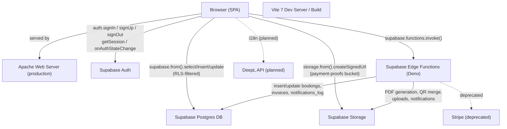
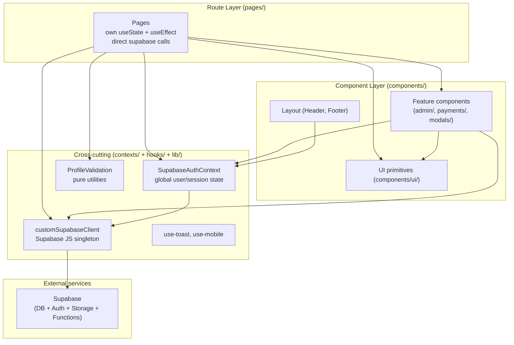
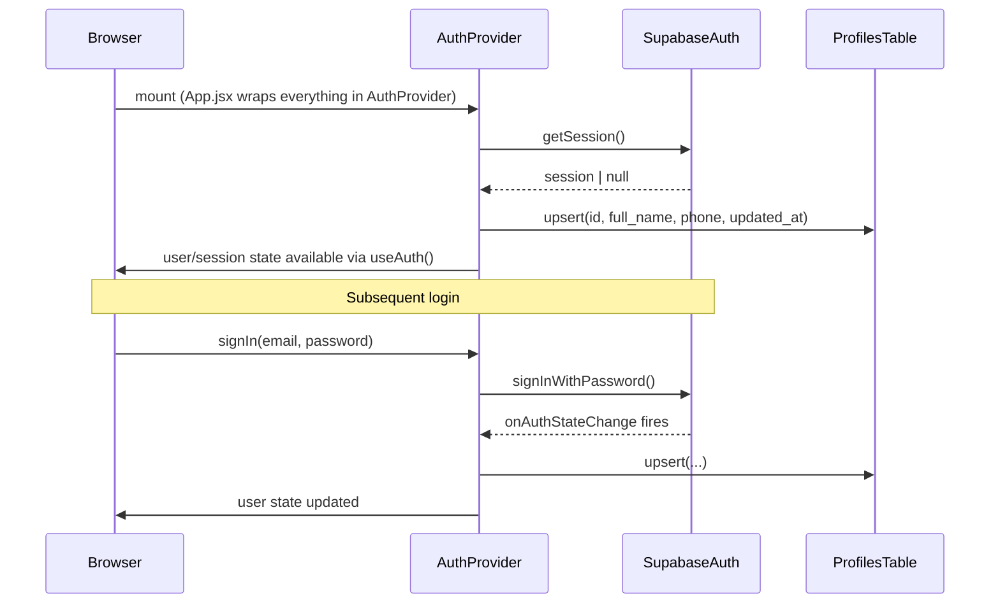
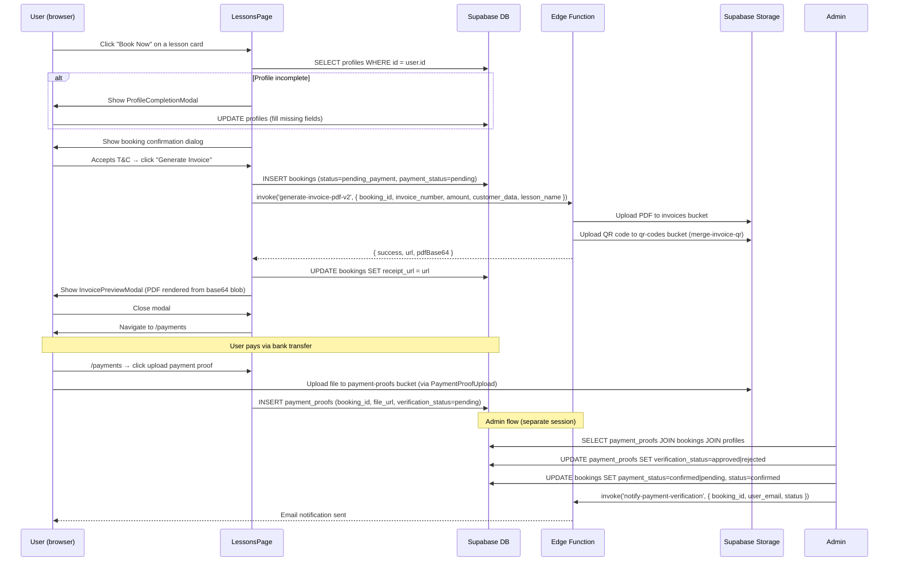
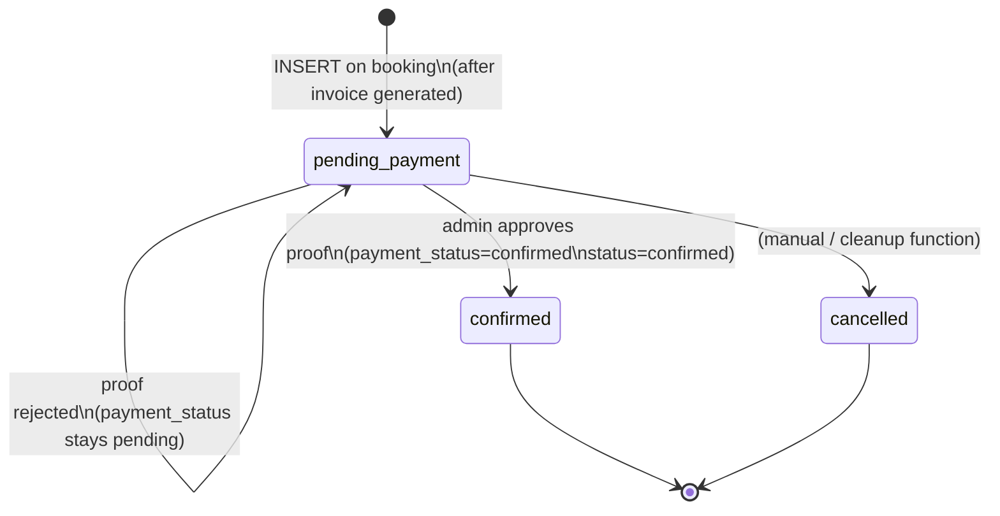

# Architecture — AGC Padel Academy Web Application

> Snapshot captured: 2026-06-28.
> Sources analyzed: all files under `src/`, `vite.config.js`, `package.json`, `plugins/`, Supabase MCP (project `jokjxpogvwxbwdaroqkc`).
> Methodology: SDD brownfield baseline — document as-is, flag issues, do not modify.

---

## 1. System Overview

The application is a **React 18 single-page application (SPA)** hosted on an Apache server. All backend logic runs inside **Supabase** (Postgres database, Auth, Storage, and Deno Edge Functions). There is no Node.js or custom API server — the frontend communicates directly with Supabase via the JS client SDK and via `supabase.functions.invoke()` calls to Edge Functions.



---

## 2. Frontend Layer Structure

### 2.1 Folder responsibilities

```
src/
├── main.jsx               Entry point — mounts <App /> into #root
├── App.jsx                Router, global layout (Header/Footer/Toaster), AuthProvider
├── index.css              Tailwind base + CSS custom properties (dark theme tokens)
│
├── pages/                 ROUTE LAYER — one file per route; own data-fetching logic
│   ├── HomePage.jsx       Static marketing landing (no data fetching)
│   ├── LessonsPage.jsx    Lesson catalogue + booking flow + invoice generation
│   ├── TripsPage.jsx      Padel trips display (static/hardcoded content — assumption)
│   ├── TournamentsPage.jsx Tournaments display (static/hardcoded — assumption)
│   ├── ContactPage.jsx    Contact form → submit-contact-form Edge Function
│   ├── LoginPage.jsx      Sign-in / sign-up forms
│   ├── TermsPage.jsx      Static legal content (T&C, privacy, impressum)
│   ├── PaymentsPage.jsx   Authenticated: list own bookings + upload payment proof
│   ├── ProfileManagementPage.jsx  Authenticated: edit profile (profiles table)
│   └── AdminDashboard.jsx  Admin shell that renders PaymentVerificationPanel
│
├── components/
│   ├── layout/
│   │   ├── Header.jsx     Top navigation bar (auth-aware)
│   │   └── Footer.jsx     Site footer
│   ├── auth/
│   │   └── ProtectedRoute.jsx  Route guard (checks auth state; admin check present but disabled — see §5)
│   ├── admin/
│   │   └── PaymentVerificationPanel.jsx  Admin table: review/approve/reject payment proofs
│   ├── payments/
│   │   ├── PaymentProofUpload.jsx    Upload bank-transfer proof to storage
│   │   └── PaymentProofPreview.jsx   Show uploaded proof status to customer
│   ├── modals/
│   │   ├── InvoiceModal.jsx          Renders generated PDF in iframe (with download button)
│   │   ├── InvoicePreviewModal.jsx   Inline PDF preview + redirect to /payments on close
│   │   └── ProfileCompletionModal.jsx  Gate: forces profile completion before booking
│   ├── ui/                shadcn/Radix UI component library (button, dialog, calendar, tabs, …)
│   └── ScrollToTop.jsx    Scrolls window to top on route change
│
├── contexts/
│   ├── SupabaseAuthContext.jsx  ACTIVE — session, user, signUp, signIn, signOut + profile upsert
│   ├── AuthContext.jsx          LEGACY / DEAD CODE — localStorage-based auth, not mounted anywhere
│   └── BookingContext.jsx       LEGACY / DEAD CODE — localStorage-based booking state, not mounted
│
├── hooks/
│   ├── use-mobile.jsx     Returns boolean: viewport < 768px
│   └── use-toast.js       Toast queue management (used by Sonner/Toaster)
│
├── lib/
│   ├── customSupabaseClient.js  Creates and exports the Supabase JS client (singleton)
│   ├── ProfileValidation.js     Pure functions: isProfileComplete(), getProfileCompletionStatus()
│   └── utils.js                 Re-exports shadcn cn() utility (clsx + tailwind-merge)
│
└── utils/                 Empty directory — no files
```

### 2.2 Layering model



> **Observation — no service / repository layer:** pages and components call `supabase.from()` and `supabase.functions.invoke()` directly inline. There is no abstraction layer (e.g. a `services/bookingService.js`) between the UI and the data access calls. This is a common SDD brownfield finding — not a blocker today, but it makes future refactoring harder and increases test surface. To note in the baseline; address in a future refactor spec if needed.

---

## 3. Authentication Architecture

### 3.1 Current implementation

Authentication is handled entirely by **Supabase Auth** via `SupabaseAuthContext.jsx`. On mount, the `AuthProvider`:
1. Calls `supabase.auth.getSession()` to restore any existing session.
2. Subscribes to `supabase.auth.onAuthStateChange()` for all future events.
3. On each session change, **upserts `public.profiles`** with `full_name` and `phone` from `user_metadata`.



**Supported auth methods (current):**
- Email + password sign-up (`supabase.auth.signUp`)
- Email + password sign-in (`supabase.auth.signInWithPassword`)
- Sign-out (`supabase.auth.signOut`)
- Email confirmation redirect to `https://agcpadelacademy.com`

**Planned:** OAuth (provider TBD — see `specs/project-context/overview.md §2`).

### 3.2 Dead legacy auth context

`src/contexts/AuthContext.jsx` is a **fully local, localStorage-based** auth implementation (login/register/logout using a password stored in plain JSON in `localStorage`). It is **not mounted in `App.jsx`** and is therefore completely unused. It should be deleted.

### 3.3 Admin access control — CRITICAL SECURITY GAP ⚠️

`src/components/auth/ProtectedRoute.jsx` contains this code:

```jsx
if (requireAdmin && user.email !== 'admin@agcpadelacademy.com') {
   // return <Navigate to="/" replace />; // Disabled strict check for demo purposes
}
```

**The redirect is commented out.** Any authenticated user can currently access `/admin/payment-verification` by navigating to it directly. This is the most critical security finding in the frontend codebase. The guard must be uncommented (or replaced with a proper role check against the DB) before any real traffic reaches the admin panel.

---

## 4. Booking & Invoice Data Flow

This is the primary transactional flow, fully confirmed from `LessonsPage.jsx`.



### Booking state machine (confirmed from DB schema + code)



> **Note:** `bookings.status` and `bookings.payment_status` are two separate columns that track overlapping state. On approval both are set to `confirmed`. The `verification_status` column on `bookings` (no CHECK constraint) mirrors `payment_proofs.verification_status`. This duplication is a schema debt item — see `specs/baseline-system/supabase-backend.md §8`.

---

## 5. Known Architecture Issues & Debt

These are confirmed findings from source code analysis, not assumptions.

| Severity | Location | Issue |
|---|---|---|
| 🔴 CRITICAL | `src/components/auth/ProtectedRoute.jsx:19` | Admin guard is **commented out** — any logged-in user can access `/admin/payment-verification` |
| 🔴 CRITICAL | `src/lib/customSupabaseClient.js:3-4` | Supabase URL and anon key are **hardcoded** in source. They should be in env vars (`VITE_SUPABASE_URL`, `VITE_SUPABASE_ANON_KEY`). Anon key is now also visible in the `specs/baseline-system/supabase-backend.md` snapshot — rotate if that file is ever made public. |
| 🟠 HIGH | `src/contexts/AuthContext.jsx` | Dead legacy auth context — stores passwords in plain JSON in `localStorage`. **Delete it.** |
| 🟠 HIGH | `src/contexts/BookingContext.jsx` | Dead legacy booking context — uses `localStorage`. Not mounted in `App.jsx`. **Delete it.** |
| 🟠 HIGH | `src/pages/LessonsPage.jsx:78-95` | **Lesson catalogue is hardcoded** as a JS array in the page file, not fetched from the `lessons` DB table (which has 14 rows). Any price or product change requires a code deployment. |
| 🟡 MEDIUM | `src/contexts/SupabaseAuthContext.jsx:67-79` | Toast messages for sign-up errors and success are in **Spanish** (`"Fallo en el registro"`, `"¡Registro completado!"`) while the rest of the UI is in English. |
| 🟡 MEDIUM | `src/pages/LessonsPage.jsx:101` | `const [lang] = useState("EN")` — the language is hardcoded to EN. The ES/EN translation object exists but the language-switcher UI is not implemented. |
| 🟡 MEDIUM | `src/pages/LessonsPage.jsx:232` | `invoice_number` is generated client-side as `` `INV-${Date.now()}` `` — not guaranteed unique under concurrent bookings, and not atomic with the DB insert. Should be generated server-side. |
| 🟡 MEDIUM | `index.html` | `<title>Hostinger Horizons</title>` — the page title is the editor platform name, not the product name. |
| 🟡 MEDIUM | `src/pages/TermsPage.jsx:80-81,214,227,240` | Stripe is still referenced as the payment processor in the legal copy, which no longer matches reality. |
| 🟢 LOW | `src/contexts/SupabaseAuthContext.jsx` | Named `SupabaseAuthContext` but exports `AuthProvider` and `useAuth` — same names as the dead legacy `AuthContext.jsx`. A future rename of the legacy file could cause import confusion. |
| 🟢 LOW | `src/utils/` | Empty directory — no purpose. |
| 🟢 LOW | `package.json` | `pdf-lib`, `pdfkit`, `qrcode` are listed as frontend dependencies but are only used server-side in Edge Functions. They inflate the dependency manifest and confuse static analysis. |

---

## 6. Build & Development Architecture

### 6.1 Vite configuration

The Vite config (`vite.config.js`) has two distinct modes:

| Context | Plugins active |
|---|---|
| **Development (`NODE_ENV !== production`)** | `inlineEditPlugin`, `editModeDevPlugin`, `iframeRouteRestorationPlugin`, `selectionModePlugin`, `react()`, Horizons error/fetch/navigation handlers injected into `<head>` |
| **Production build** | `react()` only + Horizons error handlers (still injected) + Terser minification |

The four Horizons plugins (`plugins/visual-editor/`, `plugins/selection-mode/`, `plugins/vite-plugin-iframe-route-restoration.js`) are **development-only** — they are excluded from the production bundle via the `isDev` guard. The Babel runtime deps (`@babel/parser`, `@babel/traverse`, `@babel/generator`, `@babel/types`) are also **explicitly excluded from the Rollup bundle** in `build.rollupOptions.external`.

**Path alias:** `@` → `./src` (configured in `resolve.alias`).

### 6.2 Build pipeline

```
npm run build
  │
  ├─ node tools/generate-llms.js  (generates an llms.txt / LLM-friendly sitemap — dev tooling)
  │   └─ exits with 0 even on failure (|| true)
  │
  └─ vite build
      ├─ Terser minification
      ├─ Rollup bundles (Babel externalized)
      └─ Output: dist/
```

### 6.3 Deployment target

- **Production server:** Apache (indicated by `public/.htaccess`)
- **Domain:** `agcpadelacademy.com` (confirmed by `emailRedirectTo` in `SupabaseAuthContext.jsx`)
- **SPA routing:** `.htaccess` presumably handles fallback redirects to `index.html` for client-side routes (standard SPA Apache config — not yet read in detail)

> **Assumption:** Deployment is a static file upload (e.g. FTP or Git-push-to-hosting) of the `dist/` folder to an Apache host. No CI/CD pipeline has been observed in the repository. Confirm with the team.

---

## 7. External Integrations

| Integration | Status | Entry point | Purpose |
|---|---|---|---|
| **Supabase Auth** | Active | `customSupabaseClient.js` → `SupabaseAuthContext.jsx` | User auth, session management |
| **Supabase DB** | Active | `customSupabaseClient.js` → pages/components | All persistent data |
| **Supabase Storage** | Active | `customSupabaseClient.js` → `PaymentProofUpload.jsx`, `PaymentVerificationPanel.jsx` | Payment proof uploads; invoice/QR PDFs stored server-side |
| **Supabase Edge Functions** | Active | `supabase.functions.invoke()` in `LessonsPage.jsx`, `PaymentVerificationPanel.jsx` | Invoice generation, notifications, contact form, booking cleanup |
| **Stripe** | Deprecated | `supabase/functions/create-booking`, `handle-stripe-webhook` (out-of-tree) | Originally Checkout payment; now superseded by manual bank transfer |
| **Hostinger Horizons** | Dev-only | `vite.config.js` plugins, `index.html` meta tag | Visual in-browser editor; error reporting to parent iframe |
| **DeepL API** | Planned | Not yet implemented | Runtime UI translation (multilingual support) |

---

## 8. Dependency Map

### Runtime dependencies (production bundle)

| Category | Libraries |
|---|---|
| **Core framework** | `react`, `react-dom`, `react-router-dom` |
| **UI primitives** | All `@radix-ui/react-*`, `lucide-react`, `framer-motion`, `embla-carousel-react`, `vaul`, `cmdk`, `input-otp`, `react-resizable-panels` |
| **Styling** | `tailwindcss` (build-time), `tailwind-merge`, `class-variance-authority`, `clsx`, `next-themes` |
| **Forms** | `react-hook-form` |
| **Charts** | `recharts` (wrapped, not yet used in any page) |
| **Dates** | `date-fns`, `react-day-picker` |
| **Notifications** | `sonner` |
| **Meta / SEO** | `react-helmet` |
| **Backend client** | `@supabase/supabase-js` |
| **QR codes** | `qrcode` (not imported in frontend — server-side only) |
| **PDF** | `pdf-lib`, `pdfkit` (not imported in frontend — server-side only) |
| **Dead deps (frontend)** | `@babel/parser`, `@babel/generator`, `@babel/traverse`, `@babel/types` (excluded from bundle via Rollup `external`; used by dev plugins only) |
| **Misc** | `terser` (used by Vite build) |

### Dev dependencies

| Category | Libraries |
|---|---|
| **Bundler** | `vite`, `@vitejs/plugin-react` |
| **Linting** | `eslint`, `eslint-plugin-react`, `eslint-plugin-react-hooks`, `eslint-plugin-import`, `eslint-import-resolver-alias`, `globals` |
| **CSS processing** | `postcss`, `autoprefixer` |
| **Types** | `@types/node`, `@types/react`, `@types/react-dom` |

---

## 9. Assumptions

The following items were inferred rather than confirmed from source:

- **`TripsPage.jsx` and `TournamentsPage.jsx` are likely static/hardcoded** (no Supabase calls detected at the import level), similar to how `LessonsPage.jsx` has a hardcoded lesson catalogue. They were not read in full — confirm when writing `specs/baseline-system/` for those pages.
- **Apache `.htaccess` contains SPA fallback routing** (`RewriteRule . /index.html` or similar) — standard for Vite SPAs on Apache. Not yet read.
- **No CI/CD pipeline exists** — deployment appears to be manual. No `Dockerfile`, `.github/`, `vercel.json`, or equivalent was found in the repo root.
- **The Supabase Edge Functions source code is not in this repository** — function source is stored and deployed directly via the Supabase dashboard. There is no `supabase/` directory in this repo.
- **`cleanup-pending-bookings` Edge Function has no visible scheduler** — `pg_cron` is available but not installed; it may be triggered by a Supabase cron job configured in the dashboard, or it may be invoked manually.
