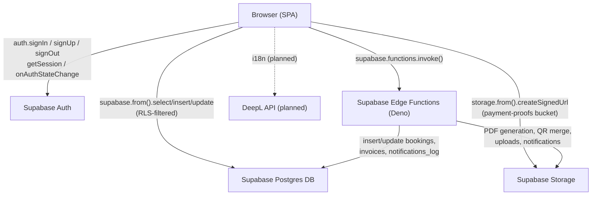
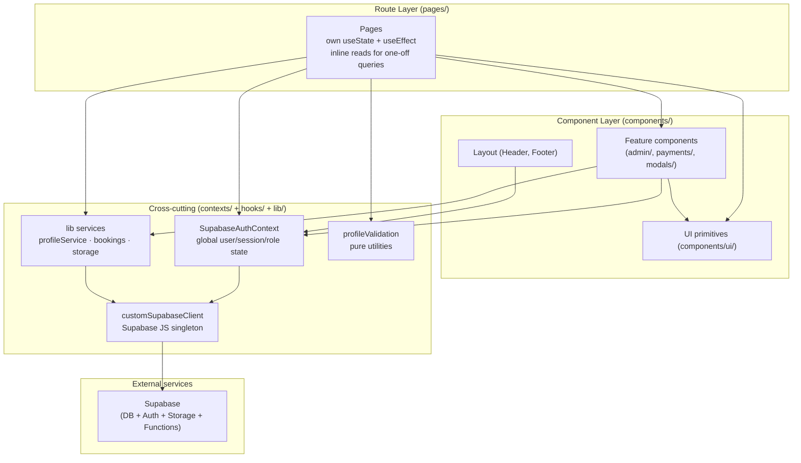
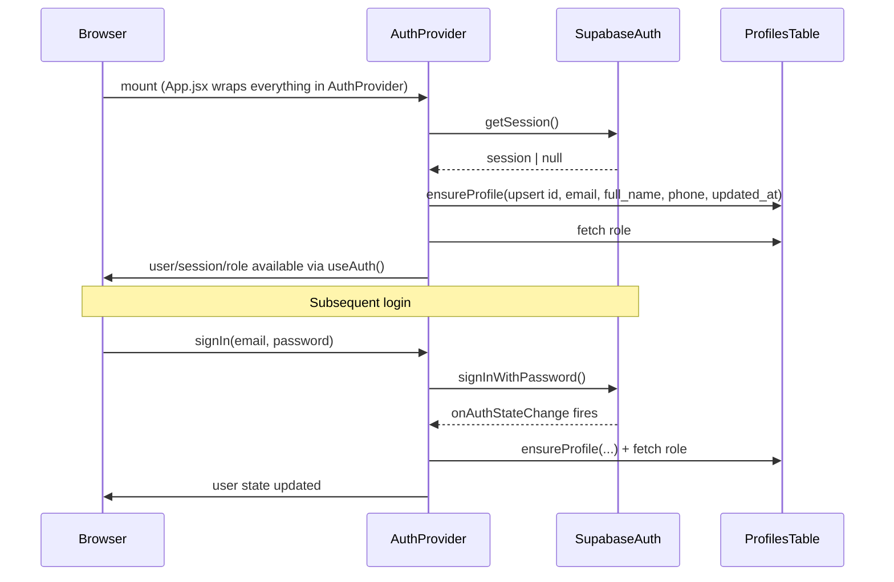
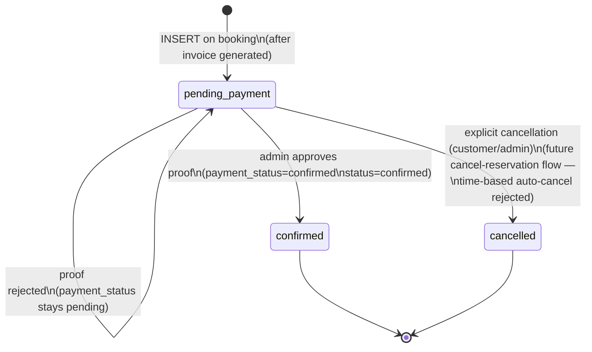

# Architecture — AGC Padel Academy Web Application

> Snapshot captured: 2026-06-28.
> Refreshed 2026-08-06: corrected stale findings (lessons catalogue is DB-driven, Supabase keys are in env vars, admin guard uses `role === 'admin'` with RLS enforcement).
> Refreshed 2026-08-19: ProtectedRoute tree line and invoice modal filename aligned with live code; payment-proofs service-role-on-public policy is **not** dropped (Advisor WARN remains).
> Sources analyzed: all files under `src/`, `vite.config.js`, `package.json`, Supabase MCP (project `jokjxpogvwxbwdaroqkc`).
> Methodology: SDD brownfield baseline — document as-is, flag issues, do not modify.

---

## 1. System Overview

The application is a **React 18 single-page application (SPA)** deployed on **Vercel**. All backend logic runs inside **Supabase** (Postgres database, Auth, Storage, and Deno Edge Functions). There is no Node.js or custom API server — the frontend communicates directly with Supabase via the JS client SDK and via `supabase.functions.invoke()` calls to Edge Functions.


```mermaid
graph TD
    Browser["Browser (SPA)"]
    SupabaseAuth["Supabase Auth"]
    SupabaseDB["Supabase Postgres DB"]
    SupabaseStorage["Supabase Storage"]
    SupabaseFunctions["Supabase Edge Functions (Deno)"]
    DeepL["DeepL API (planned)"]

    Browser -- "auth.signIn / signUp / signOut\ngetSession / onAuthStateChange" --> SupabaseAuth
    Browser -- "supabase.from().select/insert/update\n(RLS-filtered)" --> SupabaseDB
    Browser -- "storage.from().createSignedUrl\n(payment-proofs bucket)" --> SupabaseStorage
    Browser -- "supabase.functions.invoke()" --> SupabaseFunctions
    SupabaseFunctions -- "PDF generation, QR merge,\nuploads, notifications" --> SupabaseStorage
    SupabaseFunctions -- "insert/update bookings,\ninvoices, notifications_log" --> SupabaseDB
    Browser -. "i18n (planned)" .-> DeepL
```

---

## 2. Frontend Layer Structure

### 2.1 Folder responsibilities

```
src/
├── main.jsx               Entry point — mounts <App /> into #root
├── App.jsx                Router, global layout (Header/Footer/Toaster), AuthProvider
├── index.css              Tailwind base + CSS custom properties (dark theme tokens)
│
├── pages/                 ROUTE LAYER — one file per route; own data-fetching logic
│   ├── HomePage.jsx       Static marketing landing (no data fetching)
│   ├── LessonsPage.jsx    Lesson catalogue (fetched from `lessons` table) + booking flow + invoice generation
│   ├── TripsPage.jsx      Padel trips display (static/hardcoded content — assumption)
│   ├── TournamentsPage.jsx Tournaments display (static/hardcoded — assumption)
│   ├── ContactPage.jsx    Contact form → submit-contact-form Edge Function
│   ├── LoginPage.jsx      Sign-in / sign-up forms
│   ├── TermsPage.jsx      Static legal content (T&C, privacy, impressum)
│   ├── PaymentsPage.jsx   Authenticated: list own bookings + upload payment proof + re-download invoice PDF
│   ├── ProfileManagementPage.jsx  Authenticated: edit profile (profiles table)
│   └── AdminDashboardPage.jsx  Admin shell that renders PaymentVerificationPanel
│
├── components/
│   ├── layout/
│   │   ├── Header.jsx     Top navigation bar (auth-aware)
│   │   └── Footer.jsx     Site footer
│   ├── auth/
│   │   └── ProtectedRoute.jsx  Route guard (auth + `requireAdmin`; UX only — see §3.3)
│   ├── admin/
│   │   └── PaymentVerificationPanel.jsx  Admin table: review/approve/reject payment proofs
│   ├── payments/
│   │   ├── PaymentProofUpload.jsx    Upload bank-transfer proof to storage
│   │   └── PaymentProofPreview.jsx   Show uploaded proof status to customer
│   ├── modals/
│   │   ├── InvoicePreviewModal.jsx   Inline PDF preview + redirect to /payments on close
│   │   └── ProfileCompletionModal.jsx  Gate: forces profile completion before booking
│   ├── ui/                shadcn/Radix UI component library (button, dialog, calendar, tabs, …)
│   └── ScrollToTop.jsx    Scrolls window to top on route change
│
├── contexts/
│   └── SupabaseAuthContext.jsx  Session, user, role, signUp/signIn/signOut, profile ensure, PASSWORD_RECOVERY redirect
│
├── hooks/
│   └── useProfile.js      Wraps profileService getOrCreateProfile/updateProfile
│
├── lib/
│   ├── customSupabaseClient.js  Creates and exports the Supabase JS client (singleton)
│   ├── profileValidation.js     Pure functions: isProfileComplete(), getProfileCompletionStatus()
│   ├── profileService.js        Profile fetch/create/update (single owner of query shapes)
│   ├── bookings.js              Availability (booking_slots view), booking payload, insert, invoice invoke
│   ├── storage.js               Signed URLs for the private payment-proofs bucket
│   └── utils.js                 Re-exports shadcn cn() utility (clsx + tailwind-merge)
│
└── utils/                 Empty directory — no files
```

### 2.2 Layering model


```mermaid
graph TD
    subgraph "Route Layer (pages/)"
        Pages["Pages\nown useState + useEffect\ninline reads for one-off queries"]
    end
    subgraph "Component Layer (components/)"
        UI["UI primitives (components/ui/)"]
        Feature["Feature components\n(admin/, payments/, modals/)"]
        Layout["Layout (Header, Footer)"]
    end
    subgraph "Cross-cutting (contexts/ + hooks/ + lib/)"
        Auth["SupabaseAuthContext\nglobal user/session/role state"]
        Client["customSupabaseClient\nSupabase JS singleton"]
        Services["lib services\nprofileService · bookings · storage"]
        Validation["profileValidation\npure utilities"]
    end
    subgraph "External services"
        Supa["Supabase\n(DB + Auth + Storage + Functions)"]
    end

    Pages --> Feature
    Pages --> UI
    Pages --> Auth
    Pages --> Services
    Pages --> Validation
    Feature --> Services
    Feature --> Auth
    Feature --> UI
    Layout --> Auth
    Auth --> Client
    Services --> Client
    Client --> Supa
```

> **Observation — thin service layer, not a full repository pattern:** shared query/mutation logic is centralized in `src/lib/` services (`profileService.js`, `bookings.js`, `storage.js`) and the `useProfile` hook, but one-off reads still happen inline in pages. There is no mandatory abstraction layer between UI and Supabase — adopt a service when logic is needed in more than one place.

---

## 3. Authentication Architecture

### 3.1 Current implementation

Authentication is handled entirely by **Supabase Auth** via `SupabaseAuthContext.jsx`. On mount, the `AuthProvider`:
1. Calls `supabase.auth.getSession()` to restore any existing session.
2. Subscribes to `supabase.auth.onAuthStateChange()` for all future events.
3. On each session change, runs `ensureProfile(user)` to **upsert `public.profiles`** with `id`, `email`, `full_name`, `phone` and `updated_at`. (Previously this was duplicated in three places and the session-sync path omitted `email` — both fixed.)
4. Loads the user's application `role` from `public.profiles.role` and exposes it via `useAuth().role`, defaulting to `student` when no row/value exists.
5. On a `PASSWORD_RECOVERY` event, redirects to `/reset-password` so the user sets a new password instead of being silently logged in (recovery links establish a session automatically — fixed 2026-08-10).


```mermaid
sequenceDiagram
    participant Browser
    participant AuthProvider
    participant SupabaseAuth
    participant ProfilesTable

    Browser->>AuthProvider: mount (App.jsx wraps everything in AuthProvider)
    AuthProvider->>SupabaseAuth: getSession()
    SupabaseAuth-->>AuthProvider: session | null
    AuthProvider->>ProfilesTable: ensureProfile(upsert id, email, full_name, phone, updated_at)
    AuthProvider->>ProfilesTable: fetch role
    AuthProvider->>Browser: user/session/role available via useAuth()

    Note over Browser,SupabaseAuth: Subsequent login
    Browser->>AuthProvider: signIn(email, password)
    AuthProvider->>SupabaseAuth: signInWithPassword()
    SupabaseAuth-->>AuthProvider: onAuthStateChange fires
    AuthProvider->>ProfilesTable: ensureProfile(...) + fetch role
    AuthProvider->>Browser: user state updated
```

**Supported auth methods (current):**
- Email + password sign-up (`supabase.auth.signUp`) with `emailRedirectTo` set to `${window.location.origin}/auth/callback`.
- Email + password sign-in (`supabase.auth.signInWithPassword`).
- Sign-out (`supabase.auth.signOut`).
- Email confirmation handled by the `/auth/callback` route (`AuthCallbackPage.jsx`); Supabase v2 PKCE auto-exchanges the code in the URL via `detectSessionInUrl: true`.
- Resend confirmation email (`supabase.auth.resend({ type: 'signup', ... })`) — exposed as "Resend confirmation email" on `LoginPage`.
- Password reset: `supabase.auth.resetPasswordForEmail(email, { redirectTo: ${origin}/reset-password })` triggered from the "Forgot password?" link on `LoginPage`; the new password is set on the `/reset-password` route via `supabase.auth.updateUser({ password })`.

**Supabase client config:** the URL and anon key are read from Vite env vars (`VITE_SUPABASE_URL`, `VITE_SUPABASE_ANON_KEY`) — see `.env.example`. The client is explicitly configured with `persistSession: true`, `detectSessionInUrl: true`, `autoRefreshToken: true`.

**Planned:** OAuth (provider TBD — see `specs/project-context/overview.md §2`). The next decision the user wants to make is which Supabase Auth providers to enable; this section will be updated once that is decided.

### 3.2 Legacy auth context

The legacy `src/contexts/AuthContext.jsx` (localStorage-based) and `BookingContext.jsx` were **deleted** during the technical-debt cleanup. `SupabaseAuthContext.jsx` is the only context. No action needed.

### 3.3 Admin access control

`src/components/auth/ProtectedRoute.jsx` checks the application role exposed by `useAuth()` (`role === 'admin'`); the legacy admin-email fallback was removed 2026-08-10. `profiles.role` is the single source of truth.

**Important:** `ProtectedRoute` is a UX guard, not a security boundary. Server-side authorization is enforced by **Supabase RLS** (migrations `0006`/`0007`, 2026-08-10):
- `bookings` SELECT: owner or admin (`is_admin()`); public availability flows through the non-PII `booking_slots` view.
- `payment_proofs` UPDATE: only `public.is_admin()` (admins).
- The permissive "Service Role Full Access Payment Proofs" policy targeting the `public` role is **still present** (Supabase advisor warning 0024) — it is not dropped. See `supabase-backend.md` §6 and `specs/features/003-payment-proof-upload/spec.md`.

Additionally, the two user-invoked Edge Functions (`generate-invoice-pdf` v22, `notify-payment-verification` v6) run with `verify_jwt: true` and perform in-function JWT + authorization checks (booking ownership / admin role); the client passes the session token explicitly in the `Authorization` header.

### 3.4 Auth-related routes

| Route | Component | Purpose |
|---|---|---|
| `/login` | `LoginPage` | Sign in / sign up / forgot password / resend confirmation |
| `/auth/callback` | `AuthCallbackPage` | Landing page for email-confirmation and OAuth redirects |
| `/reset-password` | `ResetPasswordPage` | Set a new password after clicking the reset email link |
| `/profile` | `ProfileManagementPage` (guarded) | View / edit own profile |
| `/payments` | `PaymentsPage` (guarded) | View own payments, upload proof, re-download invoice PDF |
| `/admin` | — (redirects to `/admin/payment-verification`) | Convenience redirect |
| `/admin/payment-verification` | `AdminDashboardPage` (guarded, admin-only) | Payment proof verification |

### 3.5 OAuth / social sign-in

The frontend includes a generic OAuth button (`src/components/auth/OAuthButtons.jsx`) rendered on both the `LoginPage` and the `AuthDialog`. The list of providers shown is controlled by the `OAUTH_PROVIDERS` constant in each file (currently `['google']`). The auth context exposes `signInWithOAuth(provider)` which calls `supabase.auth.signInWithOAuth({ provider, options: { redirectTo: ${origin}/auth/callback } })`.

**Provider enablement is dashboard-side** — the Supabase MCP does not expose tools for toggling Auth providers, so each provider must be enabled in the Supabase dashboard → Authentication → Providers. Until a provider is enabled there, clicking its button returns an error from Supabase.

**Google OAuth setup (manual, one-time):**
1. Google Cloud Console → APIs & Services → Credentials → Create Credentials → OAuth client ID → Application type: Web application.
2. Add `https://jokjxpogvwxbwdaroqkc.supabase.co/auth/v1/callback` to "Authorized redirect URIs".
3. Copy the Client ID and Client Secret.
4. Supabase dashboard → Authentication → Providers → Google → enable, paste Client ID + Secret, save.
5. Add `https://agcpadelacademy.com/auth/callback` and `http://localhost:3000/auth/callback` to Authentication → URL Configuration → Allowed Redirect URLs (also covers the email-confirmation and password-reset flows).

After step 4 the "Continue with Google" button works end-to-end. New Google users get a `profiles` row via the same `ensureProfile` path (full_name and email are populated from the OAuth `user_metadata`).

---

## 4. Booking & Invoice Data Flow

This is the primary transactional flow, fully confirmed from `LessonsPage.jsx`.

```mermaid
sequenceDiagram
    participant U as User (browser)
    participant LP as LessonsPage
    participant DB as Supabase DB
    participant EF as Edge Function
    participant ST as Supabase Storage

    U->>LP: Click "Book Now" on a lesson card
    LP->>DB: SELECT profiles WHERE id = user.id
    alt Profile incomplete
        LP->>U: Show ProfileCompletionModal
        U->>DB: UPDATE profiles (fill missing fields)
    end
    LP->>U: Show booking confirmation dialog

    U->>LP: Accepts T&C → click "Generate Invoice"
    LP->>DB: INSERT bookings (status=pending_payment, payment_status=pending)
    LP->>EF: invoke('generate-invoice-pdf', { booking_id, amount, customer_data, lesson_name }) [Authorization: Bearer <session token>]
    EF->>DB: next_invoice_number(date) → INV-YYYY/MM/DD-XX (atomic)
    EF->>ST: Upload PDF (with merged QR page) to invoices bucket
    EF->>DB: INSERT invoices row; UPDATE bookings SET receipt_url
    EF-->>LP: { success, url, pdfBase64, invoice_number }
    LP->>U: Show InvoicePreviewModal (PDF rendered from base64 blob)

    U->>LP: Close modal
    LP->>U: Navigate to /payments

    Note over U,DB: User pays via bank transfer
    U->>LP: /payments → click upload payment proof
    U->>ST: Upload file to payment-proofs bucket (via PaymentProofUpload)
    LP->>DB: INSERT payment_proofs (booking_id, file_url, verification_status=pending)

    Note over DB,EF: Admin flow (separate session)
    Admin->>DB: SELECT payment_proofs JOIN bookings JOIN profiles
    Admin->>DB: UPDATE payment_proofs SET verification_status=approved|rejected
    Admin->>DB: UPDATE bookings SET payment_status=confirmed|pending, status=confirmed
    Admin->>EF: invoke('notify-payment-verification', { booking_id, user_email, status })
    EF-->>U: Email notification sent
```

### Booking state machine (confirmed from DB schema + code)


```mermaid
stateDiagram-v2
    [*] --> pending_payment : INSERT on booking\n(after invoice generated)
    pending_payment --> pending_payment : proof rejected\n(payment_status stays pending)
    pending_payment --> confirmed : admin approves proof\n(payment_status=confirmed\nstatus=confirmed)
    pending_payment --> cancelled : explicit cancellation (customer/admin)\n(future cancel-reservation flow —\ntime-based auto-cancel rejected)
    confirmed --> [*]
    cancelled --> [*]
```

> **Note:** `bookings.status` and `bookings.payment_status` are two separate columns that track overlapping state. On approval both are set to `confirmed`. The `verification_status` column on `bookings` (no CHECK constraint) mirrors `payment_proofs.verification_status`. This duplication is a schema debt item — see `specs/baseline-system/supabase-backend.md §8`.

---

## 5. Known Architecture Issues & Debt

These are confirmed findings from source code analysis, not assumptions.

| Severity | Location | Issue |
|---|---|---|
| ✅ RESOLVED | `src/components/auth/ProtectedRoute.jsx` | ~~Admin guard commented out~~ `ProtectedRoute` now checks `useAuth().role === 'admin'`; legacy email fallback removed. Server-side authorization enforced by RLS + hardened Edge Functions (§3.3). |
| ✅ RESOLVED | `src/lib/customSupabaseClient.js` | ~~Hardcoded Supabase keys~~ Keys read from Vite env vars with fail-fast guard (`.env.example`). |
| ✅ RESOLVED | `src/contexts/` | ~~Dead legacy `AuthContext.jsx` / `BookingContext.jsx`~~ Deleted during technical-debt cleanup. |
| ✅ RESOLVED | `src/pages/LessonsPage.jsx` | ~~Hardcoded lesson catalogue~~ Fetches from `lessons` DB table. |
| ✅ RESOLVED | `src/pages/LessonsPage.jsx` | ~~Client-side `invoice_number` generation~~ Atomic server-side numbering via `next_invoice_number()` RPC (migration `0005`) inside `generate-invoice-pdf`. |
| ✅ RESOLVED | `index.html` | ~~`<title>Hostinger Horizons</title>`~~ Now `<title>AGC Padel Academy</title>`; Horizons generator meta tag and dev plugins removed (2026-08-12). |
| ✅ RESOLVED | `src/pages/TermsPage.jsx` | ~~Stripe referenced in legal copy~~ Copy updated to bank transfer (2026-08-07); Stripe fully decommissioned. |
| 🟡 MEDIUM | `src/contexts/SupabaseAuthContext.jsx` | Toast messages for sign-up errors and success are in **Spanish** (`"Fallo en el registro"`, `"¡Registro completado!"`) while the rest of the UI is in English. |
| 🟡 MEDIUM | `src/pages/LessonsPage.jsx` | `const [lang] = useState("EN")` — the language is hardcoded to EN. The ES/EN translation object exists but the language-switcher UI is not implemented. |
| 🟢 LOW | `src/utils/` | Empty directory — no purpose. |

---

## 6. Build & Development Architecture

### 6.1 Vite configuration

The Vite config (`vite.config.js`) is a plain React setup:

| Context | Plugins active |
|---|---|
| **Development** | `react()` |
| **Production build** | `react()` + esbuild/Rollup minification |

The Hostinger Horizons dev plugins (visual editor, selection mode, iframe route restoration, error/fetch/navigation handlers) were **removed 2026-08-12** together with the `plugins/` directory and the `@babel/*` runtime dependencies that only they used.

The config also **defines** `import.meta.env.VITE_SUPABASE_URL` / `VITE_SUPABASE_ANON_KEY` from `process.env` or `.env`, and **fails the production build** when either is missing, so a Preview/Production deploy can never ship an empty Supabase config.

**Path alias:** `@` → `./src` (configured in `resolve.alias`).

### 6.2 Build pipeline

```
npm run build
  │
  ├─ node tools/generate-llms.js  (generates an llms.txt / LLM-friendly sitemap — dev tooling)
  │   └─ exits with 0 even on failure (|| true)
  │
  └─ vite build
      └─ Output: dist/
```

### 6.3 Deployment target

- **Platform:** Vercel (`vercel.json` in repo root) — production deploys from `main`, automatic preview deployments per branch/PR.
- **CI:** `.github/workflows/ci.yml` runs lint, Vitest unit tests, and the production build on `main` pushes and PRs (integration tests auto-skip without test-project secrets).
- **Domain:** `agcpadelacademy.com` (confirmed by `emailRedirectTo` in `SupabaseAuthContext.jsx`).
- **Node runtime:** pinned via `engines: node >= 20.19` in `package.json`.

---

## 7. External Integrations

| Integration | Status | Entry point | Purpose |
|---|---|---|---|
| **Supabase Auth** | Active | `customSupabaseClient.js` → `SupabaseAuthContext.jsx` | User auth, session management |
| **Supabase DB** | Active | `customSupabaseClient.js` → pages/components + `src/lib/` services | All persistent data |
| **Supabase Storage** | Active | `customSupabaseClient.js` → `PaymentProofUpload.jsx`, `src/lib/storage.js` | Payment proof uploads; invoice/QR PDFs stored server-side |
| **Supabase Edge Functions** | Active | `supabase.functions.invoke()` in `src/lib/bookings.js`, `PaymentVerificationPanel.jsx` | Invoice generation, notifications, contact form |
| **DeepL API** | Planned | Not yet implemented | Runtime UI translation (multilingual support) |

---

## 8. Dependency Map

### Runtime dependencies (production bundle)

| Category | Libraries |
|---|---|
| **Core framework** | `react`, `react-dom`, `react-router-dom` |
| **UI primitives** | `@radix-ui/react-*` (only those with a live `ui/` consumer), `lucide-react`, `framer-motion` |
| **Styling** | `tailwindcss` (build-time), `tailwind-merge`, `class-variance-authority`, `clsx` |
| **Dates** | `date-fns`, `react-day-picker` |
| **Notifications** | custom shadcn `Toaster` + `useToast` (`sonner` removed 2026-08-10) |
| **Meta / SEO** | `react-helmet-async` |
| **Backend client** | `@supabase/supabase-js` (pinned `2.30.0`) |

### Dev dependencies

| Category | Libraries |
|---|---|
| **Bundler** | `vite`, `@vitejs/plugin-react` |
| **Linting** | `eslint`, `eslint-plugin-react`, `eslint-plugin-react-hooks`, `eslint-plugin-import`, `eslint-import-resolver-alias`, `globals` |
| **Testing** | `vitest` |
| **CSS processing** | `postcss`, `autoprefixer` |
| **Types** | `@types/node`, `@types/react`, `@types/react-dom` |

---

## 9. Assumptions

The following items were inferred rather than confirmed from source:

- **`TripsPage.jsx` and `TournamentsPage.jsx` are static/hardcoded** (no Supabase calls) — their images are hosted on the former Hostinger Horizons CDN, which still serves them; migrate assets into the repo or Supabase Storage if that CDN is ever retired.
- **The Supabase Edge Functions source code is not in this repository** — function source is stored and deployed directly via the Supabase dashboard / MCP. There is no `supabase/` directory in this repo.
- **`cleanup-pending-bookings` Edge Function has no visible scheduler** — `pg_cron` is available but not installed; per the 2026-08-07 decision it must NOT be scheduled (explicit cancellation only).
