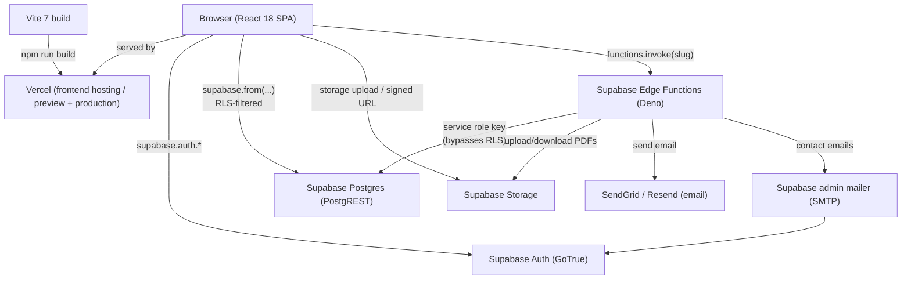
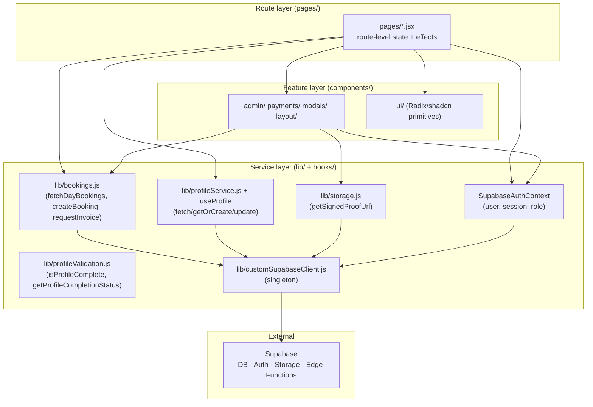
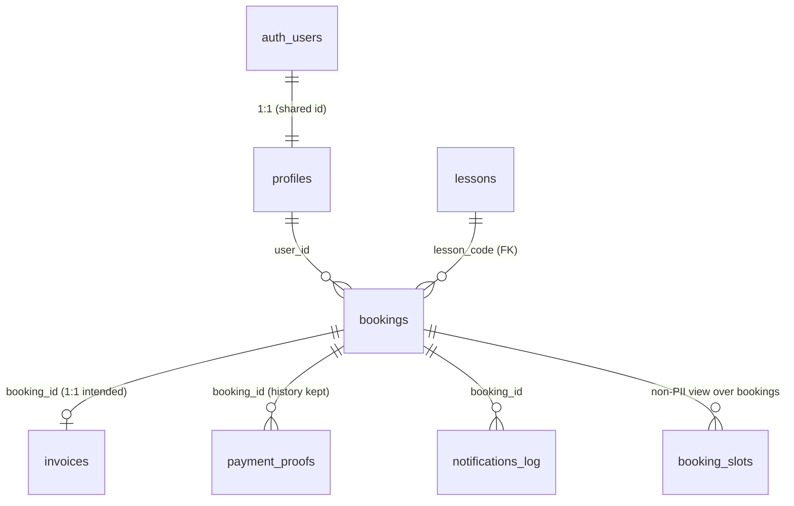
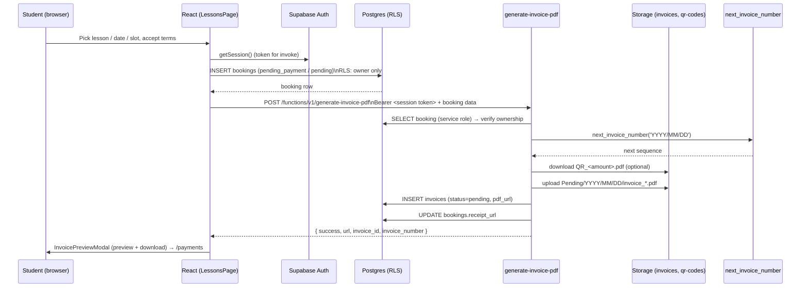
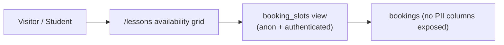
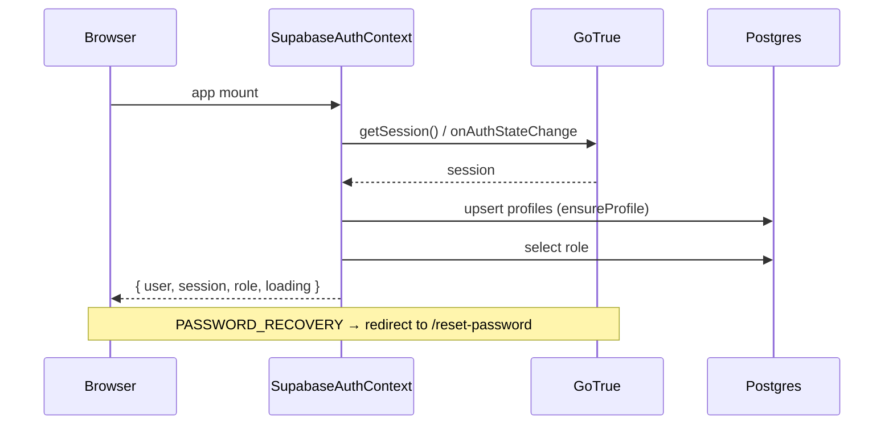

# Baseline Design — AGC Padel Academy

> Scope: **as-is technical design** of the deployed system. Complements `requirements.md` (what it does) with **how it is built and wired**.
> Sources: `src/`, `vite.config.js`, `package.json`, Supabase MCP (project `jokjxpogvwxbwdaroqkc`), `architecture.md`, `supabase-backend.md`, `api-contracts.md`, `coding-standards.md`.
> Convention: ✅ confirmed from source/config · ⚠️ inferred or partially enforced · ⏸️ present in code/schema but not a live integration.

---

## 1. System architecture

### 1.1 Shape

A **React 18 single-page application** built with **Vite 7** is served to the browser, which talks **directly** to Supabase. There is **no custom Node.js API server**. Backend capabilities live in Supabase:

- **Postgres** for persistence (PostgREST auto-exposes tables).
- **GoTrue** (Supabase Auth) for identity.
- **Storage** for invoice PDFs, QR payment slips, and payment proofs.
- **Deno Edge Functions** for server-side work the client must not do (PDF generation, atomic invoice numbering, transactional email).



> **Hosting.** Production and preview deployments run on **Vercel** (`vercel.json`; production from `main`, previews per branch/PR) — confirmed as the long-term production host 2026-08-12. The `public/.htaccess` file is a leftover from the pre-Vercel Apache setup and is unused.

### 1.2 Client layering



- **`src/lib/customSupabaseClient.js`** is the only `createClient` in the frontend. It reads `VITE_SUPABASE_URL` / `VITE_SUPABASE_ANON_KEY` (fail-fast if missing) and enables `persistSession`, `detectSessionInUrl`, `autoRefreshToken`.
- **State** is local to pages/components (`useState`, `useEffect`, `useCallback`); global state exists only for auth (`SupabaseAuthContext`).
- **Data access** is centralized for the hot paths after the 2026-08-10 refactor: bookings (`lib/bookings.js`), profiles (`lib/profileService.js` + `hooks/useProfile.js`), signed proof URLs (`lib/storage.js`). Some pages still call `supabase.from(...)` directly (e.g. `PaymentsPage` lists bookings/proofs inline).

### 1.3 Frontend modules

| Area | Responsibility |
|---|---|
| `src/main.jsx` | Mounts `App` inside `HelmetProvider` (react-helmet-async) |
| `src/App.jsx` | React Router routes, `AppLayout` (Header/Footer/Toaster), `AuthProvider`, route guards, catch-all redirect to `/` |
| `src/contexts/SupabaseAuthContext.jsx` | Session restore, `onAuthStateChange`, `ensureProfile` upsert, `role` fetch, sign-up/sign-in/sign-out/reset/OAuth helpers |
| `src/pages/*` | One component per route |
| `src/components/auth/ProtectedRoute.jsx` | Client-side guard: unauthenticated → `/login`; `requireAdmin` / `allowedRoles` → `/` |
| `src/components/modals/*` | Booking confirmation, profile completion, invoice preview/download |
| `src/components/payments/*` | Payment proof upload and preview |
| `src/components/admin/PaymentVerificationPanel.jsx` | Admin approve/reject of proofs |
| `src/components/ui/*` | Radix UI primitives wrapped in project styling |
| `src/lib/bookings.js` | Availability read (non-PII view), booking payload build, insert, invoice invoke |
| `src/lib/profileService.js` / `src/hooks/useProfile.js` | Profile read/create/update |
| `src/lib/storage.js` | Signed URLs for the private `payment-proofs` bucket |
| `src/lib/profileValidation.js` | Client-side completeness check |
| `tools/generate-llms.js` | Pre-build step (`npm run build`) |
| `tools/find-dead-code.mjs` | Import-graph analyzer used to remove unused UI/hooks |

### 1.4 Build and deploy

- `npm run build` = `node tools/generate-llms.js || true && vite build`.
- `vite.config.js` **defines** `import.meta.env.VITE_SUPABASE_*` from process env or `.env`, and **fails the production build** if they are absent (prevents shipping empty Supabase config). It registers only `@vitejs/plugin-react` — the Hostinger Horizons dev plugins (and the `plugins/` directory they lived in) were **removed 2026-08-12**.
- Node runtime pinned via `engines: node >= 20.19`.
- CI: `.github/workflows/ci.yml` runs lint, Vitest unit tests, and the production build on `main` pushes and PRs.

---

## 2. Persistence

### 2.1 Postgres (Supabase project `jokjxpogvwxbwdaroqkc`)

RLS is enabled on every table. The client accesses tables through PostgREST; Edge Functions use the service role key and bypass RLS.



| Table | Live rows | Used by frontend | Role |
|---|---|---|---|
| `profiles` | 45 | Yes | Identity + `role` |
| `lessons` | 14 | Yes | Public catalogue |
| `bookings` | 31 | Yes | Reservations |
| `invoices` | 31 | Indirect (via `receipt_url`) | Invoice metadata |
| `payment_proofs` | 2 | Yes | Customer evidence |
| `notifications_log` | 0 | No | Email audit |
| `contact_messages` | 12 | Insert only | Contact form |
| `invoice_counters` | 17 | No (RPC only) | Atomic invoice sequence |
| `availability` | 0 | No | Coach windows (unused) |
| `credits` | 0 | No | Tokens (unused) |
| `memberships` | 0 | No | Subscriptions (unused) |

**View**

- **`booking_slots`** (migration `0006`) — public projection of `bookings` with `booking_date`, `start_time`, `end_time`, `payment_status` only. Granted to `anon` + `authenticated`; it powers the `/lessons` availability grid without exposing customer PII.

**Database functions / triggers**

| Object | Type | Access | Purpose |
|---|---|---|---|
| `next_invoice_number(p_date_key)` | `SECURITY DEFINER` function | `service_role` only | Atomic per-day invoice sequence (`INV-YYYY/MM/DD-XX`) |
| `is_admin()` | function | `authenticated` (granted 0007) | RLS helper: caller's profile role is `admin` |
| `handle_new_user()` | trigger function on `auth.users` | internal | Create the `profiles` row at signup |
| `rls_auto_enable` | event trigger | internal | Infrastructure |

### 2.2 Access control (as deployed)

- `bookings` SELECT: owner (`auth.uid() = user_id`) OR admin. Insert/update: owner; admin update also allowed.
- `payment_proofs` SELECT: booking owner OR admin; INSERT: authenticated owner; UPDATE: admin only.
- `profiles` SELECT includes a permissive public policy plus owner/admin; UPDATE is owner-only.
- `lessons` SELECT is public (catalogue).
- `invoices` and `invoice_counters` have **no client policies** — service-role only.
- `contact_messages`, `notifications_log`: service role only.

### 2.3 Storage

| Bucket | Public | Used by | Contents |
|---|---|---|---|
| `invoices` | Yes | Edge Functions (service role) | `Pending/YYYY/MM/DD/invoice_INV-*.pdf`, `assets/logo.png` |
| `qr-codes` | Yes | `generate-invoice-pdf` | `QR_<amount>.pdf` |
| `payment-proofs` | No (private) | Client upload; signed reads | `{booking_id}/attempt-{n}.{ext}` (semantic attempt numbering, 2026-08-12; legacy `{booking_id}/{booking_id}_{ts}.{ext}` files remain valid), 24h signed URLs |

> ⚠️ No file-size or MIME limits are configured at the bucket level. The client validates PDF/JPG/PNG and 5 MB before upload (`PaymentProofUpload.jsx`).
>
> ⚠️ Invoice lifecycle folders (`Paid/`, `Refused/`) are documented intent, not implemented.

### 2.4 Client-side persistence

- **localStorage** — Supabase session token (via `persistSession`). No other meaningful client storage; legacy `AuthContext` / `BookingContext` were removed.

---

## 3. Integrations

### 3.1 External services

| Service | Direction | Where | Status |
|---|---|---|---|
| Supabase Auth (GoTrue) | Browser → GoTrue | `SupabaseAuthContext` | ✅ live |
| Supabase Postgres (PostgREST) | Browser → DB | pages/components + `lib/*` | ✅ live |
| Supabase Storage | Browser ↔ buckets; Functions ↔ buckets | upload proofs, signed reads, invoice/QR | ✅ live |
| Supabase Edge Functions | Browser → `/functions/v1/<slug>` | invoice, contact, notify | ✅ live |
| SendGrid | Edge Function → API | `notify-payment-verification` | ✅ if `SENDGRID_API_KEY` set |
| Resend | Edge Function → API (fallback) | `notify-payment-verification` | ✅ if `RESEND_API_KEY` set |
| Supabase admin mailer | Edge Function → internal | `submit-contact-form` emails | ✅ relies on project SMTP |
| DeepL | — | — | ⏸️ planned i18n, not implemented |

### 3.2 Edge Functions (live: 8)

| Function | Caller | verify_jwt | Purpose |
|---|---|---|---|
| `generate-invoice-pdf` (v22) | `src/lib/bookings.js` | **true** | Branded PDF + QR page, upload, `invoices` row, `bookings.receipt_url` |
| `notify-payment-verification` (v6) | `PaymentVerificationPanel.jsx` | **true** | Admin-only approve/reject email + `notifications_log` audit |
| `submit-contact-form` | `ContactPage.jsx` | false | Persist message, send emails via GoTrue admin mailer |
| `cleanup-pending-bookings` | none | false | Dormant; time-based auto-cancel **rejected** |
| `upload-invoice-to-storage` | none | false | Future invoice status-transition helper |
| `merge-invoice-qr` | none | false | QR merge helper (now inline in `generate-invoice-pdf`) |
| `verify-invoice-generation` | none | false | QA/debug scan of generated PDFs |
| `upload-logo-once` | none | false | One-off logo setup |

> Deleted 2026-08-10: `create-booking`, `handle-stripe-webhook`, `verify-booking-saved`, `generate-booking-receipt`, `assign-booking-time`.

**Auth pattern for the two hardened functions.** The client explicitly attaches `session.access_token`; the function validates it with `auth.getUser(token)` (explicit argument — the implicit-header variant fails on the pinned `supabase-js@2.39.3` runtime). `generate-invoice-pdf` also checks booking ownership (or admin); `notify-payment-verification` requires `profiles.role = 'admin'`.

---

## 4. Data flows

### 4.1 Booking → invoice



### 4.2 Payment proof → admin decision

```mermaid
sequenceDiagram
  participant S as Student
  participant ST as Storage (payment-proofs, private)
  participant DB as Postgres (RLS)
  participant A as Admin
  participant EF as notify-payment-verification
  participant Mail as SendGrid / Resend

  S->>ST: upload {booking_id}/attempt-{n}.{ext}
  S->>DB: INSERT payment_proofs (verification_status=pending)\nUPDATE bookings.proof_uploaded_at
  A->>DB: SELECT payment_proofs JOIN bookings JOIN profiles
  A->>ST: createSignedUrl(file_url, 24h)
  A->>DB: UPDATE payment_proofs (approved|rejected, admin_notes)
  A->>DB: UPDATE bookings (approve: confirmed; reject: pending)
  A->>EF: invoke notify-payment-verification (admin JWT)
  EF->>Mail: send result email
  EF->>DB: INSERT notifications_log (sent|failed)
```

### 4.3 Public availability



- The grid renders 08:00–20:30 in 30-minute steps; 14:00 is hard-blocked; slots overlapping `pending` or `confirmed` bookings for the day are disabled.

### 4.4 Authentication / session



---

## 5. Major services / modules

| Service | Kind | Responsibility |
|---|---|---|
| React SPA | frontend | Routes, booking UI, payments UI, admin panel, profile, contact |
| Supabase Auth | identity | Email/password, confirmation, reset, session, OAuth (disabled) |
| Supabase Postgres | persistence | Catalogue, profiles, bookings, invoices, proofs, audit, contact |
| `booking_slots` view | persistence | Public non-PII availability |
| `next_invoice_number` | DB function | Atomic invoice numbering |
| `is_admin()` | DB function | RLS authorization helper |
| Supabase Storage | files | Invoice PDFs (public), QR slips (public), proofs (private) |
| `generate-invoice-pdf` | Edge Function | Invoice PDF creation + persistence |
| `notify-payment-verification` | Edge Function | Decision email + audit |
| `submit-contact-form` | Edge Function | Contact intake + notification |
| SendGrid / Resend | external | Transactional email delivery |
| Vercel | hosting | Builds and serves the SPA (previews + production) |
| GitHub Actions | CI | Lint, unit tests, build |

---

## 6. Design rules (as implemented)

- **Client ↔ backend:** only via the Supabase client singleton; no hand-written REST server.
- **Service-role operations** (invoice rows, `invoice_counters`, notifications audit) happen **only inside Edge Functions**.
- **Invoice numbering** is atomic per UTC day; clients never compute numbers.
- **Payment proofs** are private and append-only; customers see the latest, admins see history.
- **Bookings PII** is owner/admin only; public availability uses `booking_slots`.
- **Admin writes** are enforced server-side (RLS `is_admin()` + function admin check), not only by the route guard.
- **Edge Function auth** (for the two hardened functions) requires an explicit `Authorization: Bearer <session.access_token>` from the client and an explicit `auth.getUser(token)` inside the function.

---

## 7. Known gaps / deferred design

- ⚠️ Booking insert and invoice generation are **two steps**, not transactional; a failed invoice leaves a booking without `receipt_url` (recoverable via My Payments “Get invoice”).
- ⚠️ `invoices` has no client read policy; the UI uses `bookings.receipt_url` instead.
- ⚠️ `invoices.status` is not updated to `paid` on admin approval.
- ⚠️ No bucket-level file size/MIME restrictions (client validates only).
- ⚠️ `availability`, `credits`, `memberships` are schema-only.
- ⏸️ OAuth providers, i18n (DeepL), trips/tournaments products, memberships/credits, cancellation flow — future feature specs.
