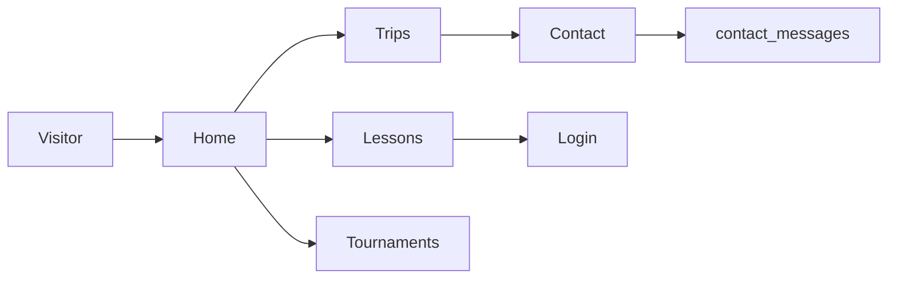
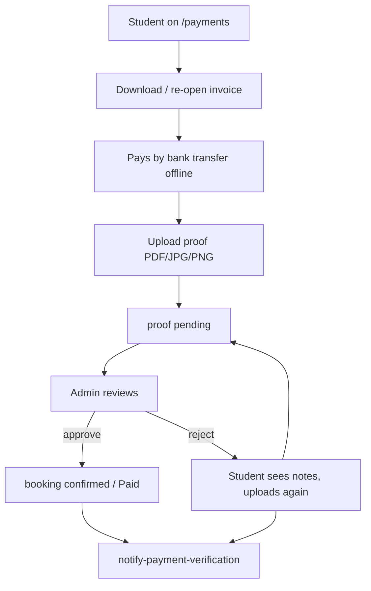
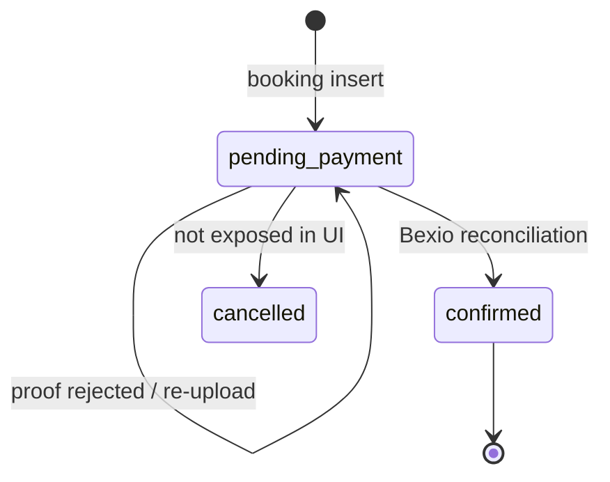

# Baseline Requirements — AGC Padel Academy

> Scope: **as-is application behavior** inferred from `src/` and the complementary specs (`overview.md`, `domain-model.md`, `api-contracts.md`, `architecture.md`, `supabase-backend.md`).
> This is the last brownfield documentation artifact before feature specs under `specs/features/`. Future specs **delta against this file**; they do not restate it.
> Convention: requirement IDs are stable. ✅ confirmed from source · ⚠️ inferred or only partially enforced · ⏸️ defined in schema/UI copy but **not implemented**.
> Requirement language: **MUST** = current system behavior that a user or actor can rely on today.

---

## 1. Purpose of this document

This file describes **what the live system already does**: existing features, actors, workflows, and business capabilities. It is not a wishlist. Planned roles (`coach`, `accounting`), unused tables (`memberships`, `credits`, `availability`), and marketing-only pages (trips booking, tournament registration, newsletter) are listed as **out of current capability**, not as requirements.

---

## 2. Actors

| Actor | Identity | Access today |
|---|---|---|
| **Visitor** | Unauthenticated browser | Public marketing pages, lesson catalogue, contact form, login/signup, terms |
| **Student** | Authenticated user whose `profiles.role` is `student` (default) | Own profile, own bookings/payments, lesson booking, invoice download |
| **Admin** | Authenticated user whose `profiles.role` is `admin` | Everything a student can do, plus `/admin/integrations` (Bexio connection and reconciliation) |
| **Coach** | Role value allowed by `profiles.role` CHECK | ⏸️ No dedicated UI, no dedicated workflows. Schema only (`availability.trainer_id`). |
| **Accounting** | Role value allowed by `profiles.role` CHECK | ⏸️ No dedicated UI. `ProtectedRoute` accepts `allowedRoles` but no route uses it. |

> **ACT-001** The system MUST treat `profiles.role` as the canonical authorization attribute. Allowed values: `student`, `coach`, `accounting`, `admin`. Default on new profiles: `student`.
>
> **ACT-002** The system MUST identify a student as the owner of a booking via `bookings.user_id = auth.uid()`.
>
> **ACT-003** The system MUST treat an admin as any authenticated user whose profile role equals `admin`. Client-side, `/admin/payment-verification` is guarded by `ProtectedRoute requireAdmin`. Server-side, RLS (`is_admin()`) and Edge Function checks enforce the same rule.
>
> **ACT-004** Unauthenticated visitors MUST be redirected to `/login` when they request a protected route (`/profile`, `/payments`, `/admin/*`).
>
> **ACT-005** Non-admin authenticated users MUST be redirected to `/` when they request `/admin/payment-verification`.
>
> ⚠️ The header does **not** expose an Admin link. Admins reach the panel by URL (`/admin` redirects to `/admin/payment-verification`).
>
> **Decision 2026-08-19:** `coach` and `accounting` remain schema-only. Do **not** invent a permission matrix until `class-assignment` / `memberships-credits` are specified. Live actors are **student** and **admin** only. Accounting MUST NOT get `/admin/payment-verification` (or other admin writes) in the meantime. Future spec: `coach-accounting-matrix`.

---

## 3. Business capabilities (as-is)

| ID | Capability | Status |
|---|---|---|
| **BC-01** Discover academy offerings | Public home, lessons, trips (marketing), tournaments (gallery), contact, terms | ✅ live |
| **BC-02** Register and authenticate | Email/password signup, confirmation, sign-in, sign-out, password recovery | ✅ live |
| **BC-03** Maintain a billing profile | Create/update name, phone, address; email is Auth-owned | ✅ live |
| **BC-04** Book a lesson | Authenticated booking of an active catalogue lesson (no self-serve date/slot — **Decision 2026-09-02**) | ✅ live |
| **BC-05** Issue an invoice | Server-generated branded PDF with Swiss QR page; unique sequential number | ✅ live |
| **BC-06** Collect payment by bank transfer | Customer pays offline using invoice instructions; no card processor | ✅ live |
| **BC-07** Submit payment evidence | Retired 2026-08-24 — proof-of-payment removed; Bexio reconciliation confirms payment | ❌ retired |
| **BC-08** Confirm or reject payment | Admin approves/rejects; booking status updates; customer is notified | ✅ live |
| **BC-09** Re-access an invoice | Customer re-opens or regenerates the PDF from My Payments | ✅ live |
| **BC-10** Enquire without an account | Public contact form stored as `contact_messages` | ✅ live |
| **BC-11** Book a trip | Marketing page only; CTA goes to `/contact` | ⏸️ not bookable |
| **BC-12** Register for a tournament | Gallery + “date TBC” copy; no registration | ⏸️ not bookable |
| **BC-13** Spend membership credits | Tables exist, unused | ⏸️ not live |
| **BC-14** Coach availability | Table exists, unused | ⏸️ not live |

---

## 4. Existing features

### 4.1 Public marketing site

- **FEAT-PUB-001**: The system MUST present a public home page describing lessons, tournaments, and trips, with a primary call-to-action to `/lessons`.
- **FEAT-PUB-002**: The system MUST expose public navigation to Home, Lessons, Trips, Tournaments, Contact, and Terms.
- **FEAT-PUB-003**: The system MUST display academy contact details in the footer (address Durisolstrasse 3, 5612 Villmergen; phone; email).
- **FEAT-PUB-004**: Unknown URLs MUST redirect to `/`.
- **FEAT-PUB-005**: `/admin` MUST redirect to `/admin/payment-verification`.
- **FEAT-PUB-006**: The footer newsletter form MUST NOT persist a subscription. ⏸️ It currently shows a “not implemented” toast.

### 4.2 Lesson catalogue

- **FEAT-LES-001**: The system MUST list every `lessons` row where `is_active = true`, ordered by `price_amount` ascending.
- **FEAT-LES-002**: The system MUST group catalogue cards into **Adult Memberships** (`is_subscription = true`) and **Individual Sessions** (`is_subscription = false`).
- **FEAT-LES-003**: Each lesson card MUST show name, price in CHF, description, and a 48-hour cancellation notice.
- **FEAT-LES-004** through **FEAT-LES-008**: **Retired 2026-09-02.** The `/lessons` calendar, 30-minute slot grid, 14:00 block, and public occupancy display are removed. Visitors book a catalogue product; the academy assigns the class.

> ⚠️ **FEAT-LES-003** states a 48-hour cancellation policy in copy. The application does **not** enforce cancellation or refunds. There is no customer-facing cancel action.
>
> **Decision 2026-09-02:** `/lessons` MUST NOT present a calendar or time-slot grid. New bookings MAY have null `booking_date` / `start_time` / `end_time`. Skill-rank placement into existing groups remains a future `class-assignment` spec.

### 4.3 Authentication

- **FEAT-AUTH-001**: A visitor MUST be able to create an account with full name, phone (≥ 9 digits), email, password, and explicit acceptance of terms.
- **FEAT-AUTH-002**: Duplicate signup (already-registered email) MUST NOT create a second account. The UI MUST switch the user to the login tab with an explanatory message.
- **FEAT-AUTH-003**: When email confirmation is required, the system MUST send a confirmation link and MUST NOT sign the user in until the link is used.
- **FEAT-AUTH-004**: After a successful confirmation, `/auth/callback` MUST establish a session and redirect to `/`.
- **FEAT-AUTH-005**: A registered user MUST be able to sign in with email and password.
- **FEAT-AUTH-006**: Unconfirmed accounts MUST be refused at sign-in with a message that points to “Resend sign-up confirmation”.
- **FEAT-AUTH-007**: A visitor MUST be able to request a password-reset email. The recovery link MUST land on `/reset-password` (the app redirects `PASSWORD_RECOVERY` events there).
- **FEAT-AUTH-008**: On `/reset-password`, the user MUST set a new password of at least 6 characters, confirmed twice, then be sent to `/login`.
- **FEAT-AUTH-009**: An authenticated user MUST be able to sign out from the header menu.
- **FEAT-AUTH-010**: On first session, the system MUST upsert a `profiles` row for the auth user (`id`, `email`, `full_name`, `phone` from metadata).
- **FEAT-AUTH-011**: After login from a booking attempt, the system MUST honor `?return_to=` and send the user back to the intended lesson page.

> **Live:** signup counts ≥ 9 digits; `ProfileCompletionModal` uses raw `phone.length < 10`.
>
> **Decision 2026-08-19 (intended, one rule everywhere — not live):** Phone UI is a **country calling-code selector** (default **+41**) plus a **national number** field that accepts **digits only** (no spaces, dashes, or `+`). The same control MUST be used on signup, `ProfileCompletionModal`, and `/profile`. Persist a single E.164 string in `profiles.phone` (`+` + country code + national digits). Completeness requires a selected prefix and a non-empty national number. Implement in a `005` follow-up (or a small profile-phone spec); do not leave two validators.
>
> ⏸️ **OAuth / Google sign-in** is wired in code (`signInWithOAuth`, `OAuthButtons`) but `OAUTH_PROVIDERS` is currently `[]`. Not a live capability.
>
> TODO: Capture OAuth enablement in `specs/features/oauth-signin.md` when the provider is configured.

### 4.4 Profile management

- **FEAT-PRF-001**: An authenticated user MUST be able to view and update `full_name`, `phone`, `address`, `postal_code`, `city`, and `country` on `/profile`.
- **FEAT-PRF-002**: The system MUST NOT allow the profile form to change the account email (email is owned by Supabase Auth).
- **FEAT-PRF-003**: A profile is **complete** when `full_name`, `phone`, `address`, `postal_code`, `city`, and `country` are all non-empty strings. Completeness is enforced in the UI before booking, not by the database.
- **FEAT-PRF-004**: If a student tries to book with an incomplete profile, the system MUST open `ProfileCompletionModal` and MUST NOT create a booking until the profile is saved complete.

### 4.5 Lesson booking

- **FEAT-BKG-001**: Only an authenticated user MAY create a booking.
- **FEAT-BKG-002**: An unauthenticated “Book Now” MUST redirect to `/login?return_to=/lessons?product=<lesson_code>`.
- **FEAT-BKG-003**: Before creating a booking, the student MUST accept the terms and cancellation policy in the confirmation dialog.
- **FEAT-BKG-004**: A new booking MUST snapshot `lesson_code`, `lesson_name`, `price` (`"<amount> CHF"`), `duration_minutes`, `client_email`, `client_phone`, and optional `notes`. `booking_date`, `start_time`, and `end_time` MUST be null (no self-serve slot).
- **FEAT-BKG-005**: A new booking MUST start as `status = pending_payment` and `payment_status = pending`.
- **FEAT-BKG-006**: `bookings.lesson_code` MUST reference an existing `lessons.lesson_code` (FK).
- **FEAT-BKG-007**: After a successful insert, the system MUST request invoice generation for that booking.
- **FEAT-BKG-008**: On invoice success, the system MUST show the PDF in `InvoicePreviewModal` (invoice page + QR page) and offer a download.
- **FEAT-BKG-009**: Closing the invoice modal MUST navigate the student to `/payments`.
- **FEAT-BKG-010**: **Retired 2026-09-02.** There is no public availability grid to occupy.

> ⚠️ There is **no** customer-facing cancel-booking action. Cancellation is an explicit future action (customer, admin, or coach) per domain-model D1/API-contracts TODO 1 — not live.
>
> ⚠️ Booking insert and invoice generation are sequential, not transactional. If invoice generation fails after insert, the booking row remains without `receipt_url`. **FEAT-PAY-003** covers recovery.

### 4.6 Invoicing

- **FEAT-INV-001**: The system MUST generate a branded A4 invoice PDF (company CAG Padel Academy GmbH, customer billing block, line item, total in CHF) and append the matching Swiss QR payment page when a QR file exists for that amount.
- **FEAT-INV-002**: Invoice numbers MUST be unique and sequential per UTC day, format `INV-YYYY/MM/DD-XX`, allocated atomically (`next_invoice_number`).
- **FEAT-INV-003**: The PDF MUST be stored under `invoices/Pending/YYYY/MM/DD/` and the public URL written to `invoices.pdf_url` and `bookings.receipt_url`.
- **FEAT-INV-004**: A new invoice row MUST be created with `status = pending`, `currency = CHF`, and `amount` equal to the lesson price.
- **FEAT-INV-005**: Only the booking owner or an admin MAY invoke invoice generation. The Edge Function MUST reject other callers (401/403).
- **FEAT-INV-006**: The caller MUST be signed in; the session JWT MUST be sent with the invoke.

> **Decision 2026-08-19 (`invoice-lifecycle`, not live):** On proof **approve**, set `invoices.status = paid`, set `paid_at`, and move the PDF from `Pending/` to `Paid/`. On proof **reject**, leave the invoice `pending` (student still owes); do not move to `Refused/` unless the invoice itself is cancelled. Add `UNIQUE (booking_id)`. A second “Get invoice” MUST UPDATE the existing row (or pass `invoice_id`), not INSERT a second invoice. Do not implement this inside unrelated features.

### 4.7 Customer payments (My Payments)

- **FEAT-PAY-001**: An authenticated student MUST see only their own bookings on `/payments`, newest first, with lesson name, date, price, and payment status (`pending` → “Pending”, `confirmed` → “Paid”).
- **FEAT-PAY-002**: For a booking that already has `receipt_url`, the student MUST be able to re-open the invoice PDF (“Invoice (PDF)”).
- **FEAT-PAY-003**: For a pending booking with no `receipt_url`, the student MUST be able to generate the invoice on demand (“Get invoice”), subject to **FEAT-INV-005**.
- **FEAT-PAY-004** through **FEAT-PAY-009**: **Retired 2026-08-24.** Payment-proof upload, preview, and re-upload after rejection are removed. Students pay the QR invoice; confirmation is Bexio reconciliation.

- **FEAT-ADM-001** through **FEAT-ADM-007**: **Retired 2026-08-24.** The admin proof-verification panel is removed. Admin tools live at `/admin/integrations`.

### 4.8 Admin (Bexio integration)

- **FEAT-ADM-001** through **FEAT-ADM-007**: **Retired 2026-08-24.** The payment-verification panel is removed. Admins use `/admin/integrations` for Bexio connection and reconciliation. `/admin/payment-verification` redirects there.

### 4.9 Contact

- **FEAT-CTC-001**: A visitor MUST be able to submit name, email, phone, subject, and message via `/contact`.
- **FEAT-CTC-002**: Submission MUST be handled by the `submit-contact-form` Edge Function and persisted as a `contact_messages` row (`status = new`).
- **FEAT-CTC-003**: There is **no** in-app inbox for staff to process contact messages. Follow-up is out of band.

### 4.10 Trips and tournaments (marketing only)

- **FEAT-TRP-001**: `/trips` MUST present the Ebro Delta campus marketing content. The primary CTA MUST navigate to `/contact` (“Sign up for the Trip”). The system MUST NOT create a trip booking.
- **FEAT-TRN-001**: `/tournaments` MUST present upcoming-tournament copy (date “to be confirmed”) and a photo gallery. The system MUST NOT accept tournament registration.

### 4.11 Legal

- **FEAT-LGL-001**: `/terms` MUST publish the academy terms, cancellation policy, and privacy/impressum copy.
- **FEAT-LGL-002**: Signup and booking confirmation MUST require explicit acceptance of those terms before the respective action proceeds.

---

## 5. Workflows

### 5.1 Discover → enquire (visitor)



- **WF-001**: A visitor MUST be able to complete the path Home → service page → Contact without an account.
- **WF-002**: A visitor who wants to book a lesson MUST be able to start from Home or header “Book Now” and land on `/lessons`.

### 5.2 Register → confirm → sign in

```mermaid
flowchart TD
  A[Visitor on /login Register] -->|accepts terms| B[signUp]
  B -->|email already used| C[Login tab + message]
  B -->|confirmation required| D[Check inbox]
  D --> E[/auth/callback]
  E --> F[Session + profile upsert]
  F --> G[Home]
  B -->|session returned| F
```

- **WF-003**: Registration MUST produce a `profiles` row linked 1:1 to `auth.users`.
- **WF-004**: Password recovery MUST be: request email → open link → `/reset-password` form → new password → `/login`. It MUST NOT silently log the user in on a random page.

### 5.3 Book a lesson and receive an invoice (primary transactional flow)

```mermaid
flowchart TD
  U[Student on /lessons] -->|Book Now| Auth{Signed in?}
  Auth -->|no| Login
  Login --> U
  Auth -->|yes| Prof{Profile complete?}
  Prof -->|no| PCM[ProfileCompletionModal]
  PCM --> Confirm
  Prof -->|yes| Confirm[Confirm dialog]
  Confirm -->|terms accepted| Ins[INSERT booking pending_payment]
  Ins --> Inv[generate-invoice-pdf]
  Inv -->|success| Modal[InvoicePreviewModal]
  Modal -->|close| Pay[/payments]
  Inv -->|fail| Orphan[Booking exists, no receipt_url]
```

- **WF-005**: The happy path MUST be: authenticate → complete profile if needed → accept terms → create pending booking → generate invoice → preview/download PDF → My Payments.
- **WF-006**: A pending booking MUST remain visible to the student on My Payments even if invoice generation failed, and **FEAT-PAY-003** MUST allow recovery.

### 5.4 Pay by bank transfer and prove payment



- **WF-007**: Payment MUST be offline (bank transfer using the invoice / QR). The application MUST NOT charge a card.
- **WF-008**: A booking MUST stay `pending` until Bexio records full payment and reconciliation confirms it.
- **WF-009**: **Retired 2026-08-24.** Proof rejection/re-upload no longer exists.
- **WF-010**: Approval MUST mark the booking paid/confirmed from the student’s point of view (“Paid” badge).

### 5.5 Admin verification

- **WF-011**: **Retired 2026-08-24.** Admin proof filtering/approve/reject is removed.
- **WF-012**: Notification failure MUST NOT roll back the verification decision.

### 5.6 Booking lifecycle (as implemented)



- **WF-013**: `bookings.status` and `bookings.payment_status` MUST both become `confirmed` on approval. On reject, `payment_status` MUST remain `pending`.
- **WF-014**: `cancelled` is a stored status value. No live UI or Edge Function currently transitions a booking to cancelled. ⏸️

---

## 6. Cross-cutting rules

- **XR-001**: Monetary amounts shown to customers MUST be in CHF.
- **XR-002**: The application is single-tenant: one academy, one brand. No multi-academy switching.
- **XR-003**: Authorization for data writes MUST be enforced by RLS and Edge Function checks, not only by `ProtectedRoute`.
- **XR-004**: PII on bookings (owner identity) MUST NOT be readable by anonymous visitors. The `booking_slots` view remains a non-PII projection; `/lessons` does not display occupancy.
- **XR-005**: Stripe MUST NOT be part of any live payment path.
- **XR-006**: English is the live UI language. A Spanish copy exists inside `LessonsPage` but is not user-selectable. ⏸️ i18n is not a live capability.

---

## 7. Explicitly out of current capability

These appear in marketing copy, schema, or earlier specs but **MUST NOT** be treated as implemented requirements:

| Item | Evidence |
|---|---|
| Trip booking / payment | `TripsPage` CTA → `/contact`; no `trips` table |
| Tournament registration | `TournamentsPage` is gallery + TBC copy; no `tournaments` table |
| Newsletter | Footer toast “not implemented” |
| OAuth sign-in | `OAUTH_PROVIDERS = []` |
| Coach schedules | `availability` empty, no UI |
| Memberships / credit tokens | tables empty, no UI |
| Customer cancel / refund | copy only (48 h); no action |
| Invoice folder move Pending → Paid | documented future; not coded |
| Combined admin invoice + proof workspace | deferred (api-contracts TODO 10) |
| In-app contact-message inbox | insert-only |

---

## 8. Assumptions and TODOs

> **Assumption:** Bank transfer details live on the invoice PDF / QR page; the web UI does not duplicate IBAN copy on My Payments.
>
> **Assumption:** There is no automatic expiry of unpaid bookings. Cancellation is an explicit future action.
>
> **Decision 2026-09-02:** Self-serve calendar/slots are removed from `/lessons`. See §4.2.
>
> **Decision 2026-08-19:** `coach` / `accounting` stay schema-only; no admin-equivalent access until `coach-accounting-matrix` (after class-assignment / memberships-credits). Live actors: student, admin.
>
> **Decision 2026-08-19:** Invoice paid + folder move + `UNIQUE(booking_id)` + regenerate-as-UPDATE belong in `invoice-lifecycle` only. See §4.6. Current approve/reject MUST keep updating bookings/proofs only.
>
> **Decision 2026-08-19:** Phone = country-prefix picker (default +41) + digits-only national number, one control on signup / profile modal / `/profile`, stored as E.164 in `profiles.phone`. See §4.3. Live dual validators stay a gap until implemented.
>
> **Decision 2026-08-19:** Dual identity. **CAG Padel Academy GmbH** on legal copy, impressum, and invoice PDFs. **AGC Padel Academy** on product UI, domain, and repository. Do not rename one side.
>
> TODO: Enforce 48-hour cancellation (or replace the copy) in a cancellation feature spec.
> TODO: Trip and tournament product tables + booking extension.
> TODO: Membership/credits — tokens from weeks-in-month and academy-open; academy redeems into classes (`memberships-credits`).
> TODO: Skill-rank placement into existing groups (`class-assignment`). Self-serve calendar/slots were removed 2026-09-02.
> TODO: OAuth provider enablement.
> TODO: i18n (DeepL) — `specs/features/i18n.md`.

---

## 9. Relationship to other specs

| Spec | Role vs. this file |
|---|---|
| `specs/project-context/overview.md` | Purpose, users, tech — high level |
| `specs/project-context/domain-model.md` | Entities, cardinalities, invariants |
| `specs/project-context/api-contracts.md` | Endpoints, payloads, auth of functions |
| `specs/baseline-system/architecture.md` | Module map, sequence diagrams, deployment |
| `specs/baseline-system/design.md` | As-is architecture, persistence, integrations, data flows |
| `specs/baseline-system/implementation-inventory.md` | Modules, responsibilities, dependencies, test coverage |
| `specs/baseline-system/supabase-backend.md` | Schema, RLS, functions, storage — technical snapshot |
| **This file** | **Behavioral requirements of the live system** |
| `specs/features/*` | Future deltas (must reference requirement IDs they change) |
| `docs/sdd-brownfield/` | SDD folder map and condensed project context |
