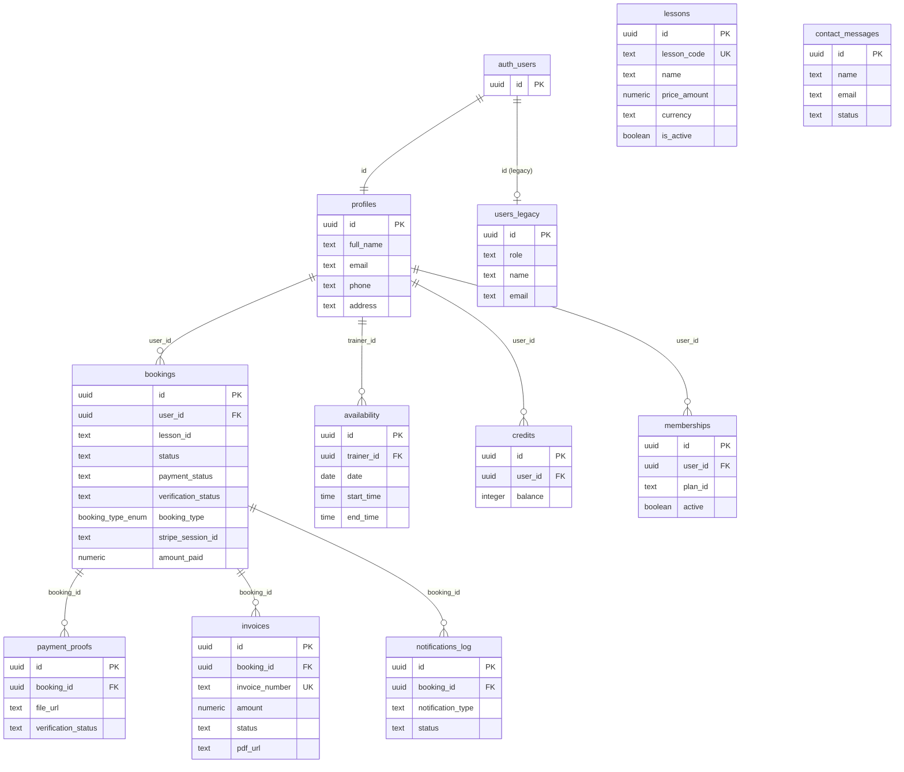

# Baseline System — Supabase Backend

> Snapshot captured: 2026-06-28 via Supabase MCP.
> Project ref: `jokjxpogvwxbwdaroqkc`
> Project URL: `https://jokjxpogvwxbwdaroqkc.supabase.co`
> Methodology: SDD brownfield baseline — document as-is, flag issues, do not modify.

---

## 1. Connection & Keys

| Key | Type | Status |
|---|---|---|
| `anon` (legacy JWT) | Legacy | Active |
| `sb_publishable_iXKO_...` | Publishable (recommended) | Active |

> The frontend currently uses the **legacy anon JWT** via `src/lib/customSupabaseClient.js`. Migrating to the publishable key is a low-priority hardening task — it provides independent rotation without re-rolling the entire JWT secret.

---

## 2. Database Schema

### Installed Extensions (active only)

| Extension | Schema | Version |
|---|---|---|
| `plpgsql` | `pg_catalog` | 1.0 |
| `pg_stat_statements` | `extensions` | 1.11 |
| `uuid-ossp` | `extensions` | 1.1 |
| `pgcrypto` | `extensions` | 1.3 |
| `supabase_vault` | `vault` | 0.3.1 |

All other extensions (PostGIS, vector, pg_cron, pg_net, etc.) are available but **not installed**.

---

### Tables — `public` schema

#### `profiles` (33 rows) — RLS enabled
Primary user profile. Linked 1:1 to `auth.users`.

| Column | Type | Notes |
|---|---|---|
| `id` | `uuid` PK | FK → `auth.users.id` |
| `full_name` | `text` | nullable |
| `email` | `text` | nullable |
| `phone` | `text` | nullable |
| `address` | `text` | nullable |
| `postal_code` | `text` | nullable |
| `city` | `text` | nullable |
| `country` | `text` | nullable |
| `updated_at` | `timestamptz` | default `now()` |

Referenced by: `bookings`, `availability`, `memberships`, `credits`.

> **Schema debt:** There is also a separate `public.users` table (see below). Two profile tables exist simultaneously — likely a migration artifact. Recommend consolidating into `profiles` only.

---

#### `users` (1 row) — RLS enabled — **LEGACY**
Duplicate user table, pre-dates `profiles`. Only 1 row. Likely orphaned.

| Column | Type | Notes |
|---|---|---|
| `id` | `uuid` PK | FK → `auth.users.id` (implied by RLS policy) |
| `name`, `surname` | `text` | split name (vs `profiles.full_name`) |
| `email`, `phone`, `address`, `postal_code`, `city`, `country` | `text` | mirrors `profiles` |
| `role` | `text` | nullable — the **only** role field found in the DB |
| `created_at` | `timestamptz` | |

> **Important:** `users.role` is the only column that could support the `admin` / `coach` / `accounting` role system. It is currently on the **legacy** table. This needs to move to (or be mirrored on) `profiles` as part of the roles & permissions feature.

---

#### `bookings` (178 rows) — RLS enabled — **Main transactional table**

| Column | Type | Notes |
|---|---|---|
| `id` | `uuid` PK | |
| `user_id` | `uuid` | FK → `profiles.id` |
| `lesson_id` | `text` | references `lessons` by code (loose FK) |
| `lesson_name` | `text` | denormalized name |
| `price` | `text` | stored as text — no numeric validation |
| `amount_paid` | `numeric` | actual amount paid |
| `duration_minutes` | `integer` | |
| `group_size` | `integer` | default 1 |
| `status` | `text` CHECK | `pending`, `pending_payment`, `confirmed`, `cancelled` — default `pending_payment` |
| `payment_status` | `text` CHECK | `pending`, `confirmed`, `cancelled` — default `pending` |
| `verification_status` | `text` | no CHECK constraint — free text |
| `booking_type` | `booking_type_enum` | `with_time` or `without_time` — default `with_time` |
| `booking_date` | `date` | nullable |
| `start_time` / `end_time` | `time` | nullable |
| `time_slot` | `text` | nullable (redundant with start/end?) |
| `time_slot_id` | `uuid` | nullable |
| `requires_scheduling` | `boolean` | default false |
| `client_email` | `text` | nullable (may differ from user's profile email) |
| `client_phone` | `text` | nullable |
| `email` | `text` | nullable (duplicate of `client_email`?) |
| `notes` | `text` | nullable |
| `stripe_session_id` | `text` | nullable — Stripe legacy, to be removed |
| `receipt_url` | `text` | nullable |
| `product_name` | `text` | nullable |
| `ip_address` | `text` | nullable |
| `terms_version` | `text` | nullable |
| `proof_uploaded_at` | `timestamptz` | nullable |
| `payment_date` | `timestamptz` | nullable |
| `created_at` / `updated_at` | `timestamptz` | |

Referenced by: `payment_proofs`, `invoices`, `notifications_log`.

> **Schema debt:**
> - `price` is `text` instead of `numeric` — inconsistent with `amount_paid` which is `numeric`.
> - `verification_status` has no CHECK constraint (unlike `status` and `payment_status`).
> - `email` column vs `client_email` — purpose is ambiguous; likely a migration artifact.
> - `time_slot` (text) vs `time_slot_id` (uuid) vs `start_time`/`end_time` — three overlapping representations of the same concept.
> - `stripe_session_id` is a dead column once Stripe is removed.

---

#### `bookings_old` (0 rows) — RLS enabled — **ARCHIVED**
Old booking table from before the current schema. Zero rows; safe to drop after confirming no foreign key dependencies.

---

#### `lessons` (14 rows) — RLS enabled — **NO RLS POLICIES** ⚠️
The lesson catalogue.

| Column | Type | Notes |
|---|---|---|
| `id` | `uuid` PK | |
| `lesson_code` | `text` UNIQUE | |
| `name` | `text` | |
| `description` | `text` | nullable |
| `price_amount` | `numeric` | |
| `currency` | `text` | default `CHF` |
| `duration_minutes` | `integer` | |
| `sessions_per_week` | `integer` | default 1 |
| `is_group_lesson` | `boolean` | default false |
| `is_subscription` | `boolean` | default false |
| `is_active` | `boolean` | default true |
| `stripe_price_id` | `text` | nullable — Stripe legacy, to be removed |
| `created_at` / `updated_at` | `timestamptz` | |

> **Security:** RLS is enabled but **no policies exist** — this means the table is inaccessible to all client-side queries. If the lessons list is currently rendering, either the Edge Functions use the service role key (bypassing RLS), or this table is not the actual data source for the lessons page. Needs investigation.

---

#### `invoices` (21 rows) — RLS enabled — **NO RLS POLICIES** ⚠️
Invoice records, one per booking.

| Column | Type | Notes |
|---|---|---|
| `id` | `uuid` PK | |
| `booking_id` | `uuid` | FK → `bookings.id` |
| `invoice_number` | `text` UNIQUE | |
| `amount` | `numeric` | |
| `currency` | `text` | default `CHF` |
| `status` | `text` CHECK | `pending`, `paid`, `cancelled` — default `pending` |
| `pdf_url` | `text` | nullable — link to generated PDF in Storage |
| `paid_at` | `timestamptz` | nullable |
| `created_at` | `timestamptz` | |

> **Security:** RLS enabled but **no policies**. Same concern as `lessons` — client-side access is currently blocked. The `pdf_url` references the `invoices` Storage bucket (see §4).

---

#### `payment_proofs` (0 rows) — RLS enabled — policies exist but conflicting ⚠️

| Column | Type | Notes |
|---|---|---|
| `id` | `uuid` PK | |
| `booking_id` | `uuid` | FK → `bookings.id` |
| `file_url` | `text` | URL to uploaded file in `payment-proofs` bucket |
| `verification_status` | `text` | default `pending` |
| `admin_notes` | `text` | nullable |
| `upload_date` / `created_at` | `timestamptz` | |

---

#### `availability` (0 rows) — RLS enabled

| Column | Type | Notes |
|---|---|---|
| `id` | `uuid` PK | |
| `trainer_id` | `uuid` | FK → `profiles.id` |
| `date` | `date` | |
| `start_time` / `end_time` | `time` | |
| `status` | `text` | default `open` |

> No rows currently. Trainer-availability scheduling is not yet in use.

---

#### `credits` (0 rows) — RLS enabled

| Column | Type | Notes |
|---|---|---|
| `id` | `uuid` PK | |
| `user_id` | `uuid` | FK → `profiles.id` |
| `balance` | `integer` | default 0 |
| `expiry_date` | `timestamptz` | nullable |
| `source` | `text` | nullable |
| `created_at` | `timestamptz` | |

> No rows currently. Credit system is not yet in use.

---

#### `memberships` (0 rows) — RLS enabled

| Column | Type | Notes |
|---|---|---|
| `id` | `uuid` PK | |
| `user_id` | `uuid` | FK → `profiles.id` |
| `plan_id` | `text` | nullable |
| `start_date` / `next_charge_date` | `timestamptz` | nullable |
| `active` | `boolean` | default true |

> No rows currently. Membership / subscription system is not yet in use.

---

#### `notifications_log` (1 row) — RLS enabled

| Column | Type | Notes |
|---|---|---|
| `id` | `uuid` PK | |
| `booking_id` | `uuid` | FK → `bookings.id` |
| `notification_type` | `text` CHECK | `email`, `sms` |
| `recipient_type` | `text` CHECK | `client`, `admin` |
| `recipient_email` / `recipient_phone` | `text` | nullable |
| `message_subject` | `text` | nullable |
| `status` | `text` CHECK | `sent`, `failed`, `pending` |
| `error_message` | `text` | nullable |
| `sent_at` / `created_at` | `timestamptz` | |

---

#### `contact_messages` (12 rows) — RLS enabled

| Column | Type | Notes |
|---|---|---|
| `id` | `uuid` PK | |
| `name`, `email` | `text` | |
| `phone` | `text` | nullable |
| `subject`, `message` | `text` | |
| `status` | `text` | default `new` |
| `created_at` | `timestamptz` | |

---

### Entity Relationship Diagram

---

## 3. Edge Functions

All 14 functions are **ACTIVE** and run with `verify_jwt: false` (unauthenticated calls are permitted at the HTTP level — trust is enforced inside each function).

| Function | Version | Purpose | Status |
|---|---|---|---|
| `create-booking` | v50 | Original booking creation (Stripe Checkout) | **Deprecate** (Stripe removal) |
| `handle-stripe-webhook` | v20 | Stripe payment webhook handler | **Deprecate** (Stripe removal) |
| `cleanup-pending-bookings` | v15 | Scheduled cleanup of stale pending bookings | Active |
| `generate-booking-receipt` | v3 | Generate a receipt for a booking | Active |
| `assign-booking-time` | v1 | Assign a time slot to a booking | Active |
| `verify-booking-saved` | v9 | Confirm a booking was persisted correctly | Active |
| `submit-contact-form` | v13 | Handle contact form submissions | Active |
| `generate-invoice-pdf` | v9 | Generate invoice PDF (v1) | May be superseded by v2 |
| `merge-invoice-qr` | v1 | Merge QR code into the invoice PDF | Active — explains `qrcode` dep |
| `upload-invoice-to-storage` | v2 | Upload generated PDF to `invoices` bucket | Active |
| `create-booking-with-invoice` | v2 | Combined: create booking + generate invoice | **Current main booking flow** |
| `verify-invoice-generation` | v1 | Verify invoice was generated and stored | Active |
| `notify-payment-verification` | v1 | Notify user/admin of payment verification result | Active |
| `generate-invoice-pdf-v2` | v2 | Revised invoice PDF generator | Active — may replace v1 |

> **Invoice pipeline (inferred):**
> `create-booking-with-invoice` → `generate-invoice-pdf-v2` → `merge-invoice-qr` → `upload-invoice-to-storage` → `invoices.pdf_url` set → `InvoiceModal` renders the PDF in an iframe.
>
> `qrcode` and `pdf-lib`/`pdfkit` are server-side dependencies inside these Edge Functions — they are **not** needed in the frontend `package.json`.
>
> **Deprecation backlog:** `create-booking` (v50) and `handle-stripe-webhook` (v20) should be deactivated once it is confirmed that the `create-booking-with-invoice` flow is the sole active entry point.

---

## 4. Storage Buckets

| Bucket | Public | Purpose | File size limit | MIME restriction |
|---|---|---|---|---|
| `invoices` | Yes | Generated invoice PDFs | None | None |
| `receipts` | Yes | Stripe receipts (legacy) | None | None |
| `qr-codes` | Yes | QR codes embedded in invoices | None | None |
| `payment-proofs` | No (private) | Customer-uploaded bank transfer proofs | None | None |

---

## 5. RLS Policies Summary

| Table | Policy | Role | Command | Condition |
|---|---|---|---|---|
| `profiles` | Public profiles are viewable by everyone | public | SELECT | `true` |
| `profiles` | Users can insert their own profile | public | INSERT | (check via trigger) |
| `profiles` | Users can update own profile | public | UPDATE | `auth.uid() = id` |
| `profiles` | Users can update own stripe_customer_id | public | UPDATE | `auth.uid() = id` (**duplicate of above — merge**) |
| `profiles` | Users can view their own stripe_customer_id | public | SELECT | `auth.uid() = id` (**redundant with public SELECT**) |
| `users` (legacy) | Users can see their own profile | public | SELECT | `auth.uid() = id` |
| `users` (legacy) | Users can update their own profile | public | UPDATE | `auth.uid() = id` |
| `bookings` | Public read bookings | public | SELECT | `true` (**all bookings visible to all — security concern**) |
| `bookings` | Users insert own bookings | public | INSERT | (no row filter) |
| `bookings` | Users update own bookings | public | UPDATE | `auth.uid() = user_id` |
| `bookings_old` | Users can view their own bookings | public | SELECT | `auth.uid() = user_id` |
| `bookings_old` | Users can create bookings for themselves | public | INSERT | — |
| `availability` | Public can view availability | public | SELECT | `true` |
| `credits` | Users can view own credits | public | SELECT | `auth.uid() = user_id` |
| `memberships` | Users can view own membership | public | SELECT | `auth.uid() = user_id` |
| `payment_proofs` | Service Role Full Access Payment Proofs | public | ALL | `true` (**overly permissive — see §6**) |
| `payment_proofs` | Users can insert their own payment proofs | public | INSERT | — |
| `payment_proofs` | Users can view their own payment proofs | public | SELECT | via `bookings.user_id = auth.uid()` |
| `contact_messages` | Service role full access | service_role | ALL | `true` |
| `notifications_log` | Service Role Full Access | service_role | ALL | `true` |
| `invoices` | *(none)* | — | — | **No policies — inaccessible to clients** ⚠️ |
| `lessons` | *(none)* | — | — | **No policies — inaccessible to clients** ⚠️ |

> **Applied to remote on 2026-07-07** via the Supabase MCP: `supabase/migrations/0001_add_roles_and_admin_rls.sql` is now tracked in `supabase_migrations`. It added a `profiles.role` column, an `is_admin()` helper, and admin-only UPDATE policies on `payment_proofs` and `bookings`. It also dropped the permissive "Service Role Full Access Payment Proofs" policy on the `public` role (advisor warning 0024) and consolidated `payment_proofs` SELECT/INSERT into single permissive policies (advisor warning 0006). The table below still reflects the *pre-migration* state for traceability; update it on the next baseline refresh.

---

## 6. Security Findings

These were reported by the Supabase advisor. Listed here for traceability; remediation should be done as deliberate spec'd tasks, not ad-hoc.

| Severity | Finding | Affected object | Remediation |
|---|---|---|---|
| ⚠️ WARN | `payment_proofs` has a service-role ALL policy targeting `public` role — effectively bypasses RLS for everyone | `payment_proofs` | Remove the "Service Role Full Access Payment Proofs" policy from the `public` role; service_role bypasses RLS by default anyway. [Docs](https://supabase.com/docs/guides/database/database-linter?lint=0024_permissive_rls_policy) |
| ⚠️ WARN | `payment_proofs` has conflicting policies causing multiple permissive policy overhead | `payment_proofs` | Consolidate into a single SELECT and single INSERT policy. [Docs](https://supabase.com/docs/guides/database/database-linter?lint=0006_multiple_permissive_policies) |
| ⚠️ WARN | `profiles` has duplicate SELECT and UPDATE policies (stripe_customer_id ones vs general) | `profiles` | Merge the stripe_customer_id policies into the general profile policies. |
| ℹ️ INFO | `invoices` — RLS enabled, zero policies | `invoices` | Add appropriate client-side read policy (e.g. users can read invoices for their own bookings). |
| ℹ️ INFO | `lessons` — RLS enabled, zero policies | `lessons` | Add a public SELECT policy (lesson catalogue is public data). |
| ⚠️ WARN | `handle_new_user()` function has a mutable `search_path` | `public.handle_new_user` | Set `search_path = ''` and qualify all object names. [Docs](https://supabase.com/docs/guides/database/database-linter?lint=0011_function_search_path_mutable) |
| ⚠️ WARN | `handle_new_user()` is callable by `anon` and `authenticated` as `SECURITY DEFINER` | `public.handle_new_user` | Revoke `EXECUTE` from `anon`/`authenticated`, or switch to `SECURITY INVOKER`. [Docs](https://supabase.com/docs/guides/database/database-linter?lint=0028_anon_security_definer_function_executable) |
| ⚠️ WARN | `invoices` and `receipts` Storage buckets are public and allow directory listing | `storage.invoices`, `storage.receipts` | Remove broad SELECT storage policies; object URLs still work without listing. [Docs](https://supabase.com/docs/guides/database/database-linter?lint=0025_public_bucket_allows_listing) |
| ⚠️ WARN | `bookings` SELECT policy is `true` — all bookings are readable by anyone (including unauthenticated) | `bookings` | Restrict to `auth.uid() = user_id` for customers; add admin bypass. |
| ⚠️ WARN | Leaked password protection is disabled in Supabase Auth | Auth settings | Enable HaveIBeenPwned.org check in Supabase Auth dashboard → Settings → Auth → Password. |

---

## 7. Performance Findings

| Issue | Affected object | Fix |
|---|---|---|
| Unindexed FK `availability_trainer_id_fkey` | `availability.trainer_id` | `CREATE INDEX ON availability(trainer_id)` |
| Unindexed FK `bookings_user_id_fkey1` | `bookings.user_id` | `CREATE INDEX ON bookings(user_id)` |
| Unindexed FK `bookings_user_id_fkey` | `bookings_old.user_id` | (drop table instead) |
| Unindexed FK `credits_user_id_fkey` | `credits.user_id` | `CREATE INDEX ON credits(user_id)` |
| Unindexed FK `invoices_booking_id_fkey` | `invoices.booking_id` | `CREATE INDEX ON invoices(booking_id)` |
| Unindexed FK `memberships_user_id_fkey` | `memberships.user_id` | `CREATE INDEX ON memberships(user_id)` |
| Unindexed FK `notifications_log_booking_id_fkey` | `notifications_log.booking_id` | `CREATE INDEX ON notifications_log(booking_id)` |
| Unindexed FK `payment_proofs_booking_id_fkey` | `payment_proofs.booking_id` | `CREATE INDEX ON payment_proofs(booking_id)` |
| `auth.uid()` not wrapped in `SELECT` in RLS policies | `profiles`, `bookings`, `bookings_old`, `users`, `credits`, `memberships`, `payment_proofs` | Replace `auth.uid()` with `(SELECT auth.uid())` in all policy expressions. |

---

## 8. Open Items / Deferred Decisions

- **Role system:** Implemented as a `role` column on `public.profiles` (`student`, `coach`, `accounting`, `admin`; default `student`). Applied to remote on 2026-07-07 as migration `0001_add_roles_and_admin_rls` (tracked in `supabase_migrations`). A helper `public.is_admin()` is used by RLS policies on `payment_proofs` and `bookings` to enforce admin-only writes server-side. The frontend reads `profile.role` via `useAuth().role`. JWT custom claims and a separate `user_roles` join table were considered and rejected (claims require session refresh on role change; the join table adds complexity for a single-role-per-user model). The current admin user is `josep.barbera.reverte.1999@gmail.com` (the legacy `admin@agcpadelacademy.com` hardcoded in old code never existed in `auth.users`).
- **`generate-invoice-pdf` vs `generate-invoice-pdf-v2`:** Both are active. Determine which is the canonical generator and deprecate the other.
- **`cleanup-pending-bookings`:** Unclear if this is triggered by a Supabase cron job (`pg_cron`) or an external scheduler. `pg_cron` extension is available but not installed.
- **Migrations table is empty:** No migrations are tracked in `supabase_migrations`. All schema changes were applied directly through the Supabase dashboard. This means there is no reproducible migration history. Creating a migration baseline should be a priority before adding new schema changes.
- **No-file-size or MIME-type restrictions on any Storage bucket:** Any file size / type can be uploaded to `payment-proofs`. Add limits when implementing the payment-proof upload feature spec.
