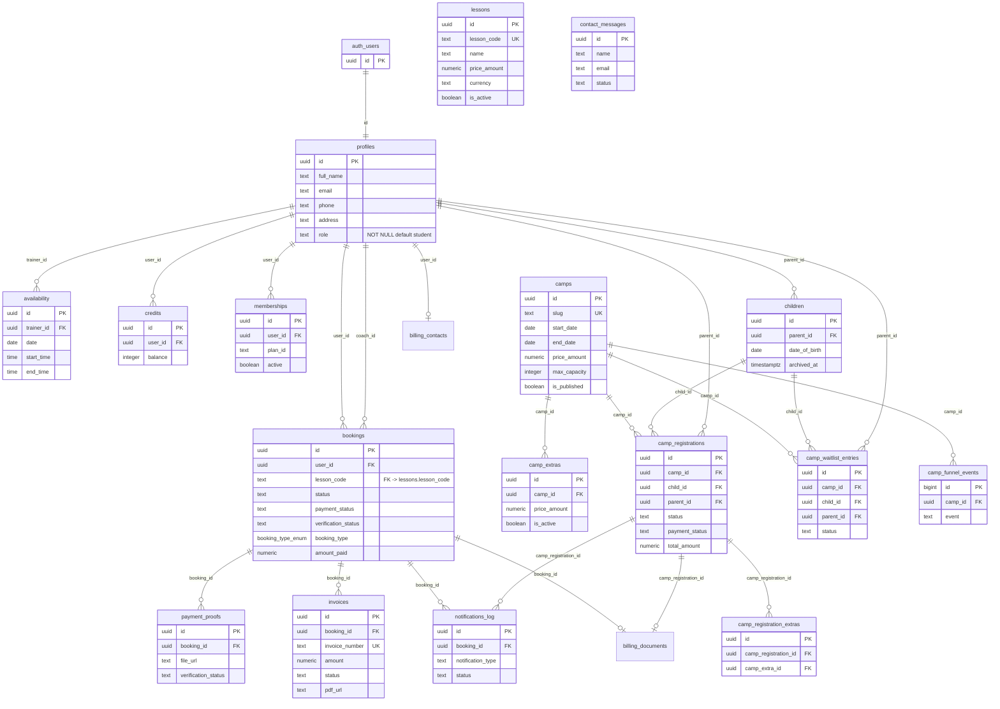

# Baseline System — Supabase Backend

> Snapshot captured: 2026-06-28 via Supabase MCP.
> Refreshed 2026-08-06: `profiles.role` column added (was missing from the original snapshot); `users` table deleted; NOT NULL constraints tightened (migration `0002`); `lessons.stripe_price_id` column dropped; `bookings.lesson_id` renamed to `lesson_code` with FK to `lessons.lesson_code` (migration `0003`); 135 old/null-dated bookings deleted (29 remain); `notifications_log` FK changed from ON DELETE SET NULL to ON DELETE CASCADE.
> Refreshed 2026-08-07: Stripe artifacts removed (migration `0004`: `bookings.stripe_session_id` column dropped, Stripe-named `profiles` policies dropped); atomic invoice numbering added (migration `0005`: `invoice_counters` table + `next_invoice_number()` RPC); `generate-invoice-pdf` v18 and `notify-payment-verification` v2 deployed; §3/§4/§5 reconciled with the live project (13 Edge Functions, 3 pending manual deletion; `receipts` bucket pending deletion; live RLS policies; `bookings_old` no longer present in the live schema). Live row counts updated.
> Refreshed 2026-08-10: five unused/legacy Edge Functions (`create-booking`, `handle-stripe-webhook`, `verify-booking-saved`, `generate-booking-receipt`, `assign-booking-time`) and the `receipts` bucket deleted by the owner. 8 functions remain.
> Refreshed 2026-08-10 (PM): RLS hardening (migration `0006`) — `booking_slots` non-PII view created; `bookings` public-read policy replaced by owner/admin SELECT policies. Edge Function auth hardened — `generate-invoice-pdf` v21 and `notify-payment-verification` v5 run with `verify_jwt: true` + in-function JWT/authorization checks.
> Refreshed 2026-08-19: live Edge Function versions are `generate-invoice-pdf` **v22** and `notify-payment-verification` **v6** (explicit JWT); payment-proof storage path is `{booking_id}/attempt-{n}.{ext}`.
> Refreshed 2026-08-25 (007 Bexio): migrations `0003_bexio_integration`, `0004_bexio_reconcile_cron`, `0005_profile_billing_fields` add billing tables, `pg_cron`/`pg_net`, profile name/country_code columns, and five billing Edge Functions. Proof UI removed; Bexio is the paid signal. Full schema: `specs/features/007-bexio-integration/data-model.md`.
> Refreshed 2026-08-31 (008 F1.02): `bookings.coach_id`, `is_coach()`, role/assignment triggers, `session_roster`, dropped public `profiles` SELECT, and owner-path `payment-proofs` storage policies are live. Exact policy-name hardening is tracked as `f102_drop_public_profiles_policy_exact_name`.
> Refreshed 2026-09-07 (009 F1.04): `profiles.date_of_birth` and `profiles.is_active`, field-level profile mutation guard, active-aware role helpers and booking mutations, admin client management, active-aware billing/Bexio functions, and assigned-participant roster phone are live.
> Refreshed 2026-08-31 (Security Advisor): migration `0009_security_advisor_hardening` removes API execution of trigger-only functions, narrows definer views to explicit read-only grants, and revokes API privileges from service-role-only tables.
> Refreshed 2026-08-31 (Security Advisor): migration `0010_private_projection_readers` makes all public views SECURITY INVOKER. Fixed-output privileged readers live in unexposed `private`; explicit deny policies document service-role-only tables.
> Refreshed 2026-09-08 (010 F1.25): migrations `0014_f125_padel_camps` and `0015_f125_is_admin_anon_grant` add the Camps domain (8 new tables), the `camp_public_list` view, three camp Edge Functions, and `camp_registration_id` columns on `notifications_log` / `billing_documents` / `billing_operations` / `billing_events`. Legacy `bookings_duplicate` table documented. Live row counts, role distribution, and Edge Function versions reconciled with the live project. Schema-layout decision recorded (§2).
> Refreshed 2026-09-09 (010 C1+C2): migrations `0016_f125_children_evolution` (`children.avatar_path`, private `child-avatars` bucket, owner/admin DELETE when no history) and `0017_f125_camp_flyers_pricing` (`camps.flyer_path`, `camps.member_price_amount`, `camp_registrations.member_price_claimed`, private `camp-flyers` bucket, `register_camp_child` claim parameter). `camp-submit-registration` v8 and `camp-admin` v5.
> Project ref: `jokjxpogvwxbwdaroqkc`
> Project URL: `https://jokjxpogvwxbwdaroqkc.supabase.co`
> Methodology: SDD brownfield baseline — document as-is, flag issues, do not modify.

---

## 1. Connection & Keys

| Key | Type | Status |
|---|---|---|
| `anon` (legacy JWT) | Legacy | Active |
| `sb_publishable_iXKO_...` | Publishable (recommended) | Active |

> The frontend currently uses the **legacy anon JWT** via `src/lib/customSupabaseClient.js`. Migrating to the publishable key is a low-priority hardening task — it provides independent rotation without re-rolling the entire JWT secret.

---

## 2. Database Schema

### Installed Extensions (active only)

| Extension | Schema | Version |
|---|---|---|
| `plpgsql` | `pg_catalog` | 1.0 |
| `pg_stat_statements` | `extensions` | 1.11 |
| `uuid-ossp` | `extensions` | 1.1 |
| `pgcrypto` | `extensions` | 1.3 |
| `supabase_vault` | `vault` | 0.3.1 |
| `pg_cron` | *(installed 007)* | used by `0004_bexio_reconcile_cron` |
| `pg_net` | *(installed 007)* | HTTP from cron to `bexio-reconcile` |

`pg_cron` and `pg_net` were enabled by migration `0003_bexio_integration` (007). `supabase_vault` was already installed and is used for Bexio token names.

---

### Schema layout (decision 2026-09-08)

User-owned objects live in exactly two schemas:

| Schema | Exposed via Data API | Contents |
|---|---|---|
| `public` | Yes (PostgREST exposed schema) | All domain tables + narrow SECURITY INVOKER projection views. **RLS on every table is the security boundary**, not the schema. |
| `private` | No | SECURITY DEFINER fixed-output readers behind the public views (`booking_slots_rows`, `session_roster_rows`, `billing_public_config_row`) — migration `0010`. |

All other schemas (`auth`, `storage`, `vault`, `cron`, `net`, `extensions`, `graphql`, `graphql_public`, `realtime`, `supabase_migrations`, `pgbouncer`) are Supabase-managed — never create or move user objects there.

**Convention: new domain tables stay in `public`; do not create per-domain schemas** (e.g. `camps`, `billing`):

- Postgres schemas are namespaces, not security boundaries — RLS protects rows identically in any schema.
- The frontend Data API client resolves unqualified table names against the exposed schema list; moving a table out of `public` breaks every `supabase.from('<table>')` caller and every view/function with unqualified references, for no security gain.
- Name prefixes already provide namespacing (`camp_*`, `billing_*`).
- Objects that must never be reachable through the API go in the existing unexposed `private` schema, not in a new schema.

---

### Tables — `public` schema

#### `profiles` (64 rows) — RLS enabled
Primary user profile. Linked 1:1 to `auth.users`. Holds the canonical `role` field.

| Column | Type | Notes |
|---|---|---|
| `id` | `uuid` PK | FK → `auth.users.id` |
| `full_name` | `text` NOT NULL | |
| `email` | `text` | nullable (27 incomplete profiles) |
| `phone` | `text` | nullable (20 incomplete profiles) |
| `address` | `text` | nullable (26 incomplete profiles) |
| `postal_code` | `text` | nullable (26 incomplete profiles) |
| `city` | `text` | nullable (26 incomplete profiles) |
| `country` | `text` | nullable (26 incomplete profiles) |
| `role` | `text` NOT NULL | default `'student'`, CHECK constraint: `student`, `coach`, `accounting`, `admin`. Current values: `student` (61), `coach` (2), `admin` (1). |
| `first_name` / `last_name` | `text` | nullable — added 007 migration `0005_profile_billing_fields`; mapped to Bexio person `name_2` / `name_1` |
| `country_code` | `text` | nullable ISO 3166-1 alpha-2 (CHECK `^[A-Z]{2}$`); mapped to Bexio `country_id` |
| `date_of_birth` | `date` | nullable; future dates rejected by `guard_profile_mutation` |
| `is_active` | `boolean` NOT NULL | default `true`; non-destructive client lifecycle and active-role authorization |
| `updated_at` | `timestamptz` NOT NULL | default `now()` |

Referenced by: `bookings`, `availability`, `memberships`, `credits`, `children`, `camp_registrations`, `camp_waitlist_entries`, `bookings_duplicate`.

> **Profile completion:** contact/address fields remain nullable because 20–27 existing profiles are incomplete (users who never finished profile completion). The "profile must be complete before booking" invariant is enforced only in the UI layer (`ProfileCompletionModal` + `src/lib/profileValidation.js`), not in the DB.

---

#### ~~`users`~~ — **DELETED 2026-08-06**
The legacy `public.users` table (pre-`profiles`, 1 mock row) has been dropped. `profiles.role` is the sole canonical role field. See `specs/project-context/domain-model.md` for the role-system decision.

---

#### `bookings` (93 rows) — RLS enabled — **Main transactional table**

| Column | Type | Notes |
|---|---|---|
| `id` | `uuid` PK | |
| `user_id` | `uuid` NOT NULL | FK → `profiles.id` |
| `lesson_code` | `text` | nullable — FK → `lessons.lesson_code` (enforced, migration `0003`). Application layer should always set it. |
| `lesson_name` | `text` NOT NULL | denormalized name |
| `price` | `text` NOT NULL | stored as text — no numeric validation |
| `amount_paid` | `numeric` | nullable — set when paid |
| `duration_minutes` | `integer` NOT NULL | |
| `group_size` | `integer` NOT NULL | default 1 |
| `status` | `text` NOT NULL CHECK | `pending`, `pending_payment`, `confirmed`, `cancelled` — default `pending_payment` |
| `payment_status` | `text` NOT NULL CHECK | `pending`, `confirmed`, `cancelled` — default `pending` |
| `verification_status` | `text` NOT NULL | no CHECK constraint — free text — default `pending` |
| `booking_type` | `booking_type_enum` NOT NULL | `with_time` or `without_time` — default `with_time` |
| `booking_date` | `date` | nullable (without_time bookings) |
| `start_time` / `end_time` | `time` | nullable (without_time bookings) |
| `time_slot` | `text` | nullable (redundant with start/end?) |
| `time_slot_id` | `uuid` | nullable — orphaned, to be dropped |
| `requires_scheduling` | `boolean` NOT NULL | default false |
| `client_email` | `text` | nullable (may differ from user's profile email) |
| `client_phone` | `text` | nullable |
| `email` | `text` | nullable (duplicate of `client_email`?) |
| `notes` | `text` | nullable |
| `receipt_url` | `text` | nullable — public URL of the invoice PDF in the `invoices` bucket |
| `product_name` | `text` | nullable |
| `ip_address` | `text` | nullable |
| `terms_version` | `text` | nullable |
| `proof_uploaded_at` | `timestamptz` | nullable |
| `payment_date` | `timestamptz` | nullable |
| `payment_confirmation_source` | `text` | nullable CHECK `'bexio_reconciliation'` \| `'manual_proof'` — 007 additive |
| `payment_confirmed_at` | `timestamptz` | nullable — 007 additive |
| `created_at` / `updated_at` | `timestamptz` NOT NULL | default `now()` |
| `coach_id` | `uuid` NULL | FK → `profiles.id` ON DELETE SET NULL — F1.02 coach assignment (migration `0008`). Not `availability.trainer_id`. |

Referenced by: `payment_proofs`, `invoices`, `notifications_log`, `billing_documents`, `billing_operations`.

> **Schema debt:**
> - `price` is `text` instead of `numeric` — inconsistent with `amount_paid` which is `numeric`.
> - `verification_status` has no CHECK constraint (unlike `status` and `payment_status`).
> - `email` column vs `client_email` — purpose is ambiguous; likely a migration artifact.
> - `time_slot` (text) vs `time_slot_id` (uuid) vs `start_time`/`end_time` — three overlapping representations of the same concept.
>
> ~~`stripe_session_id`~~ — column **dropped** 2026-08-07 (migration `0004`, Stripe decommission).

---

#### ~~`bookings_old`~~ — **DROPPED** (not present in the live schema as of 2026-08-07)
The archived pre-migration booking table no longer exists in `public` (dropped at some point after the 2026-06-28 snapshot).

---

#### `bookings_duplicate` (83 rows) — RLS enabled — **legacy duplicate, API access denied**
A dashboard-created copy of `bookings` (table comment: "This is a duplicate of bookings"). Same columns as `bookings` minus `coach_id`; FKs to `profiles.id` and `lessons.lesson_code`. Not referenced by `src/` or any Edge Function. RLS enabled; the only policy is `API roles denied` (`anon`/`authenticated`, ALL, `false`) added by migration `0009`, so the Data API cannot reach it. **Candidate for DROP** after a final owner confirmation — tracked in §8.

---

#### `lessons` (14 rows) — RLS enabled
The lesson catalogue. Fetched by `LessonsPage.jsx` via `supabase.from('lessons').select('*').eq('is_active', true)`.

| Column | Type | Notes |
|---|---|---|
| `id` | `uuid` PK | |
| `lesson_code` | `text` UNIQUE NOT NULL | business key |
| `name` | `text` NOT NULL | |
| `description` | `text` | nullable |
| `price_amount` | `numeric` NOT NULL | |
| `currency` | `text` NOT NULL | default `CHF` |
| `duration_minutes` | `integer` NOT NULL | |
| `sessions_per_week` | `integer` NOT NULL | default 1 |
| `is_group_lesson` | `boolean` NOT NULL | default false |
| `is_subscription` | `boolean` NOT NULL | default false |
| `is_active` | `boolean` NOT NULL | default true |
| `created_at` / `updated_at` | `timestamptz` NOT NULL | default `now()` |

> ~~`stripe_price_id`~~ — column **dropped** (Stripe deprecation).

> **Security (resolved 2026-08-07):** a live policy `lessons_public_read` (SELECT, `true`) exists — public catalogue read is intentional. The earlier "no policies" finding was stale.

---

#### `invoices` (67 rows) — RLS enabled — **NO RLS POLICIES** ⚠️
Invoice records, one per booking.

| Column | Type | Notes |
|---|---|---|
| `id` | `uuid` PK | |
| `booking_id` | `uuid` NOT NULL | FK → `bookings.id` |
| `invoice_number` | `text` UNIQUE NOT NULL | |
| `amount` | `numeric` NOT NULL | |
| `currency` | `text` NOT NULL | default `CHF` |
| `status` | `text` NOT NULL CHECK | `pending`, `paid`, `cancelled` — default `pending` |
| `pdf_url` | `text` | nullable — link to generated PDF in Storage |
| `paid_at` | `timestamptz` | nullable |
| `created_at` | `timestamptz` NOT NULL | default `now()` |

> **Security:** RLS enabled but **no policies**. Same concern as `lessons` — client-side access is currently blocked. The `pdf_url` references the `invoices` Storage bucket (see §4).

---

#### `payment_proofs` (7 rows) — RLS enabled

| Column | Type | Notes |
|---|---|---|
| `id` | `uuid` PK | |
| `booking_id` | `uuid` NOT NULL | FK → `bookings.id` |
| `file_url` | `text` NOT NULL | URL to uploaded file in `payment-proofs` bucket |
| `verification_status` | `text` NOT NULL | default `pending` |
| `admin_notes` | `text` | nullable |
| `upload_date` / `created_at` | `timestamptz` NOT NULL | default `now()` |

---

#### `availability` (0 rows) — RLS enabled

| Column | Type | Notes |
|---|---|---|
| `id` | `uuid` PK | |
| `trainer_id` | `uuid` NOT NULL | FK → `profiles.id` (where `role = 'coach'`) |
| `date` | `date` NOT NULL | |
| `start_time` / `end_time` | `time` NOT NULL | |
| `status` | `text` NOT NULL | default `open` |

> No rows currently. Trainer-availability scheduling is not yet in use.

---

#### `credits` (0 rows) — RLS enabled

| Column | Type | Notes |
|---|---|---|
| `id` | `uuid` PK | |
| `user_id` | `uuid` NOT NULL | FK → `profiles.id` |
| `balance` | `integer` NOT NULL | default 0 — tokens, not currency |
| `expiry_date` | `timestamptz` | nullable |
| `source` | `text` | nullable |
| `created_at` | `timestamptz` NOT NULL | default `now()` |

> No rows currently. Credit system is not yet in use.

---

#### `memberships` (0 rows) — RLS enabled

| Column | Type | Notes |
|---|---|---|
| `id` | `uuid` PK | |
| `user_id` | `uuid` NOT NULL | FK → `profiles.id` |
| `plan_id` | `text` | nullable — will reference a future `plans` table |
| `start_date` | `timestamptz` NOT NULL | |
| `next_charge_date` | `timestamptz` | nullable |
| `active` | `boolean` NOT NULL | default true |

> No rows currently. Membership / subscription system is not yet in use.

---

#### `notifications_log` (19 rows) — RLS enabled
Audit trail for outbound notifications. Populated by `notify-payment-verification` v2 (2026-08-07) and camp confirmation emails (010). Values constrained by CHECKs: `notification_type` (`email`, `sms`), `recipient_type` (`client`, `admin`), `status` (`sent`, `failed`, `pending`). `booking_id` is nullable since 010; `camp_registration_id` (uuid, nullable, FK → `camp_registrations.id`) added by migration `0014`.

| Column | Type | Notes |
|---|---|---|
| `id` | `uuid` PK | |
| `booking_id` | `uuid` NOT NULL | FK → `bookings.id` |
| `notification_type` | `text` NOT NULL CHECK | `email`, `sms` |
| `recipient_type` | `text` NOT NULL CHECK | `client`, `admin` |
| `recipient_email` / `recipient_phone` | `text` | nullable |
| `message_subject` | `text` | nullable |
| `status` | `text` NOT NULL CHECK | `sent`, `failed`, `pending` |
| `error_message` | `text` | nullable |
| `sent_at` | `timestamptz` | nullable |
| `created_at` | `timestamptz` NOT NULL | default `now()` |

---

#### `contact_messages` (17 rows) — RLS enabled

| Column | Type | Notes |
|---|---|---|
| `id` | `uuid` PK | |
| `name`, `email` | `text` NOT NULL | |
| `phone` | `text` | nullable |
| `subject`, `message` | `text` NOT NULL | |
| `status` | `text` NOT NULL | default `new` |
| `created_at` | `timestamptz` NOT NULL | default `now()` |

---

#### `invoice_counters` (31 rows) — RLS enabled, no policies (service-role only)
Per-day invoice sequence allocation. **Added 2026-08-07 (migration `0005`)**; seeded from existing invoice numbers. Used exclusively by `generate-invoice-pdf` via the `next_invoice_number(p_date_key)` RPC (`SECURITY DEFINER`, EXECUTE granted to `service_role` only) — atomic under concurrent bookings.

| Column | Type | Notes |
|---|---|---|
| `date_key` | `text` PK | e.g. `'2026/08/07'` (matches the `INV-YYYY/MM/DD-XX` number format) |
| `next_seq` | `integer` NOT NULL | last allocated sequence for that day |

---

### Entity Relationship Diagram

```mermaid
erDiagram
    auth_users {
        uuid id PK
    }
    profiles {
        uuid id PK
        text full_name
        text email
        text phone
        text address
        text role "NOT NULL default student"
    }
    lessons {
        uuid id PK
        text lesson_code UK
        text name
        numeric price_amount
        text currency
        boolean is_active
    }
    bookings {
        uuid id PK
        uuid user_id FK
        text lesson_code "FK -> lessons.lesson_code"
        text status
        text payment_status
        text verification_status
        booking_type_enum booking_type
        numeric amount_paid
    }
    invoices {
        uuid id PK
        uuid booking_id FK
        text invoice_number UK
        numeric amount
        text status
        text pdf_url
    }
    payment_proofs {
        uuid id PK
        uuid booking_id FK
        text file_url
        text verification_status
    }
    notifications_log {
        uuid id PK
        uuid booking_id FK
        text notification_type
        text status
    }
    availability {
        uuid id PK
        uuid trainer_id FK
        date date
        time start_time
        time end_time
    }
    credits {
        uuid id PK
        uuid user_id FK
        integer balance
    }
    memberships {
        uuid id PK
        uuid user_id FK
        text plan_id
        boolean active
    }
    contact_messages {
        uuid id PK
        text name
        text email
        text status
    }
    camps {
        uuid id PK
        text slug UK
        date start_date
        date end_date
        numeric price_amount
        integer max_capacity
        boolean is_published
    }
    camp_extras {
        uuid id PK
        uuid camp_id FK
        numeric price_amount
        boolean is_active
    }
    children {
        uuid id PK
        uuid parent_id FK
        date date_of_birth
        timestamptz archived_at
    }
    camp_registrations {
        uuid id PK
        uuid camp_id FK
        uuid child_id FK
        uuid parent_id FK
        text status
        text payment_status
        numeric total_amount
    }
    camp_registration_extras {
        uuid id PK
        uuid camp_registration_id FK
        uuid camp_extra_id FK
    }
    camp_waitlist_entries {
        uuid id PK
        uuid camp_id FK
        uuid child_id FK
        uuid parent_id FK
        text status
    }
    camp_funnel_events {
        bigint id PK
        uuid camp_id FK
        text event
    }

    auth_users ||--|| profiles : "id"
    profiles ||--o{ bookings : "user_id"
    profiles ||--o{ bookings : "coach_id"
    profiles ||--o{ availability : "trainer_id"
    profiles ||--o{ credits : "user_id"
    profiles ||--o{ memberships : "user_id"
    bookings ||--o{ payment_proofs : "booking_id"
    bookings ||--o{ invoices : "booking_id"
    bookings ||--o{ notifications_log : "booking_id"
    bookings ||--o| billing_documents : "booking_id"
    profiles ||--o| billing_contacts : "user_id"
    profiles ||--o{ children : "parent_id"
    camps ||--o{ camp_extras : "camp_id"
    camps ||--o{ camp_registrations : "camp_id"
    camps ||--o{ camp_waitlist_entries : "camp_id"
    camps ||--o{ camp_funnel_events : "camp_id"
    children ||--o{ camp_registrations : "child_id"
    children ||--o{ camp_waitlist_entries : "child_id"
    profiles ||--o{ camp_registrations : "parent_id"
    profiles ||--o{ camp_waitlist_entries : "parent_id"
    camp_registrations ||--o{ camp_registration_extras : "camp_registration_id"
    camp_registrations ||--o| billing_documents : "camp_registration_id"
    camp_registrations ||--o{ notifications_log : "camp_registration_id"
```

---

#### Billing tables — **ADDED 2026-08-25 (007 migrations `0003`/`0004`)**

Provider-neutral financial mapping. Writes are service-role only (Edge Functions). Full columns and state machines: `specs/features/007-bexio-integration/data-model.md`.

| Table | Rows | RLS | SELECT | Writes |
|---|---|---|---|---|
| `billing_integrations` | 1 | enabled | admin (`is_admin()`) | service role |
| `billing_contacts` | 13 | enabled | admin | service role |
| `billing_documents` | 24 | enabled | admin **or** booking owner | service role |
| `billing_operations` | 28 | enabled | admin | service role |
| `billing_events` | 915 | enabled | admin | service role |

010 (migration `0014`) added a nullable `camp_registration_id` FK → `camp_registrations.id` to `billing_documents` (UNIQUE — one invoice per registration), `billing_operations`, and `billing_events`, and two `billing_operations.kind` values (`camp_invoice_issue`, `camp_invoice_cancel`). Camp invoices reuse this spine; there is no parallel camp financial schema.

Vault secret **names** live on `billing_integrations`; values are in `vault.secrets` (`bexio_refresh_token`, `bexio_access_token_cache`, `bexio_scheduler_secret`).

---

#### Camps tables — **ADDED 2026-09-08 (010 migration `0014_f125_padel_camps`)**

Admin-managed padel camps with parent/child registration. All RLS enabled; all currently empty except `camp_funnel_events` (1 row). Full columns, constraints, and the transactional capacity function `register_camp_child(...)`: `specs/features/010-padel-camps/data-model.md`.

| Table | Purpose | Access summary |
|---|---|---|
| `camps` | Camp configuration (slug, dates, capacity, usual price, optional `member_price_amount`, optional `flyer_path`, optional `camp_type`, `is_published`, waitlist flag) | SELECT published-or-admin (anon OK); writes admin-only |
| `camp_extras` | Priced optional extras per camp | SELECT for published camps or admin; writes admin-only |
| `children` | Parent-owned child profiles (PII: DOB, allergies, emergency contact); optional `avatar_path`; `archived_at` retained; DELETE allowed only with no registrations/invoices | owner (active parent) or admin |
| `camp_registrations` | Registration with denormalized child/camp/parent snapshots, `status` (`pending_payment`/`confirmed`/`cancelled`), `payment_status`, totals, `member_price_claimed` | SELECT owner-or-admin; writes via `camp-submit-registration` / `camp-cancel-registration` (service role) |
| `camp_registration_extras` | Snapshot of extras chosen per registration | SELECT owner-or-admin; writes service role |
| `camp_waitlist_entries` | Waitlist for full camps (`active`/`converted`/`removed`) | INSERT active owner for own non-archived child; SELECT/UPDATE owner-or-admin |
| `camp_funnel_events` | Anonymous-safe funnel counters (`camps_page_view`, `camp_registration_started`, `camp_registration_completed`, `camp_payment_confirmed`) — no PII | INSERT anon/authenticated with event/camp validation; SELECT admin-only |

---

### Views — `public` schema

#### `booking_slots` — **ADDED 2026-08-10 (migration `0006`)**
Non-PII availability projection over `bookings`: `booking_date`, `start_time`, `end_time`, `payment_status` only (no `client_email` / `client_phone` / `notes` / `user_id`). Granted SELECT to `anon` + `authenticated`; SECURITY INVOKER barrier over unexposed `private.booking_slots_rows()` so the projection stays available while direct `bookings` remains owner/admin. Implemented consumer: `src/lib/bookings.js` (`fetchDayBookings`). **`/lessons` no longer queries this view** (calendar/grid removed 2026-09-02).

#### `session_roster` — **ADDED (migration `0008`, F1.02)**
Operational roster projection over `bookings` ⨝ `profiles`: `booking_id`, `booking_date`, `start_time`, `end_time`, `lesson_name`, `participant_id`, `participant_full_name`, `participant_phone`, `coach_id`. It excludes email, address, DOB, role/status, price, payment, and proof data. SECURITY INVOKER barrier over unexposed `private.session_roster_rows()`; active admins see all rows and active coaches only assigned rows. GRANT SELECT to `authenticated`; REVOKE `anon`.

#### `billing_public_config` — **ADDED 2026-08-25 (007 migration `0003`)**
One boolean: `integration_enabled` (true when a `billing_integrations` row for `bexio` is `connected` or `degraded`). SECURITY INVOKER barrier over unexposed `private.billing_public_config_row()`; granted SELECT to `authenticated`. Powers the frontend invoice cutover. Does not expose tokens, config IDs, or status strings.

#### `camp_public_list` — **ADDED 2026-09-08 (010 migration `0014`)**; **extended 2026-09-09 (`0017`, `0018`)**
Public catalogue projection over `camps` (`WHERE is_published`): schedule/eligibility/pricing fields (including `member_price_amount`, `flyer_path` since `0017`, and `camp_type` since `0018`) plus computed `places_remaining` / `is_full` (via SECURITY DEFINER `camp_active_registration_count(uuid)` — fixed-output count, no PII) and an aggregated `extras` jsonb array of active `camp_extras`. Granted SELECT to `anon` + `authenticated`; powers the public `/camps` page. Unlike the other views it reads RLS-protected tables directly (published-or-admin policies) rather than a `private` reader function.

---

## 3. Edge Functions

16 functions are **ACTIVE** (8 pre-007 helpers + 5 Bexio billing functions + 3 camp functions, 2026-09-08). JWT at the gateway: `generate-invoice-pdf`, `notify-payment-verification`, `billing-issue-invoice`, `billing-invoice-document`, `billing-cancel-invoice`, and all three camp functions use `verify_jwt: true`. `bexio-oauth` and `bexio-reconcile` use `verify_jwt: false` with in-function auth (admin JWT / signed OAuth `state` / `x-scheduler-secret`). Full billing contracts: `specs/features/007-bexio-integration/contracts/edge-functions.md`; camp contracts: `specs/features/010-padel-camps/contracts/edge-functions.md`.

| Function | Version | Purpose | Status |
|---|---|---|---|
| `generate-invoice-pdf` | v31 | Generate invoice PDF (atomic `INV-YYYY/MM/DD-XX` numbering via `next_invoice_number` RPC) | **Active — legacy generator** when Bexio is disconnected. Auth: active owner or active admin. |
| `submit-contact-form` | v24 | Persist contact message + trainer/customer emails | **Active** (called by `ContactPage.jsx`) |
| `notify-payment-verification` | v15 | Email customer on proof approval/rejection; audits to `notifications_log` | **Dormant** — proof UI removed 2026-08-24; no `src/` caller. Auth: caller JWT + admin role. |
| `cleanup-pending-bookings` | v25 | Time-based auto-cancel of pending bookings | **Dormant — do NOT schedule.** Rejected approach; unpaid cancel is explicit on My Payments (007 US5). |
| `upload-invoice-to-storage` | v12 | Verify invoice PDF in storage, set status | Active, no frontend caller. To become the flag-driven invoice status-transition helper (future spec). |
| `merge-invoice-qr` | v11 | Merge QR page into a base64 invoice PDF | Active, no frontend caller (QR merge now inline in `generate-invoice-pdf`) |
| `verify-invoice-generation` | v11 | Scan generated PDF for unresolved placeholders | Active — QA/debug utility |
| `upload-logo-once` | v11 | One-off upload of `assets/logo.png` to `invoices` bucket | Active — setup helper |
| `bexio-oauth` | v22 | Bexio OAuth connect / status / disconnect / initialize | **Active** (`IntegrationsPanel.jsx`). `verify_jwt` off; active-admin JWT or signed callback state whose initiating admin remains active. |
| `billing-issue-invoice` | v18 | Contact sync + issue one Bexio invoice per booking | **Active** (`src/lib/bookings.js` when integration enabled). `verify_jwt` on; active owner/admin only. |
| `billing-invoice-document` | v10 | Stream Bexio PDF for owner/admin | **Active** (`InvoicePreviewModal` / `billing.js`). `verify_jwt` on; inactive owners retain own-document reads, inactive admins lose broad reads. |
| `billing-cancel-invoice` | v6 | Cancel unpaid issued invoice + booking | **Active** (`PaymentsPage.jsx`). `verify_jwt` on; active owner/admin only. |
| `bexio-reconcile` | v10 | Payment sync + retry queue | **Active** (`pg_cron` every six hours + admin Run now). `verify_jwt` off; scheduler secret or active-admin JWT. |
| `camp-submit-registration` | v8 | Parent registers a saved child: atomic capacity-safe insert + Bexio invoice + confirmation email; accepts `membership_claimed` (C2) | **Active** (010, `/camps` registration flow). `verify_jwt` on; active owning parent. |
| `camp-cancel-registration` | v1 | Unpaid cancel by registering parent; cancels Bexio document, releases capacity | **Active** (010). `verify_jwt` on; owner or admin. |
| `camp-admin` | v5 | Admin CRUD for camps/extras (incl. `member_price_amount`) and registration oversight (incl. `member_price_claimed`) | **Active** (010, admin UI). `verify_jwt` on; admin only. |

> **Deleted 2026-08-10** (by owner, via dashboard/CLI): `create-booking` (Stripe), `handle-stripe-webhook` (Stripe), `verify-booking-saved` (validated the dropped Stripe column), `generate-booking-receipt` and `assign-booking-time` (verified unused — no callers, no invocations, broken source bundles). Earlier snapshots also listed `create-booking-with-invoice` and `generate-invoice-pdf-v2`, which no longer exist.
>
> Stripe cleanup status: secrets confirmed removed from Edge Function secrets (2026-08-10). The only remaining manual step is deleting the stale webhook endpoint in the Stripe dashboard (Developers → Webhooks → endpoint pointing to `…/functions/v1/handle-stripe-webhook` → Delete; check Live and Test mode) — harmless while it exists since the target function is gone.

---

## 4. Storage Buckets

| Bucket | Public | Purpose | File size limit | MIME restriction |
|---|---|---|---|---|
| `invoices` | Yes | Generated invoice PDFs (`Pending/YYYY/MM/DD/` prefix; planned: `Paid/`, `Refused/` on finance verification) + `assets/logo.png` | None | None |
| `qr-codes` | Yes | Swiss QR payment slips embedded in invoices (`QR_<amount>.pdf`) | None | None |
| `payment-proofs` | No (private) | Customer-uploaded bank transfer proofs (`<booking_id>/attempt-<n>.<ext>`; legacy `<booking_id>/<booking_id>_<ts>.<ext>` files remain valid), accessed via 24h signed URLs. F1.02 (`0008`): SELECT/INSERT allowed when the first path segment equals an owned `bookings.id` or `is_admin()` | None | None |
| `child-avatars` | No (private) | Child profile images (`{parent_id}/{child_id}.*`); owner-path-or-admin policies; SPA reads via signed URLs (0016) | 5 MB | png/jpeg/webp |
| `camp-flyers` | No (private) | Camp flyer images (`{camp_id}/{file}`); SELECT for published-camp path or admin; writes admin-only (0017) | 5 MB | png/jpeg/webp |

> ~~`receipts`~~ bucket **deleted 2026-08-10** (legacy Stripe-era invoice PDFs; verified unreferenced before deletion).
>
> **Bucket structure decision 2026-08-07:** `invoices` and `payment-proofs` stay **separate** — bucket publicity is bucket-level and the two have opposite privacy requirements (public invoice URLs vs private signed proof URLs). See `api-contracts.md §3`.

---

## 5. RLS Policies Summary

Live policy set, verified 2026-08-10 via `pg_policies` (after migration `0006`); camp and deny policies re-verified 2026-09-08 (after migrations `0014`/`0015`). RLS is enabled on **all** tables.

| Table | Policy | Role | Command | Condition |
|---|---|---|---|---|
| `profiles` | ~~Public profiles are viewable by everyone~~ | — | — | **DROPPED (migration `0008`)** — was `true`, exposed email/role to anon |
| `profiles` | Users can insert their own profile | public | INSERT | (check via trigger) |
| `profiles` | Users can read own profile role | authenticated | SELECT | `id = auth.uid()` OR `is_admin()` |
| `profiles` | Users or active admins can update profiles | authenticated | UPDATE | own row or active admin; `guard_profile_mutation` enforces owner allow-list, exact Auth-email sync, admin restrictions, DOB, activity, and last-admin invariant |
| `bookings` | ~~Public read bookings~~ | — | — | **DROPPED 2026-08-10 (migration `0006`)** — was `true`, exposed PII to anonymous callers |
| `bookings` | Users can view own bookings | authenticated | SELECT | `auth.uid() = user_id` (added 2026-08-10) |
| `bookings` | Admins can view all bookings | authenticated | SELECT | `is_admin()` (added 2026-08-10) |
| `bookings` | Users insert own bookings | authenticated | INSERT | active owner with `auth.uid() = user_id` |
| `bookings` | Users update own bookings | authenticated | UPDATE | active owner with `auth.uid() = user_id` |
| `bookings` | Admins can update any booking | authenticated | UPDATE | `is_admin()` — `coach_id` changes also require `prevent_non_admin_coach_assignment` (admin-only; target must be `role = coach`) |
| `booking_slots` (view) | *(view grant)* | anon, authenticated | SELECT | view-owner rights over a non-PII projection (added 2026-08-10, migration `0006`) |
| `session_roster` (view) | *(view grant)* | authenticated | SELECT | admin all operational rows; coach assigned rows only (migration `0008`) |
| `lessons` | lessons_public_read | public | SELECT | `true` (intentional — public catalogue) |
| `availability` | Public can view availability | public | SELECT | `true` |
| `credits` | Users can view own credits | public | SELECT | `auth.uid() = user_id` |
| `memberships` | Users can view own membership | public | SELECT | `auth.uid() = user_id` |
| `payment_proofs` | Users can insert their own payment proofs | authenticated | INSERT | — |
| `payment_proofs` | Users can view their own payment proofs | authenticated | SELECT | via `bookings.user_id = auth.uid()` OR `is_admin()` |
| `payment_proofs` | Admins can update any payment proof | authenticated | UPDATE | `is_admin()` |
| `contact_messages` | Service role full access | service_role | ALL | `true` |
| `notifications_log` | Service Role Full Access | service_role | ALL | `true` |
| `invoices` | *(none)* | — | — | **No policies — client reads blocked; writes are service-role only** |
| `invoice_counters` | *(none)* | — | — | **No policies — service-role only (intended)** |
| `billing_integrations` | Admins can read billing integrations | authenticated | SELECT | `is_admin()` (007) |
| `billing_contacts` | Admins can read billing contacts | authenticated | SELECT | `is_admin()` (007) |
| `billing_documents` | Admins and owners can read billing documents | authenticated | SELECT | `is_admin()` OR owner via `bookings.user_id` (007) |
| `billing_operations` | Admins can read billing operations | authenticated | SELECT | `is_admin()` (007) |
| `billing_events` | Admins can read billing events | authenticated | SELECT | `is_admin()` (007) |
| `billing_public_config` (view) | *(view grant)* | authenticated | SELECT | boolean `integration_enabled` only (007) |
| `bookings_duplicate` | API roles denied | anon, authenticated | ALL | `false` — explicit deny; legacy duplicate table (0009) |
| `camps` | camps_select_published_or_admin | anon, authenticated | SELECT | `is_published OR is_admin()` (010) |
| `camps` | camps_admin_write | authenticated | ALL | `is_admin()` (010) |
| `camp_extras` | camp_extras_select_published_or_admin | anon, authenticated | SELECT | admin, or parent camp published (010) |
| `camp_extras` | camp_extras_admin_write | authenticated | ALL | `is_admin()` (010) |
| `children` | children_select_owner_or_admin | authenticated | SELECT | `parent_id = (SELECT auth.uid())` OR `is_admin()` (010) |
| `children` | children_insert_active_owner_or_admin | authenticated | INSERT | admin, or own active parent (010) |
| `children` | children_update_active_owner_or_admin | authenticated | UPDATE | admin, or own active parent (010) |
| `children` | children_delete_owner_or_admin | authenticated | DELETE | owner or admin; FK RESTRICT refuses delete when registrations exist (0016) |
| `camp_registrations` | camp_registrations_select_owner_or_admin | authenticated | SELECT | owner parent OR `is_admin()`; writes service-role only via camp Edge Functions (010) |
| `camp_registration_extras` | camp_registration_extras_select_owner_or_admin | authenticated | SELECT | admin, or owner via `camp_registrations.parent_id` (010) |
| `camp_waitlist_entries` | camp_waitlist_insert_active_owner | authenticated | INSERT | active owner parent, own non-archived child (010) |
| `camp_waitlist_entries` | camp_waitlist_select_owner_or_admin / camp_waitlist_update_owner_or_admin | authenticated | SELECT, UPDATE | owner parent OR `is_admin()` (010) |
| `camp_funnel_events` | camp_funnel_insert | anon, authenticated | INSERT | validated event names + existing camp only; no PII (010) |
| `camp_funnel_events` | camp_funnel_select_admin | authenticated | SELECT | `is_admin()` (010) |
| `camp_public_list` (view) | *(view grant)* | anon, authenticated | SELECT | published camps + computed capacity, no PII (010) |

> Dropped 2026-08-07 (migration `0004`): `profiles` policies "Users can update own stripe_customer_id" / "Users can view their own stripe_customer_id" (Stripe-era duplicates).
>
> Hardening executed 2026-08-10 (migration `0006`): the `booking_slots` non-PII view was created for the former `LessonsPage` availability grid, and `bookings` SELECT is owner/admin only. The grid was removed from `/lessons` on 2026-09-02; the view remains.
>
> Hardening executed 2026-08-25 (migration `0008`, F1.02): public `profiles` SELECT dropped; PostgREST cannot change `profiles.role`; `payment-proofs` storage is owner-path-or-admin; coaches read `session_roster` only. Remaining: `invoices` read policy (`api-contracts.md §7.1`).

---

## 6. Security Findings

These were reported by the Supabase advisor. Listed here for traceability; remediation should be done as deliberate spec'd tasks, not ad-hoc.

| Severity | Finding | Affected object | Remediation |
|---|---|---|---|
| ⚠️ WARN | ~~`payment_proofs` had broad/conflicting policies~~ | `payment_proofs` | **Resolved by `0008`**: owner-or-admin storage SELECT and owner/admin INSERT; discarded proof UI remains discarded. |
| ⚠️ WARN | ~~`profiles` has duplicate SELECT and UPDATE policies (stripe_customer_id ones vs general)~~ | `profiles` | **Resolved 2026-08-07** (migration `0004`): Stripe-named policies dropped. |
| ℹ️ INFO | ~~`bookings_duplicate`, `invoice_counters`, `invoices` had RLS enabled and zero policies~~ | Three service-only/legacy tables | **Resolved by `0009` + `0010`**: API table privileges revoked and explicit restrictive false policies document deny-by-default without granting access. |
| ℹ️ INFO | ~~`lessons` — RLS enabled, zero policies~~ | `lessons` | **Resolved** — live policy `lessons_public_read` (SELECT, `true`) verified 2026-08-07. |
| ⚠️ WARN | ~~`handle_new_user()` had mutable `search_path` and API EXECUTE~~ | `public.handle_new_user` | **Resolved by `0009`**: empty search path, qualified table, and EXECUTE revoked from API/service roles. Trigger execution remains available. [Docs](https://supabase.com/docs/guides/database/database-linter?lint=0011_function_search_path_mutable) |
| ⚠️ WARN | ~~`rls_auto_enable()` was exposed as an RPC~~ | `public.rls_auto_enable` | **Resolved by `0009`**: EXECUTE revoked from API/service roles; event-trigger execution remains available. [Docs](https://supabase.com/docs/guides/database/database-linter?lint=0028_anon_security_definer_function_executable) |
| ❗ ERROR | ~~`booking_slots`, `billing_public_config`, `session_roster` were SECURITY DEFINER views~~ | Three narrow projection views | **Resolved by `0010`**: public views are SECURITY INVOKER barriers over fixed-output SECURITY DEFINER functions in unexposed `private`; API roles retain only the intended SELECT. [Docs](https://supabase.com/docs/guides/database/database-linter?lint=0010_security_definer_view) |
| ⚠️ WARN | `pg_net` is installed in `public` | `pg_net` extension | **Accepted 007 dependency.** Moving the extension may break the live reconciliation cron and requires a separately tested scheduler migration. [Docs](https://supabase.com/docs/guides/database/database-linter?lint=0014_extension_in_public) |
| ❗ ERROR | ~~Default privileges gave API roles write privileges on definer views~~ | `booking_slots`, `billing_public_config`, `session_roster` | **Resolved by `0009`**: revoke all, then grant only the intended SELECT privilege. |
| ⚠️ WARN | `invoices` and `receipts` Storage buckets are public and allow directory listing | `storage.invoices`, `storage.receipts` | Remove broad SELECT storage policies; object URLs still work without listing. `receipts` is pending deletion (2026-08-07). [Docs](https://supabase.com/docs/guides/database/database-linter?lint=0025_public_bucket_allows_listing) |
| ⚠️ WARN | ~~`bookings` SELECT policy is `true` — all bookings are readable by anyone (including unauthenticated)~~ | `bookings` | **Resolved 2026-08-10** (migration `0006`): public-read policy dropped; owner (`auth.uid() = user_id`) + admin (`is_admin()`) SELECT policies added; public availability served by the non-PII `booking_slots` view. |
| ⚠️ WARN | ~~`profiles` SELECT policy is `true` — anyone can read email/role~~ | `profiles` | **Resolved 2026-08-25** (migration `0008`): public SELECT dropped; own-or-admin SELECT remains. |
| ⚠️ WARN | Leaked password protection is disabled in Supabase Auth | Auth settings | Enable HaveIBeenPwned.org check in Supabase Auth dashboard → Settings → Auth → Password. |

---

## 7. Performance Findings

| Issue | Affected object | Fix |
|---|---|---|
| Unindexed FK `availability_trainer_id_fkey` | `availability.trainer_id` | `CREATE INDEX ON availability(trainer_id)` |
| Unindexed FK `bookings_user_id_fkey1` | `bookings.user_id` | `CREATE INDEX ON bookings(user_id)` |
| Unindexed FK `bookings_user_id_fkey` | `bookings_old.user_id` | (drop table instead) |
| Unindexed FK `credits_user_id_fkey` | `credits.user_id` | `CREATE INDEX ON credits(user_id)` |
| Unindexed FK `invoices_booking_id_fkey` | `invoices.booking_id` | `CREATE INDEX ON invoices(booking_id)` |
| Unindexed FK `memberships_user_id_fkey` | `memberships.user_id` | `CREATE INDEX ON memberships(user_id)` |
| Unindexed FK `notifications_log_booking_id_fkey` | `notifications_log.booking_id` | `CREATE INDEX ON notifications_log(booking_id)` |
| Unindexed FK `payment_proofs_booking_id_fkey` | `payment_proofs.booking_id` | `CREATE INDEX ON payment_proofs(booking_id)` |
| `auth.uid()` not wrapped in `SELECT` in RLS policies | `profiles`, `bookings`, `bookings_old`, `users`, `credits`, `memberships`, `payment_proofs` | Replace `auth.uid()` with `(SELECT auth.uid())` in all policy expressions. |

---

## 8. Open Items / Deferred Decisions

- **Role system:** Canonical store is `public.profiles.role` (`student`, `coach`, `accounting`, `admin`; default `student`). Helpers: `is_admin()`, `is_coach()` (GRANT EXECUTE to `authenticated`). Live actors after F1.02: student, admin, coach (assigned-session roster). `accounting` remains unused (non-admin, no roster). Role promotion stays out-of-band SQL (`prevent_role_self_service`). JWT custom claims and a `user_roles` table remain rejected. Apply migration `0008` on the target project before treating this as the remote as-is. The current admin user is `josep.barbera.reverte.1999@gmail.com` (the legacy `admin@agcpadelacademy.com` hardcoded in old code never existed in `auth.users`).
- ~~**`generate-invoice-pdf` vs `generate-invoice-pdf-v2`:**~~ **Resolved 2026-08-07** — the `-v2` function no longer exists in the live project; `generate-invoice-pdf` (v18) is the sole canonical generator.
- ~~**`cleanup-pending-bookings`:**~~ **Resolved 2026-08-07** — no scheduler exists and none should be added; time-based auto-cancellation is rejected. To be replaced by an explicit cancel-reservation flow (customer/admin/coach), spec'd as a future feature.
- ~~**Migrations table is empty:**~~ **Resolved** — migrations `0001`–`0006` are tracked in `supabase_migrations` as of 2026-08-10. 007 added `0003_bexio_integration`, `0004_bexio_reconcile_cron`, `0005_profile_billing_fields` (feature numbering is independent of the earlier 0003–0006 brownfield files in git history). Live `supabase_migrations` confirmed 2026-09-09: `0001`–`0007` brownfield, `0003_bexio_integration`, `profile_billing_fields`, `bexio_reconcile_cron`, `f102_drop_public_profiles_policy_exact_name`, `0009`–`0013`, `0014_f125_padel_camps`, `0015_f125_is_admin_anon_grant`, `0016_f125_children_evolution`, `0017_f125_camp_flyers_pricing`.
- **`bookings_duplicate` (83 rows):** legacy dashboard-created copy of `bookings`; API access denied (migration `0009`), no `src/` or Edge Function references. Await owner confirmation, then DROP via a spec'd migration.
- **Bexio production cutover (T053):** Preview/test branch is live. Production redirect URL, production secrets, production migrations, and enabling the cutover flag still require an explicit production rollout.
- **No-file-size or MIME-type restrictions on any Storage bucket:** Any file size / type can be uploaded to `payment-proofs`. Add limits when implementing the payment-proof upload feature spec.
- **Stripe cleanup:** Edge Functions deleted 2026-08-10; DB artifacts dropped (migration `0004`); Stripe secrets removed from Edge Function secrets 2026-08-10. Last leftover: the webhook endpoint in the Stripe dashboard (Developers → Webhooks, pointing to `…/functions/v1/handle-stripe-webhook`) — delete it there; harmless while it exists (deliveries just fail).
