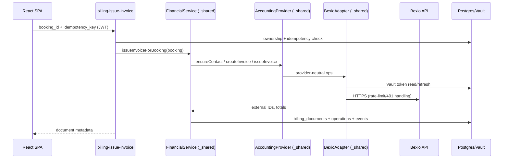

# Contracts: Edge Functions (HTTP)

**Feature**: `specs/features/007-bexio-integration/spec.md` | **Date**: 2026-08-20

All functions live at `https://<project-ref>.supabase.co/functions/v1/<name>` and follow the existing project conventions (see `specs/project-context/api-contracts.md`): `Content-Type: application/json`, caller JWT in `Authorization: Bearer <user-jwt>` for user-facing functions. Error responses are always `{ "error": "<machine-code>", "message": "<human-readable, sanitized>" }` with a non-2xx status. Secrets, tokens, and upstream payload bodies never appear in responses or logs (FR-034).

New source locations (in-repo, research R-13): `supabase/functions/bexio-oauth/index.ts`, `supabase/functions/billing-issue-invoice/index.ts`, `supabase/functions/billing-invoice-document/index.ts`, `supabase/functions/bexio-reconcile/index.ts`, shared code under `supabase/functions/_shared/`.

---

## 1. `bexio-oauth` — connection lifecycle (FR-001–FR-007)

**Auth**: caller JWT required for `start`, `status`, `disconnect`; caller must be admin (`is_admin` pattern from existing functions). `callback` is invoked by the browser redirect from Bexio and authenticates via the signed `state` parameter instead of a JWT.

### `POST /bexio-oauth` `{ "action": "start" }`
→ `200 { "authorize_url": "https://idp.bexio.com/authorize?..." }`
Builds the authorize URL with scopes `contact_show contact_edit kb_invoice_show kb_invoice_edit offline_access` and a signed, single-use `state` nonce (HMAC with server secret, 10-min TTL). No session? → `401`. Not admin? → `403`.

### `GET /bexio-oauth?action=callback&code=…&state=…` (browser redirect target, registered at developer.bexio.com)
Validates `state`, exchanges `code` at `https://idp.bexio.com/token`, stores refresh token + access-token cache in Vault, upserts `billing_integrations` (`status='connected'`, scopes, `connected_at/by`), writes `integration.connected` audit event, then `302` redirects to the admin integrations page (`/admin/integrations?bexio=connected` or `?bexio=error=<code>`). Never renders tokens.

### `POST /bexio-oauth` `{ "action": "status" }`
→ `200 { "status": "not_connected|connected|degraded|requires_reauth", "connected_at": "…", "scopes": [...], "last_successful_call_at": "…", "last_error": "…", "config_complete": true|false }` — powers the admin integration card (FR-006).

### `POST /bexio-oauth` `{ "action": "initialize" }`
Runs first-run configuration discovery (research R-06): fetches user/currencies/bank accounts/payment types/taxes/units/languages/countries/templates, merges into `billing_integrations.config`, returns `{ "config": {…}, "missing": ["tax_id", …] }`. IDs that cannot be discovered are accepted via `{ "action": "configure", "config": {…} }` (validated with a test invoice-roundtrip in draft, then reverted) before `config_complete` flips true.

### `POST /bexio-oauth` `{ "action": "disconnect" }`
Deletes Vault secrets, sets `status='disconnected'`, keeps config for audit. Existing `billing_documents` remain valid (historical record); issuing new invoices becomes unavailable until reconnect.

---

## 2. `billing-issue-invoice` — post-booking orchestration (US2/US3, FR-009–FR-020)

**Auth**: caller JWT required (student creating their own booking). Invoked by `src/lib/bookings.js` for new bookings when `billing_public_config.integration_enabled = true` (research R-12).

### Request
```json
{ "booking_id": "uuid", "idempotency_key": "booking:<uuid>:invoice:v1" }
```

### Behavior
1. Verify caller owns the booking (or is admin) and booking is in a billable state.
2. Idempotency: return existing result if `billing_operations.idempotency_key` already `succeeded`, or `billing_documents.booking_id` exists.
3. Ensure contact (research R-04) → create draft invoice (research R-05 payload, `api_reference` set) → issue → upsert `billing_documents` → write `invoice.issued` audit event.
4. Booking payment state is untouched at issuance (`payment_status='pending'`); confirmation arrives only via reconciliation or the manual proof path (Q2-A).

### Responses
- `200 { "document": { "id", "document_nr", "status": "issued", "total", "currency" }, "reused": false }`
- `200 { "document": {…}, "reused": true }` — idempotent replay
- `409 { "error": "booking_not_billable" }` • `401/403` auth • `502 { "error": "provider_unavailable" }` — operation enqueued in `billing_operations` for worker retry; booking itself is unaffected (FR-030)

---

## 3. `billing-invoice-document` — PDF access (US5, FR-026)

**Auth**: caller JWT; booking owner **or** admin (same dual-check pattern as existing proof access).

### `GET /billing-invoice-document?booking_id=<uuid>` (or `POST { "booking_id" }`)
Resolves `billing_documents` for the booking → `404 { "error": "no_document" }` if none (legacy bookings use the existing `invoices` path instead) → fetches `GET /2.0/kb_invoice/{id}/pdf` → streams decoded bytes:
`200 Content-Type: application/pdf`, `Content-Disposition: inline; filename="<document_nr>.pdf"`.
Errors: `401/403`, `502 provider_unavailable`. Nothing is written to Storage (research R-11).

---

## 4. `bexio-reconcile` — scheduled worker (US4, FR-021–FR-029, FR-035–FR-038)

**Auth**: scheduler shared secret header `x-scheduler-secret` (Vault-stored, set by migration; research R-09) **or** admin JWT (manual "run now" from the integrations page). All other callers → `401`.

### `POST /bexio-reconcile` `{ }`
1. Token refresh if cache expired (single-flight; on `invalid_grant` → `status='requires_reauth'`, event `integration.token_refresh_failed`, stop).
2. For each `billing_documents` in (`issued`,`partially_paid`): fetch invoice, apply numeric-totals rule (research R-07):
   - fully paid → guarded booking update mirroring the live admin-approval writes: `status='confirmed'`, `payment_status='confirmed'`, `verification_status='approved'`, `payment_confirmation_source='bexio_reconciliation'`, `payment_confirmed_at=now()`, guarded by `WHERE payment_status <> 'confirmed'` (research R-08; no `paid` value exists on `bookings`) → supersede unresolved proofs (FR-036), events `payment.reconciled` (+ `proof.superseded`);
   - partial → document status `partially_paid` (admin-visible);
   - cancelled in Bexio → document `cancelled` + discrepancy event for admin follow-up (spec Edge Cases).
3. Process due `billing_operations` retries (backoff, `max_attempts`, then `failed` + `operation.retry_exhausted` event → admin alert per FR-031).
4. Update `last_successful_call_at` / `last_error`; clear `degraded` on success.

### Responses
`200 { "checked": n, "confirmed": n, "retried": n, "failed_operations": n }` • `401` • `503 { "error": "requires_reauth" }`

---

## Internal call graph



The layered chain `FinancialService → AccountingProvider → BexioAdapter` (spec §Architecture layering, FR-014) is implemented as Deno modules in `supabase/functions/_shared/` and is **internal** — no direct HTTP exposure.
