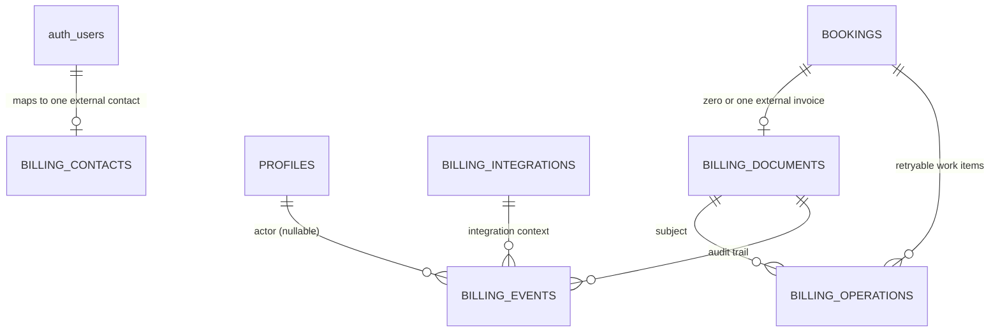
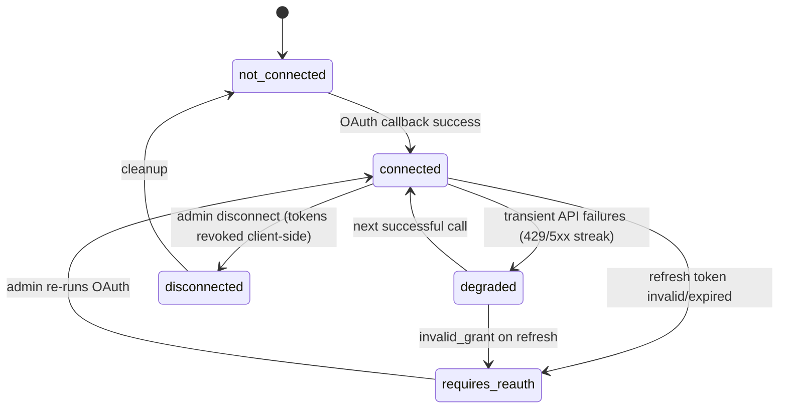
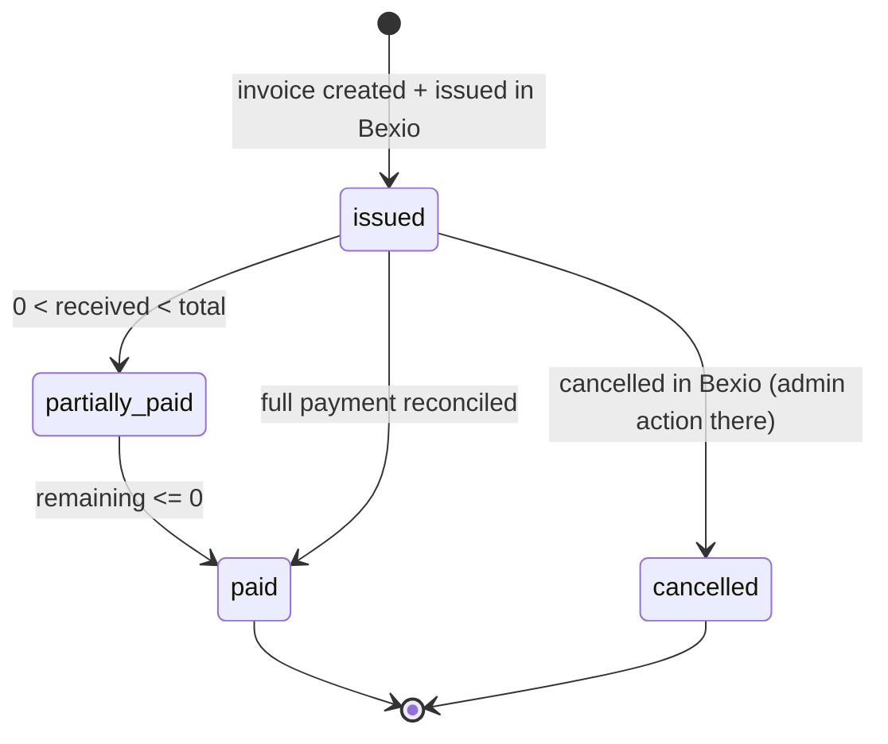
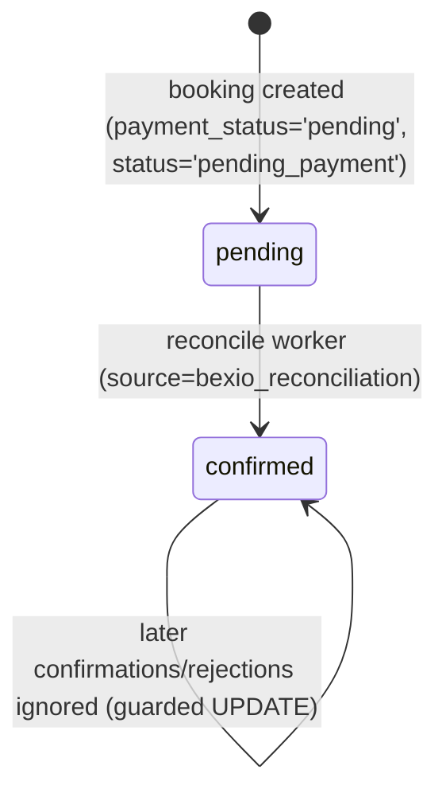

# Data Model: Bexio Financial & Accounting Integration

**Feature**: `specs/features/007-bexio-integration/spec.md` | **Research**: `research.md`
**Date**: 2026-08-20

## Design rules (from constitution + spec §Data Model)

1. All new tables are **provider-neutral** (`provider` column carries `'bexio'`) — no Bexio-specific column names (FR-013).
2. Existing tables are **extended, not restructured**: only additive columns on `bookings`; `invoices`, `payments`, `payment_proofs` left in place but unused by the product UI after 2026-08-24.
3. Every new table ships with RLS enabled and policies in the same migration (constitution §Security; TD-015/TD-016 patterns not repeated).
4. Secrets never appear in any table — only Vault secret **names** (research R-02).

## Entity overview



## New tables

### `billing_integrations` (singleton)

One row per provider. V1: exactly one row (`provider = 'bexio'`).

| Column | Type | Constraints | Notes |
|---|---|---|---|
| `id` | uuid | PK, default `gen_random_uuid()` | |
| `provider` | text | NOT NULL, UNIQUE, CHECK `provider = 'bexio'` | forward-compat |
| `status` | text | NOT NULL, default `'not_connected'` | `not_connected` → `connected` → `degraded` / `requires_reauth` → `disconnected` |
| `config` | jsonb | NOT NULL, default `'{}'` | discovered IDs + status map (see Config schema below) |
| `refresh_token_secret` | text | NULL | Vault secret name, e.g. `bexio_refresh_token` — never the value |
| `access_token_secret` | text | NULL | Vault secret name for cached access token + expiry |
| `scopes` | text[] | NULL | granted scope list, for admin display |
| `connected_at` / `connected_by` | timestamptz / uuid | NULL | audit of OAuth completion |
| `last_successful_call_at` | timestamptz | NULL | health signal (FR-006) |
| `last_error` | text | NULL | sanitized, no payloads/tokens (FR-032) |
| `created_at` / `updated_at` | timestamptz | NOT NULL, defaults | |

**`config` JSONB schema** (validated in the Edge Function layer, research R-06/R-14):

```json
{
  "bexio_user_id": 1,
  "currency_id": 1,
  "bank_account_id": 1,
  "payment_type_id": 1,
  "sales_account_id": 3400,
  "tax_id_sales": 21,
  "tax_value_sales": 0,
  "unit_id": 1,
  "language_id": 1,
  "country_id": 1,
  "template_slug": null,
  "mwst_type": 0,
  "payment_term_days": 20,
  "status_map": { "draft": 1, "pending": 7, "paid": 9, "partial": 16, "cancelled": 19 }
}
```

*`status_map` values above are placeholders until discovered at setup (research R-07); `payment_term_days` follows Swiss QR-bill convention and is admin-adjustable. Go-live VAT is **0%** (`tax_id_sales` is the active Bexio sales tax with `value === 0`; research R-14).*

**RLS**: `SELECT` for admins (via `is_admin(auth.uid())`, mirroring existing admin policies). No direct `INSERT/UPDATE/DELETE` for any API role — mutations only via service role inside Edge Functions.

### `billing_contacts`

AGC user ↔ external accounting contact mapping (FR-010/FR-011).

| Column | Type | Constraints | Notes |
|---|---|---|---|
| `id` | uuid | PK, default | |
| `user_id` | uuid | NOT NULL, UNIQUE, FK → `auth.users(id)` ON DELETE CASCADE | one external contact per user (V1) |
| `provider` | text | NOT NULL, default `'bexio'` | |
| `external_id` | text | NOT NULL | Bexio `contact_id` (stored as text for provider neutrality) |
| `email_snapshot` | text | NOT NULL | email used for the match/create — drift detection |
| `synced_at` | timestamptz | NOT NULL, default `now()` | |
| `created_at` / `updated_at` | timestamptz | NOT NULL | |

UNIQUE (`provider`, `external_id`) — prevents two AGC users sharing one Bexio contact.

**RLS**: `SELECT` admin-only. Owners do **not** read this table (external IDs are not user-facing; PDF/status flows go through functions).

### `billing_documents`

External invoice reference per AGC financial transaction (FR-017). V1 transaction scope: **bookings** (membership invoices are future scope per spec §Scope).

| Column | Type | Constraints | Notes |
|---|---|---|---|
| `id` | uuid | PK, default | |
| `booking_id` | uuid | NOT NULL, UNIQUE, FK → `public.bookings(id)` ON DELETE RESTRICT | idempotency anchor (research R-05) |
| `provider` | text | NOT NULL, default `'bexio'` | |
| `external_id` | text | NOT NULL | Bexio invoice `id` |
| `document_nr` | text | NULL | Bexio-assigned number, display only (AGC sequence untouched, FR-020) |
| `api_reference` | text | NOT NULL | `agc:booking:{uuid}` — echoed to Bexio (FR-016) |
| `status` | text | NOT NULL, default `'issued'` | `issued` → `partially_paid` → `paid`; `issued` → `cancelled` |
| `total` | numeric(10,2) | NOT NULL | snapshot from Bexio response |
| `currency` | text | NOT NULL, default `'CHF'` | |
| `issued_at` / `last_synced_at` | timestamptz | NOT NULL default `now()` / NULL | |
| `created_at` / `updated_at` | timestamptz | NOT NULL | |

UNIQUE (`provider`, `external_id`); INDEX on `status` (reconciliation work set).

**RLS**: `SELECT` for admins, and for the **booking owner** (`bookings.user_id = auth.uid()`) — powers the student-facing "invoice status" affordance. No client writes.

### `billing_operations`

Idempotency + retry queue + observability spine (FR-008, FR-015, FR-030/031).

| Column | Type | Constraints | Notes |
|---|---|---|---|
| `id` | uuid | PK, default | |
| `kind` | text | NOT NULL | `contact_sync` / `invoice_issue` / `invoice_cancel` / `reconcile_check` |
| `idempotency_key` | text | NOT NULL, UNIQUE | deterministic, e.g. `booking:{id}:invoice:v1` |
| `booking_id` | uuid | NULL, FK → `bookings(id)` | subject |
| `billing_document_id` | uuid | NULL, FK → `billing_documents(id)` | subject |
| `status` | text | NOT NULL, default `'pending'` | `pending` → `succeeded` / `failed` (failed = retries exhausted) |
| `attempts` | int | NOT NULL, default 0 | |
| `max_attempts` | int | NOT NULL, default 8 | exponential backoff stops here |
| `next_retry_at` | timestamptz | NULL | worker picks up `pending` rows where `next_retry_at <= now()` |
| `last_error` | text | NULL | sanitized |
| `created_at` / `updated_at` | timestamptz | NOT NULL | |

INDEX on (`status`, `next_retry_at`).

**RLS**: `SELECT` admin-only. No client writes.

### `billing_events`

Append-only audit log (spec §Events/Domain Boundaries — audit record, not a domain-event bus).

| Column | Type | Constraints | Notes |
|---|---|---|---|
| `id` | bigint | PK, generated always as identity | |
| `event_type` | text | NOT NULL | e.g. `integration.connected`, `contact.linked`, `invoice.issued`, `payment.reconciled`, `integration.token_refresh_failed`, `operation.retry_exhausted` |
| `actor_user_id` | uuid | NULL | NULL for system actions (worker) |
| `booking_id` / `billing_document_id` | uuid | NULL | subjects |
| `details` | jsonb | NOT NULL, default `'{}'` | sanitized — never tokens/full payloads |
| `created_at` | timestamptz | NOT NULL, default `now()` | |

**RLS**: `SELECT` admin-only. Append via service role only.

## Extensions to existing tables

### `bookings` (additive only)

| Column | Type | Constraints | Notes |
|---|---|---|---|
| `payment_confirmation_source` | text | NULL, CHECK IN (`'bexio_reconciliation'`, `'manual_proof'`) | FR-033 attribution. New confirms use `bexio_reconciliation` only; `manual_proof` may exist on historical rows. |
| `payment_confirmed_at` | timestamptz | NULL | |

Existing `payment_status` CHECK values (`'pending' | 'confirmed' | 'cancelled'`, per `specs/baseline-system/supabase-backend.md`) are **unchanged** — the integration writes the exact field set the live admin approval writes (`status='confirmed'`, `payment_status='confirmed'`, `verification_status='approved'`), so downstream consumers (availability view, payments page) see identical semantics (brownfield compatibility; research R-08). Document-level "paid" is tracked on `billing_documents.status`, not on `bookings`.

### Views

**`billing_public_config`** — `SECURITY DEFINER`-free plain view exposing exactly one derived column: `integration_enabled boolean` (`EXISTS (SELECT 1 FROM billing_integrations WHERE provider='bexio' AND status IN ('connected','degraded'))`). Granted `SELECT` to `authenticated`. Powers the frontend cutover branch (research R-12) without leaking config.

## Secrets (Supabase Vault, no table columns)

| Secret name | Content | Rotation |
|---|---|---|
| `bexio_refresh_token` | OAuth refresh token | rotates on each refresh (365-day validity) |
| `bexio_access_token_cache` | `{ "access_token": "…", "expires_at": "…" }` | hourly |

Written/read only by Edge Functions via service-role SQL (`vault.create_secret` / `vault.decrypted_secrets`). Names stored in `billing_integrations` for lookup; values are never selectable through PostgREST.

## State machines

### Integration status (`billing_integrations.status`)



### Document status (`billing_documents.status`)



### Booking payment confirmation (guarded transition, research R-08)



*`confirmed` here means the full live approval triple: `payment_status='confirmed'`, `status='confirmed'`, `verification_status='approved'`.*

## Migration plan

Single additive migration `supabase/migrations/0XX_bexio_integration.sql` (applied via MCP `apply_migration`):

1. `CREATE EXTENSION IF NOT EXISTS pg_cron; CREATE EXTENSION IF NOT EXISTS pg_net;` (research R-09 — deliberate, documented enablement).
2. Five new tables + constraints + indexes as above.
3. Two additive columns on `bookings`.
4. RLS enable + policies for all new tables; view + grant.
5. `pg_cron` job registration calling `bexio-reconcile` every 15 min with scheduler secret read from Vault (`bexio_scheduler_secret` — generated at deploy, stored in Vault, not in the migration).

**Backward compatibility**: no existing table, policy, function, bucket, or enum is altered. Rollback = drop cron job, drop new objects, drop two columns — no data loss to pre-existing entities. Legacy `invoices` data and the `invoices` bucket are untouched (Q1-A).

## Validation rules mapped from requirements

| Requirement | Enforcement point |
|---|---|
| FR-010 duplicate prevention | `billing_contacts` unique pairs + email search-before-create |
| FR-015 idempotent creation | `billing_documents.booking_id` UNIQUE + `billing_operations.idempotency_key` UNIQUE + Bexio `api_reference` search |
| FR-025/026 reconcile authority | guarded UPDATE (R-08) + `status` transitions above |
| FR-029 no duplicate confirmations | `payment_status <> 'confirmed'` guard in both worker and manual path |
| FR-033 source attribution | `payment_confirmation_source` CHECK constraint |
| FR-034 no secrets in responses | no secret columns anywhere; Vault names only |
