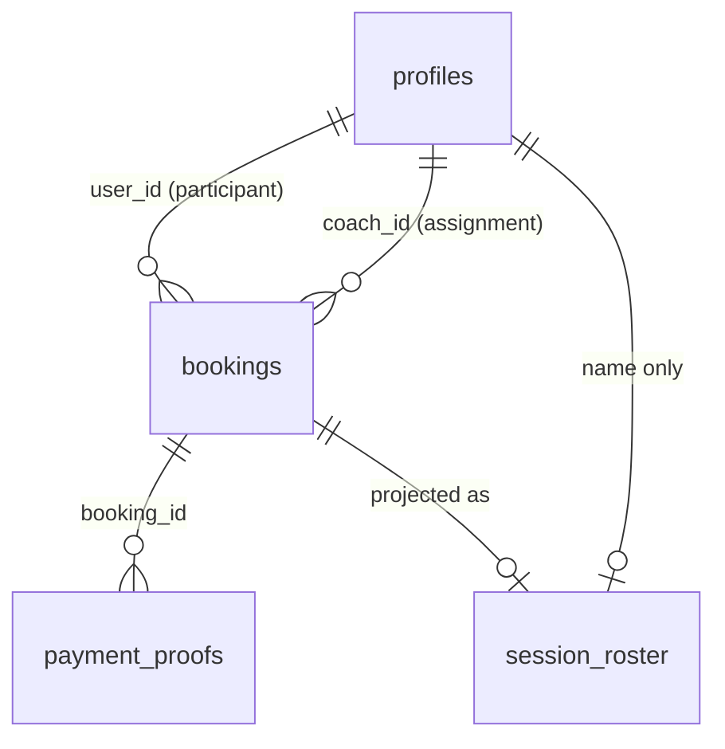

# Data Model: Roles and Permissions (F1.02)

**Feature**: `specs/features/008-roles-and-permissions/spec.md`  
**Date**: 2026-08-24  
**Baseline**: `profiles.role`, `is_admin()`, existing `bookings` / `payment_proofs` / `profiles` RLS in `specs/baseline-system/supabase-backend.md` §5 and reverse spec `006`.

This feature does **not** add a roles table, a sessions table, or JWT claims. It adds assignment + isolation tightenings.

---

## Entities

### Profile role (existing)

| Field | Type | Rules |
|---|---|---|
| `profiles.id` | uuid PK | = `auth.users.id` |
| `profiles.role` | text NOT NULL | CHECK `student \| coach \| accounting \| admin`; default `student` |

- One role per user. `accounting` remains unused (FR-002).
- **New:** role is immutable through PostgREST (`authenticated` / `anon`). Out-of-band changes (SQL / service role) still work (FR-003).
- **Change:** DROP policy `Public profiles are viewable by everyone` (`SELECT true`). Keep own-or-admin SELECT (FR-004).

### Session occurrence (existing booking)

Until `class-assignment`, an occurrence is one `bookings` row. No new table.

Financial columns (`price`, `payment_status`, `client_email`, `email`, `receipt_url`, `verification_status`, `notes`, …) stay on `bookings`. Coaches do not SELECT this table for other people’s rows.

### Coach assignment (new attribute)

| Field | Type | Rules |
|---|---|---|
| `bookings.coach_id` | uuid NULL | FK → `profiles.id` ON DELETE SET NULL |

- Null = unassigned (no coach roster access for that occurrence).
- Non-null target MUST have `profiles.role = 'coach'` (trigger).
- Only Admin may set or clear it (trigger; FR-007). Owner UPDATE of other booking fields is unchanged.
- Index: `bookings_coach_id_idx`.
- Do **not** use `availability.trainer_id`.

### Participant

The student on the occurrence: `bookings.user_id` → `profiles`. Exposed to coaches only as a display name on `session_roster`, not as a full profile row.

### Roster projection (new view)

`public.session_roster` — operational columns only (FR-008):

| Column | Source |
|---|---|
| `booking_id` | `bookings.id` |
| `booking_date` | `bookings.booking_date` |
| `start_time` | `bookings.start_time` |
| `end_time` | `bookings.end_time` |
| `lesson_name` | `bookings.lesson_name` |
| `participant_full_name` | `COALESCE(NULLIF(profiles.full_name, ''), 'Student')` — **not** email |
| `coach_id` | `bookings.coach_id` |

**Access (view body, `SECURITY DEFINER`, `security_barrier = true`, qualified names, empty `search_path`):**

- Admin: all occurrences (operational projection).
- Coach: rows where `coach_id = auth.uid()` AND `is_coach()`.
- Everyone else: zero rows.

GRANT SELECT to `authenticated`. REVOKE from `anon`. No INSERT/UPDATE/DELETE.

### Helpers (new + existing)

| Function | Behavior |
|---|---|
| `is_admin()` | Existing. GRANT EXECUTE to `authenticated` (live `0007` lesson — this branch’s `0001` revoked it). |
| `is_coach()` | New; same shape as `is_admin()` for `role = 'coach'`. GRANT EXECUTE to `authenticated`. |

---

## Relationships



`availability.trainer_id` is unrelated and unused by this feature.

---

## State transitions

### Assignment

```text
coach_id IS NULL  --(admin sets coach profile)-->  assigned
assigned          --(admin sets NULL or another coach)-->  unassigned | reassigned
```

Removing assignment takes effect on the next `session_roster` read (no cache). A demoted coach (`role` no longer `coach`) fails `is_coach()` even if stale `coach_id` rows remain; Admin should clear those rows when demoting (out-of-band).

### Role

```text
student --(out-of-band)--> coach | admin | accounting
any     --(PostgREST UPDATE)--> REJECTED
```

---

## Validation rules

1. `coach_id` NULL or references `profiles.id` with `role = 'coach'`.
2. Non-admin JWT cannot change `profiles.role` or `bookings.coach_id`.
3. Storage object keys for proofs remain `{booking_id}/…` (current + legacy names). First path segment is the booking id used for ownership.

---

## What does not change

- Student INSERT/SELECT/UPDATE of **own** bookings (except `coach_id`).
- `payment_proofs` **table** INSERT/SELECT/UPDATE policies (owner INSERT already live).
- `booking_slots` public occupancy (XR-004 / SC-006).
- `invoices` / `invoice_counters` service-role-only.
- Admin payment-verification writes (`is_admin()` UPDATE on bookings and proofs).

---

## Migration plan

One additive SQL file, numbered as the next unused file **on this branch’s merge-base `main`**.

While this worktree only contains `0001` and `0002`, that file is:

`supabase/migrations/0003_f102_roles_and_permissions.sql`

If `007` (or another spec) lands on `main` first and consumes `0003`, **renumber at rebase**. Apply via Supabase MCP (`apply_migration`) per constitution; live `supabase_migrations` tracking may still be empty.

Contents (order):

1. GRANT EXECUTE on `is_admin()` to `authenticated`.
2. `is_coach()` + GRANT.
3. `bookings.coach_id` + FK + index.
4. Role-immutability trigger on `profiles`.
5. `coach_id` assignment trigger (admin-only + target must be coach).
6. DROP public profiles SELECT; keep own-or-admin SELECT.
7. `session_roster` view + grants.
8. Replace `payment-proofs` **storage** policies (see [contracts/authorization.md](contracts/authorization.md)).

No data backfill. Existing bookings stay unassigned (`coach_id` NULL).

---

## PII / nDSG

Roster shows participant **name** to the assigned coach only. Dropping public profile SELECT removes anonymous email/role listing. Proof files stay private and become owner-path scoped.
