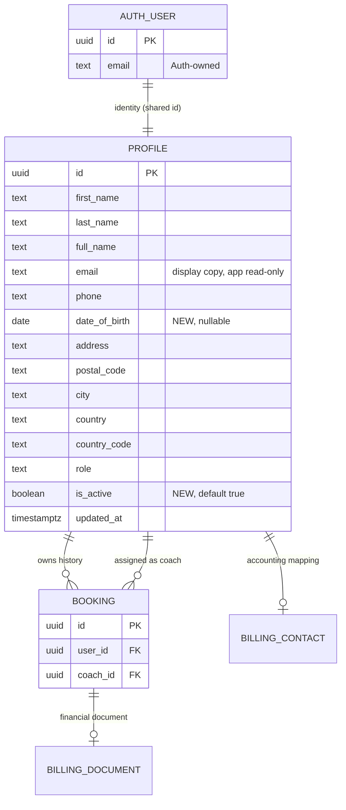
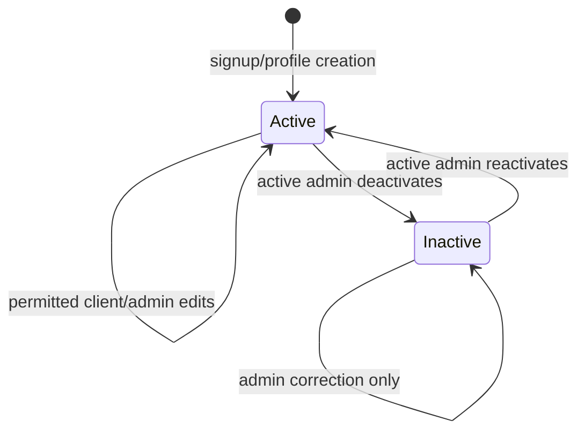

# Data Model: Client Management (F1.04)

**Feature**: [spec.md](spec.md)
**Research**: [research.md](research.md)
**Date**: 2026-09-04

## 1. Model summary

F1.04 does not create a Client entity. The existing `public.profiles` row remains the client and keeps its shared primary key with `auth.users`.



Deactivation changes one profile field. It does not delete or re-key any entity.

## 2. `public.profiles`

### 2.1 Existing fields retained

| Field | Type | Ownership | Validation / behavior |
|---|---|---|---|
| `id` | uuid, PK/FK | system | Shared with `auth.users.id`; immutable |
| `first_name` | text, nullable | client-controlled | Trim before write |
| `last_name` | text, nullable | client-controlled | Trim before write |
| `full_name` | text, NOT NULL | derived client-controlled | Rebuilt from first/last by existing profile service |
| `email` | text, nullable | Auth-owned | Displayed; not writable through client management |
| `phone` | text, nullable | client-controlled | Existing profile formatting/validation remains |
| `address` | text, nullable | client-controlled | Existing behavior |
| `postal_code` | text, nullable | client-controlled | Existing behavior |
| `city` | text, nullable | client-controlled | Existing behavior |
| `country` | text, nullable | client-controlled/derived | Existing country label |
| `country_code` | text, nullable | client-controlled | Existing ISO alpha-2 constraint |
| `role` | text, NOT NULL | academy-controlled | Existing CHECK: `student`, `coach`, `accounting`, `admin` |
| `updated_at` | timestamptz, NOT NULL | system | Updated on successful profile mutation |

### 2.2 New fields

| Field | Type | Null/default | Ownership | Rules |
|---|---|---|---|---|
| `date_of_birth` | `date` | nullable | client-controlled | Optional; cannot be in the future; excluded from booking completeness |
| `is_active` | `boolean` | NOT NULL, default `true` | academy-controlled | Existing rows backfill/default active; only active admin can change via application |

### 2.3 Field-level write matrix

| Field group | Active owner | Inactive owner | Active admin (other profile) | Coach (other profile) |
|---|---:|---:|---:|---:|
| Name, phone, address, country, DOB | update | no update | update | no update |
| Email | no update | no update | no update | no update |
| Role | no update | no update | update | no update |
| Active status | no update | no update | update | no update |
| Future/unrecognized fields | no update by default | no update | permitted only when intentionally exposed to admin | no update |

Admin self-role change is always refused. Removing the last active admin by role change or deactivation is refused.

## 3. Profile lifecycle



### Active

- Owner can view and update client-controlled fields.
- Owner can create/update their own booking subject to existing booking rules.
- Role-derived admin/coach permissions apply.

### Inactive

- Owner can authenticate and read own profile, bookings, and invoice documents.
- Owner cannot update profile, create/update/cancel a booking, or issue a missing invoice.
- Admin can view/edit/reactivate the profile.
- `is_admin()` and `is_coach()` evaluate false for this profile.
- Existing booking, billing, membership, credit, and assignment relationships remain unchanged.

### Invariants

1. Exactly one Profile is associated with an Auth user.
2. `date_of_birth` is null or no later than the current date at write time.
3. Profile email cannot be changed through F1.04.
4. Non-admin profile writes can change only the explicit client-controlled allow-list.
5. No application operation can leave zero active admins.
6. Deactivation never deletes profile/history.

## 4. `public.bookings` impact

No new booking columns.

| Operation | Active owner | Inactive owner | Active admin |
|---|---:|---:|---:|
| SELECT own/history | yes | yes | all |
| INSERT own | yes | no | existing admin behavior only |
| UPDATE own (including cancellation) | yes | no | all |
| DELETE | no new permission | no | no new permission |

Owner INSERT/UPDATE policies require an active profile. Existing admin policies use the active-aware `is_admin()`.

## 5. Coach roster projection

`private.session_roster_rows()` and `public.session_roster` retain existing columns and add:

| Field | Source | Exposure |
|---|---|---|
| `participant_id` | `bookings.user_id` | Assigned coach and active admin |
| `participant_phone` | current `profiles.phone` | Assigned coach and active admin |

Full output:

```text
booking_id
booking_date
start_time
end_time
lesson_name
participant_id
participant_full_name
participant_phone
coach_id
```

The projection intentionally excludes email, address, date of birth, role, status, prices, payments, and proofs.

## 6. Authorization objects

### Existing, revised

- `public.is_admin()` — true only for an active admin.
- `public.is_coach()` — true only for an active coach.
- Profile SELECT policy — owner regardless of activity, or active admin.
- Profile UPDATE policy — owner or active admin; trigger applies column/invariant rules.
- Booking owner INSERT/UPDATE policies — additionally require active owner.
- Active-admin booking policies — continue through `is_admin()`.
- `private.session_roster_rows()` / `public.session_roster` — new fixed output above.

### New/replaced trigger behavior

One profile mutation guard supersedes the current role-only check:

1. Determine authenticated caller and whether caller is an active admin.
2. Reject future DOB.
3. Reject application-originated email change for all callers.
4. For non-admin: require target=self, existing profile active, and changed-column subset of client-controlled fields.
5. For admin: reject own role change.
6. Before removing an active admin (role away from admin or `is_active=false`), serialize and enforce at least one active admin remains.

Trusted signup/profile-creation triggers remain able to insert profile rows. RLS and trigger code must not use user metadata for authorization.

## 7. Query model for admin directory

Admin directory reads `profiles` through existing active-admin SELECT authorization.

Recommended result fields:

```text
id, first_name, last_name, full_name, email, phone, date_of_birth,
address, postal_code, city, country, country_code, role, is_active, updated_at
```

Behavior:

- Stable ordering by `full_name`, then `id`.
- Bounded pages (default 50).
- Optional server-side search over name/email and filters for role/status.
- No role/status-derived joins are required in F1.04.

## 8. Migration behavior

One forward migration:

1. Add nullable DOB and non-null active flag with safe default.
2. Replace active-role helpers without changing public signatures.
3. Replace profile mutation trigger.
4. Replace profile and booking policies with active-aware expressions.
5. Recreate roster function/view in dependency-safe order and restore grants.
6. Reload the Data API schema cache.

Before naming/applying, confirm remote migration history because historical migration tracking was incomplete. Do not edit applied `0008`–`0010`.

## 9. Data retention and downstream compatibility

- No foreign-key `ON DELETE` behavior changes.
- No backfill beyond existing rows becoming active.
- DOB/status are not copied into bookings or Bexio contacts.
- Existing incomplete profiles remain valid.
- F1.05 and later domain entities reference `profiles.id`; they do not duplicate person identity.
