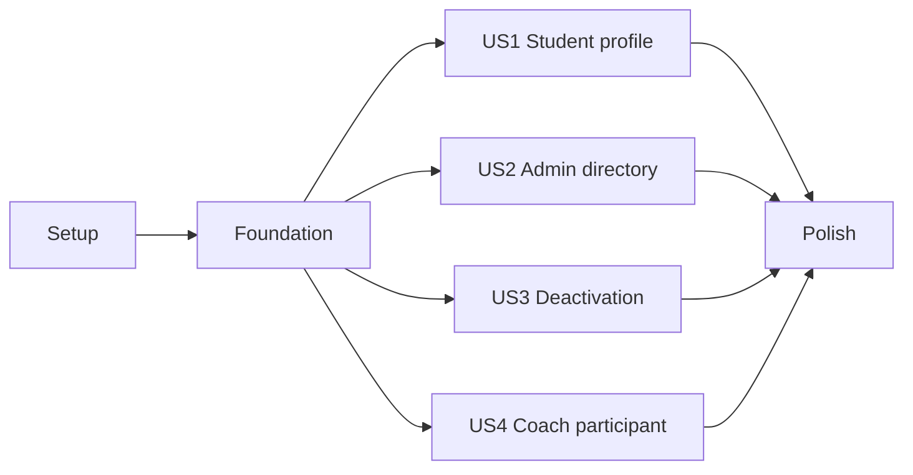

# Tasks: Client Management (F1.04)

**Input**: Design documents from `/specs/features/009-client-management/`

**Prerequisites**: plan.md, spec.md, research.md, data-model.md, contracts/authorization.md, quickstart.md

**Tests**: Included — the feature specification requires backend authorization, RLS, student, admin, coach, horizontal-escalation, profile-validation, and regression tests. Write each test task before its paired implementation task and confirm it fails for the missing behavior.

**Organization**: Tasks are grouped by the four user stories in spec.md. Shared database authorization is foundational because every story depends on the same profile lifecycle and role helpers.

## Format: `[ID] [P?] [Story] Description`

- **[P]**: Can run in parallel after its stated prerequisites because it touches a different file
- **[Story]**: US1–US4 from spec.md; omitted for Setup, Foundational, and Polish phases
- Every task names the exact file it creates or modifies

---

## Phase 1: Setup (Shared Infrastructure)

**Purpose**: Verify external state that controls migration naming and close the unversioned legacy-function risk before implementation.

- [ ] T001 [P] Compare local `supabase/migrations/` with the test project migration list, then create the next non-conflicting migration as `supabase/migrations/0011_f104_client_management.sql` (rename both planned `0011` paths consistently if remote history already uses that number)
- [ ] T002 [P] Retrieve and review the deployed `generate-invoice-pdf` source and preserve its current contract in `supabase/functions/generate-invoice-pdf/index.ts`; if the source cannot be retrieved and safely versioned, stop implementation and report the blocker rather than creating a placeholder or proceeding to US3

**Checkpoint**: Migration filename is safe for the target test project and every owner-facing mutating Edge Function has retrievable, safely versioned source; otherwise implementation is blocked.

---

## Phase 2: Foundational (Blocking Prerequisites)

**Purpose**: Establish the additive profile lifecycle, field-level authorization, active-aware privileges, and coach-safe projection required by all stories.

**CRITICAL**: No user-story implementation starts until the migration passes on a separate test project.

### Tests for the foundation

- [ ] T003 [P] Encode the complete plan.md RLS/trigger/service-role checklist as role-switched assertions in `tests/sql/0011_f104_client_management.test.sql`, including schema/defaults, owner/admin field differences, exact signed-Auth-email synchronization, future DOB, inactive mutations, admin self-deactivation denial, `accounting` assignment denial, concurrent last-admin protection, active-aware helpers, roster columns/grants, accounting/anon denials, and absence of new DELETE access

### Foundation implementation

- [ ] T004 Implement `supabase/migrations/0011_f104_client_management.sql` per data-model.md §§2–8: add nullable `date_of_birth` and default-true `is_active`; replace `is_admin()`/`is_coach()` with active-aware bodies and preserved grants; replace the role-only trigger with explicit changed-column/DOB guards, exact same-user signed-Auth-email synchronization, admin own-role/self-deactivation and `accounting` assignment denial, and transaction-locked last-admin protection; make profile UPDATE and booking owner INSERT/UPDATE policies active-aware while preserving inactive-owner SELECT; and dependency-safely recreate `private.session_roster_rows()` plus the security-invoker `public.session_roster` with participant id/phone and exact grants
- [ ] T005 Apply `supabase/migrations/0011_f104_client_management.sql` to a separate test project, execute `tests/sql/0011_f104_client_management.test.sql`, run Supabase security/performance advisors, and fix every feature-introduced failure in those two files before any frontend work

**Checkpoint**: The database alone enforces profile fields, deactivation, active admin/coach privileges, last-admin safety, and assignment-scoped phone access.

---

## Phase 3: User Story 1 - Student maintains their own permitted profile (Priority: P1) 🎯 MVP

**Goal**: An active student views and updates only their own client-controlled fields including optional DOB; email/role/status/other profiles stay protected; session bootstrap creates missing profiles or synchronizes only the exact signed Auth email.

**Independent Test**: As active student S1, save phone and DOB and observe them after refresh; direct updates to email/role/status and reads/updates of S2 fail; existing sign-in and profile-completeness behavior still work.

### Tests for User Story 1

- [ ] T006 [P] [US1] Add failing Vitest coverage for own-profile mapping, DOB serialization, omission of email/role/status from form payloads, create-if-missing bootstrap, exact signed-Auth-email synchronization without profile-field overwrite, and protected error mapping in `src/lib/profileService.test.js`
- [ ] T007 [P] [US1] Add regression cases proving DOB/status are excluded from booking completeness and future DOB validation is independent of completeness in `src/lib/profileValidation.test.js`

### Implementation for User Story 1

- [ ] T008 [US1] Extend `src/lib/profileService.js` with `date_of_birth`, read-only `role`/`is_active` mapping, explicit owner form payload allow-list, create-or-exact-Auth-email-sync bootstrap that never rewrites other existing fields, and stable protected/inactive/DOB error messages required by `contracts/authorization.md`
- [ ] T009 [US1] Refactor session handling in `src/contexts/SupabaseAuthContext.jsx` to use the create-or-exact-Auth-email-sync profile operation, load `role` and `is_active` together, expose activity state through `useAuth()`, and never overwrite profile-controlled or academy-controlled fields from Auth metadata on sign-in
- [ ] T010 [US1] Update `src/hooks/useProfile.js` to preserve inactive profile reads, expose read-only state, and refuse/save-map owner mutations through the new `profileService.js` contract
- [ ] T011 [US1] Add optional DOB editing plus read-only email/role/status and inactive save state to `src/pages/ProfileManagementPage.jsx` without adding DOB/status to the existing completeness requirement
- [ ] T012 [US1] Execute the Student S1 direct-request and browser checks in `specs/features/009-client-management/quickstart.md` §§4–5, fix story-specific failures in `src/lib/profileService.js` or `src/pages/ProfileManagementPage.jsx`, and record the verified cases in the quickstart completion section

**Checkpoint**: US1 works independently; existing students sign in and manage permitted own-profile data without gaining protected-field or cross-client access.

---

## Phase 4: User Story 2 - Admin manages client profiles (Priority: P1)

**Goal**: An active admin can page/search profiles, edit another client’s personal fields, assign another user’s supported role, and use existing profiles without impersonation; own-role, self-deactivation, legacy `accounting`, email, non-admin, and last-admin restrictions remain server-enforced.

**Independent Test**: Admin A finds S1, updates S1’s phone, changes a second test user’s role, and sees persisted values; A cannot change A’s own role/status, assign `accounting`, or change profile email; student/coach/accounting cannot list the directory; find → edit → toggle completes within three measured minutes.

### Tests for User Story 2

- [ ] T013 [P] [US2] Write failing Vitest contract tests for bounded profile list/search/filter, explicit personal update payloads, separate role/status updates restricted to `student`/`coach`/`admin`, admin self-role/self-deactivation and `accounting` assignment denials, and stable admin error mapping in `src/lib/clientManagement.test.js`

### Implementation for User Story 2

- [ ] T014 [US2] Implement paginated list/search/filter and explicit personal/role/status update operations in `src/lib/clientManagement.js`, exposing only `student`/`coach`/`admin` assignment and mapping own-role/self-deactivation/`accounting`/last-admin errors from `contracts/authorization.md` §§2–3
- [ ] T015 [US2] Create `src/components/admin/ClientManagementPanel.jsx` with bounded directory loading, role/status filters, client edit form reusing existing profile controls, separate role/status actions, own-role/self-deactivation/`accounting` safeguards, loading/empty/error states, and no create-login action
- [ ] T016 [US2] Add a Client management tab to `src/pages/AdminDashboardPage.jsx` while preserving the Bexio integration and Coach assignment tabs and the existing admin route guard
- [ ] T017 [US2] Execute the Admin A and non-admin direct/browser matrix in `specs/features/009-client-management/quickstart.md` §§4–5, measure and record find → edit → toggle elapsed time (must be under three minutes), fix story-specific failures in `src/lib/clientManagement.js` or `src/components/admin/ClientManagementPanel.jsx`, and record results in the quickstart completion section

**Checkpoint**: US2 works independently after Foundation; admin profile management is available without weakening student/coach/accounting access.

---

## Phase 5: User Story 3 - Admin deactivates/reactivates without losing history (Priority: P1)

**Goal**: An admin toggles profile activity non-destructively; inactive clients can sign in and read profile/payment history but cannot perform profile, booking, cancellation, invoice-issuance, or privileged admin/coach mutations; reactivation restores normal rules.

**Independent Test**: Deactivate S1, verify own profile/bookings/existing invoice remain readable while profile save/new booking/cancel/issue fail through direct calls, then reactivate S1 and verify profile save/new booking resume with every historical relationship intact.

### Tests for User Story 3

- [ ] T018 [P] [US3] Add failing Vitest cases for inactive booking pre-check/error mapping while preserving active booking payloads and read behavior in `src/lib/bookings.test.js`
- [ ] T019 [P] [US3] Add failing Deno tests for active owner/admin, inactive owner/admin, and missing-profile decisions in `supabase/functions/_shared/profile-access.test.ts`

### Implementation for User Story 3

- [ ] T020 [US3] Implement shared profile role/activity parsing and active-mutation/admin decisions without logging PII in `supabase/functions/_shared/profile-access.ts`
- [ ] T021 [P] [US3] Require an active owner or active admin before invoice issuance while preserving retry/idempotency behavior in `supabase/functions/billing-issue-invoice/index.ts`
- [ ] T022 [P] [US3] Require an active owner or active admin before booking/invoice cancellation while preserving paid/unpaid conflict behavior in `supabase/functions/billing-cancel-invoice/index.ts`
- [ ] T023 [P] [US3] Preserve inactive-owner document retrieval but remove admin-wide access for inactive admins in `supabase/functions/billing-invoice-document/index.ts`
- [ ] T024 [P] [US3] Require active-admin status for manual reconciliation while preserving scheduler-secret execution in `supabase/functions/bexio-reconcile/index.ts`
- [ ] T025 [P] [US3] Require active-admin status for every authenticated OAuth administration action/callback continuation in `supabase/functions/bexio-oauth/index.ts`
- [ ] T026 [US3] Apply the shared active-owner/admin mutation check to the preserved legacy contract in `supabase/functions/generate-invoice-pdf/index.ts`, keeping existing JWT ownership, PDF, numbering, and response behavior unchanged
- [ ] T027 [US3] Deploy `billing-issue-invoice`, `billing-cancel-invoice`, `billing-invoice-document`, `bexio-reconcile`, `bexio-oauth`, and `generate-invoice-pdf` from `supabase/functions/` to the separate test project, verify each deployed version/configuration, and do not begin direct authorization checks until all deployments succeed
- [ ] T028 [P] [US3] Map inactive booking/cancellation failures to a stable client message without changing active booking/invoice behavior in `src/lib/bookings.js`
- [ ] T029 [US3] Check profile activity before completeness/confirmation, disable inactive booking actions, and retain the final server-enforced insert in `src/pages/LessonsPage.jsx`
- [ ] T030 [P] [US3] Fail closed when a stale flow opens profile completion for an inactive profile while preserving active completion behavior in `src/components/modals/ProfileCompletionModal.jsx`
- [ ] T031 [US3] Execute the inactive-client, active/inactive-admin, admin self-deactivation, last-admin, history-retention, stale-session, deployed-Edge-Function, and reactivation checks in `specs/features/009-client-management/quickstart.md` §§4–6, fix failures in the US3 files above, and record results in the quickstart completion section

**Checkpoint**: US3 is independently demonstrable; deactivation changes authorization state only and no historical row or identity is deleted.

---

## Phase 6: User Story 4 - Coach sees only assigned-session participants (Priority: P2)

**Goal**: An active assigned coach sees current participant identity and phone through the roster only; unrelated/full-profile/financial data and all participant writes remain denied, and assignment removal or coach deactivation revokes access on the next request.

**Independent Test**: Coach C assigned only to B1 sees S1 name/phone on B1 and not S2/B2; direct S1 profile access/update fails; clearing B1 assignment or deactivating C removes the roster row.

### Tests for User Story 4

- [ ] T032 [P] [US4] Update the failing roster contract tests for `participant_id` and `participant_phone` while asserting no email/address/DOB/status/role/financial columns in `src/lib/sessionRoster.test.js`

### Implementation for User Story 4

- [ ] T033 [US4] Extend the exact `SESSION_ROSTER_COLUMNS` query contract with participant id/phone and preserve assignment ordering/error behavior in `src/lib/sessionRoster.js`
- [ ] T034 [US4] Display assigned participant phone accessibly in the existing roster table/empty/error states without adding profile navigation in `src/pages/CoachRosterPage.jsx`
- [ ] T035 [US4] Execute assigned/unassigned/inactive-coach direct and browser checks in `specs/features/009-client-management/quickstart.md` §§4–5, fix story-specific failures in `src/lib/sessionRoster.js` or `src/pages/CoachRosterPage.jsx`, and record results in the quickstart completion section

**Checkpoint**: US4 works independently after Foundation; the coach receives only assigned operational data.

---

## Phase 7: Polish & Cross-Cutting Concerns

**Purpose**: Complete security/regression evidence and synchronize living documentation after all desired stories pass.

- [ ] T036 Run `npm run lint`, `npm test`, and the placeholder-env production build defined by `package.json` and `.github/workflows/ci.yml`, fixing only F1.04-introduced failures in the changed `src/` files
- [ ] T037 Run the Deno test task from `supabase/functions/deno.json`, rerun `tests/sql/0011_f104_client_management.test.sql` plus Supabase advisors on the separate test project, and resolve every F1.04 regression in `supabase/functions/` or `supabase/migrations/0011_f104_client_management.sql`
- [ ] T038 [P] Update shipped schema, policies, client lifecycle, API projections, and implementation inventory in `specs/baseline-system/requirements.md`, `specs/project-context/domain-model.md`, `specs/project-context/api-contracts.md`, and `specs/baseline-system/supabase-backend.md`
- [ ] T039 [P] Refresh the living as-is profile and authorization behavior after rollout in `specs/features/005-auth-and-profile-completion/spec.md` and `specs/features/006-roles-and-permissions/spec.md`, keeping `009` as the forward change record
- [ ] T040 Run every scenario in `specs/features/009-client-management/quickstart.md`, record pass/fail and test-project limitations in that file, and save the minimal successful admin/inactive-client and coach-roster walkthrough artifacts under `/opt/cursor/artifacts/`

---

## Dependencies & Execution Order

### Phase dependencies

- **Setup (Phase 1)**: No dependencies; T001 and T002 can run in parallel.
- **Foundational (Phase 2)**: T003 can be authored from the contract while T001 completes; T004 depends on T001; T005 depends on T003 and T004. Foundation blocks all user stories.
- **US1 (Phase 3)**: Depends on Foundation. It is the suggested MVP.
- **US2 (Phase 4)**: Depends on Foundation. It does not require US1 code, though both use the same profile columns.
- **US3 (Phase 5)**: Depends on Foundation and successful T002 source retrieval. Admin UI can come from US2 for the browser journey, but direct status updates make US3 independently testable without US2. T027 deployment precedes T031 direct checks.
- **US4 (Phase 6)**: Depends on Foundation’s roster projection only; independent of US1–US3 frontend work.
- **Polish (Phase 7)**: Depends on every story selected for delivery.

### User story dependencies



- **US1 (P1)**: Independently testable after Foundation with S1/S2.
- **US2 (P1)**: Independently testable after Foundation with two admins and one target client.
- **US3 (P1)**: Independently testable after Foundation via direct status update; requires successful T002 source retrieval and T027 test-project deployment.
- **US4 (P2)**: Independently testable after Foundation with one assigned and one unassigned booking.

### Within each story

- Write and observe failing tests first.
- Implement service/data contract before UI integration.
- Run direct backend authorization checks before accepting browser behavior.
- Complete the story checkpoint and one logical commit before starting the next story phase.

### Parallel opportunities

- Setup: T001 and T002.
- Foundation: T003 can be authored while T004 is prepared; T005 waits for both.
- US1: T006 and T007; implementation then proceeds T008 → T009/T010 → T011 → T012.
- US3: T018 and T019; after T020, T021–T025 and T028/T030 can run in parallel on different files; T026 also depends on T002; T027 deploys all functions before T031 verification.
- US4: T032 can be written while Foundation is applied; then T033 → T034 → T035.
- Polish: T038 and T039 can run in parallel after verification.

---

## Parallel Examples

### User Story 1

```text
Task T006: Write src/lib/profileService.test.js
Task T007: Extend src/lib/profileValidation.test.js
```

Then implement the tested service before context/hook/page integration:

```text
T008 → T009 and T010 → T011 → T012
```

### User Story 3

After T020 creates the shared access decision:

```text
Task T021: Update supabase/functions/billing-issue-invoice/index.ts
Task T022: Update supabase/functions/billing-cancel-invoice/index.ts
Task T023: Update supabase/functions/billing-invoice-document/index.ts
Task T024: Update supabase/functions/bexio-reconcile/index.ts
Task T025: Update supabase/functions/bexio-oauth/index.ts
Task T028: Update src/lib/bookings.js
Task T030: Update src/components/modals/ProfileCompletionModal.jsx
```

### User Story 4

```text
T032 tests → T033 roster service → T034 roster page → T035 direct/browser verification
```

---

## Implementation Strategy

### MVP first

1. Complete Setup and Foundation.
2. Complete US1 only.
3. Stop and run the US1 independent test.
4. Deliverable: active students manage optional DOB and existing profile fields while protected/cross-client writes are server-denied and session restore cannot overwrite profile data.

### Incremental delivery

1. Foundation → data and authorization contracts available.
2. US1 → student profile MVP.
3. US2 → admin directory/edit/role management.
4. US3 → non-destructive deactivate/reactivate and inactive mutation enforcement.
5. US4 → assigned coach phone.
6. Polish → full quickstart, advisors, docs, and artifacts.

### Commit discipline

- Commit once per completed user-story phase, not once per task.
- Keep the migration and Foundation in one prerequisite commit if needed.
- Do not implement on `main`; stay on the authorized feature branch.
- Do not apply unverified RLS changes to production.

---

## Notes

- `[P]` means distinct files and no unmet dependency, not merely “small.”
- No task adds a separate Client table, invite flow, level fields, or coach profile SELECT policy.
- DOB never enters completeness, booking snapshots, roster, logs, analytics, or Bexio payloads.
- Inactive users retain read history; all normal owner mutations fail server-side.
- The admin UI may anticipate errors, but database/Edge Function checks are authoritative.
