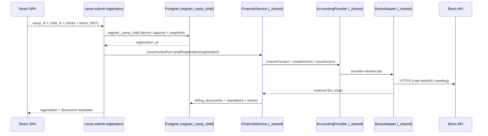

# Contracts: Edge Functions (HTTP)

**Feature**: `specs/features/010-padel-camps/spec.md` | **Date**: 2026-09-08

All functions live at `https://<project-ref>.supabase.co/functions/v1/<name>` and follow the existing project conventions (`Content-Type: application/json`, caller JWT in `Authorization: Bearer <user-jwt>` for user-facing functions, sanitized `{ error, message }` failures). Secrets, tokens, and upstream payload bodies never appear in responses or logs. New source locations (in-repo): `supabase/functions/camp-submit-registration/index.ts`, `supabase/functions/camp-cancel-registration/index.ts`, `supabase/functions/camp-admin/index.ts`, plus shared code under `supabase/functions/_shared/`.

---

## 1. `camp-submit-registration` — parent registers a saved child (US4, FR-006–FR-018, FR-028–FR-032)

**Auth**: caller JWT required; caller must be an active parent who owns `child_id` (F1.04). Billing-profile completeness is enforced before a chargeable registration is created (same fields as the lesson gate).

### Request

```json
{
  "camp_id": "uuid",
  "child_id": "uuid",
  "extra_ids": ["uuid"],
  "terms_version": "2026-09",
  "terms_accepted": true
}
```

### Behavior

1. Resolve caller; require active profile and ownership of `child_id` (not archived).
2. Require billing-profile completeness (first/last name, phone, address, postal code, city, country).
3. Call `register_camp_child(...)` (data-model §Transactional capacity function) — atomic publication/window/eligibility/capacity insert with snapshots and extras.
4. Issue the invoice through the F1.03 financial boundary with idempotency key `camp-registration:{registrationId}:invoice:v1` and `api_reference` `agc:camp-registration:{registrationId}`; line items = Camp base + each selected extra.
5. Email the Bexio invoice PDF via the existing mailer (FR-031). Mail failure is audited and does not fail the registration.
6. Registration remains `pending_payment` / `pending`; payment is never implied by invoice creation.

### Responses

- `200 { "registration": { "id", "camp_id", "child_id", "status": "pending_payment", "total_amount", "currency" }, "document": { "id", "document_nr", "status": "issued", "total", "currency" } | null, "reused": false }`
- `409 { "error": "camp_full" | "camp_closed" | "camp_not_published" | "age_out_of_range" | "duplicate_registration" | "profile_incomplete" }`
- `401/403` auth/ownership • `502 { "error": "provider_unavailable" }` — registration exists; invoice issue enqueued in `billing_operations` for the worker.

---

## 2. `camp-cancel-registration` — unpaid cancel by the registering parent (FR-022)

**Auth**: caller JWT; registration’s `parent_id` must equal caller (admin allowed for support). Paid or partially paid invoices are refused.

### Request

```json
{ "registration_id": "uuid" }
```

### Behavior

1. Resolve registration and caller ownership.
2. If a `billing_documents` row exists and is `issued`: cancel it in Bexio, persist `cancelled`, then cancel the registration (releases capacity). If Bexio is down, cancel the registration and enqueue `camp_invoice_cancel`.
3. If document is `paid`/`partially_paid`: `409 refund_agreement_required` (paid cancellation is out of scope).
4. Idempotent: re-cancelling an already-cancelled registration returns `reused: true`.

### Responses

- `200 { "outcome": "cancelled", "reused": bool, "document": {…} | null }`
- `404 not_found` • `409 refund_agreement_required | cancel_refused` • `401/403` • `502 provider_unavailable`

---

## 3. `camp-admin` — Camp management, registrations, waitlist, export (US1/US8/US9, FR-001–FR-003, FR-035/FR-036)

**Auth**: caller JWT; active admin only (`canAdminister`). Every action is enforced server-side.

### Actions

- `POST { "action": "upsert_camp", "camp": {…} }` — create/update Camp configuration; publish/unpublish.
- `POST { "action": "upsert_extra", "camp_id", "extra": {…} }` / `{ "action": "remove_extra", "extra_id" }` — extras management.
- `POST { "action": "list_registrations", "camp_id", "status"? }` — returns registrations with Camp, child, age, parent, phone, email, level, extras, total, payment status, registration date, and remaining places.
- `POST { "action": "export_registrations", "camp_id" }` — CSV/Excel-compatible export of the authorized registration fields only.
- `POST { "action": "list_waitlist", "camp_id" }` — deterministic order (`created_at` asc).
- `POST { "action": "convert_waitlist", "entry_id" }` — revalidates eligibility and capacity via `register_camp_child`, then issues the invoice; refuses when full/ineligible.

### Responses

Action-specific `200 { … }`; `401/403` for non-admins; `409 camp_full | age_out_of_range | duplicate_registration` on invalid conversion.

---

## 4. Existing functions extended

### `billing-invoice-document`

Accepts `{ "camp_registration_id": "uuid" }` in addition to `{ "booking_id": "uuid" }`. Authorization: registration’s parent or admin. Streams the Bexio PDF exactly as for lesson invoices.

### `bexio-reconcile`

For Camp documents, on full payment: guarded update of `camp_registrations` (`status='confirmed'`, `payment_status='confirmed'`, `payment_confirmation_source='bexio_reconciliation'`, `payment_confirmed_at=now()`, guarded by `payment_status <> 'confirmed'`), then send the Camp confirmation email once (guarded by `notifications_log`). Partial payment leaves the registration pending. Retry queue processes `camp_invoice_issue` / `camp_invoice_cancel`.

---

## Internal call graph



The layered chain `FinancialService → AccountingProvider → BexioAdapter` is reused unchanged; F1.25 adds a camp mapper and camp repository methods, not a second provider.
