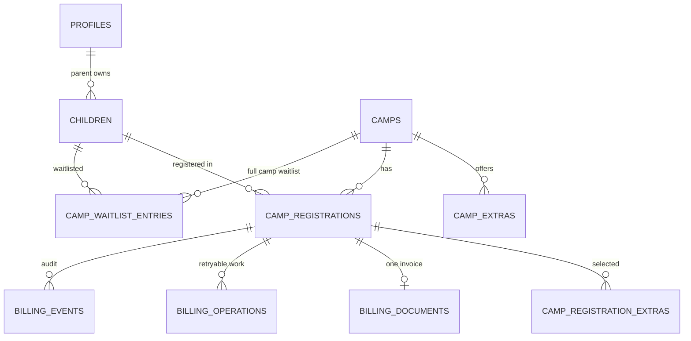
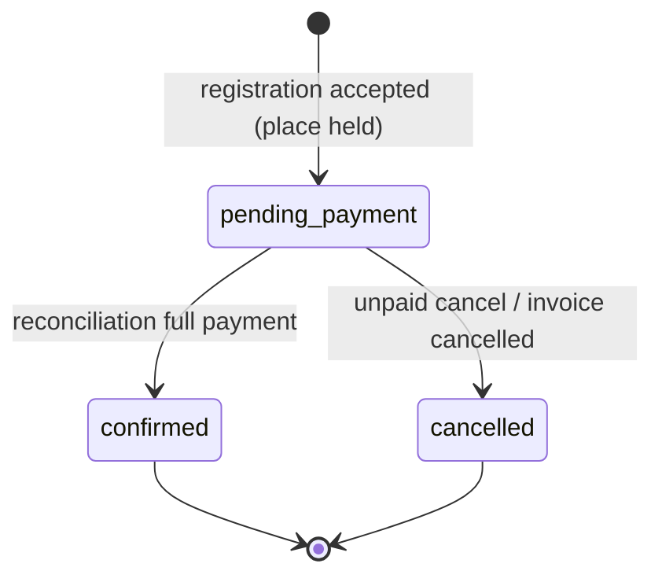
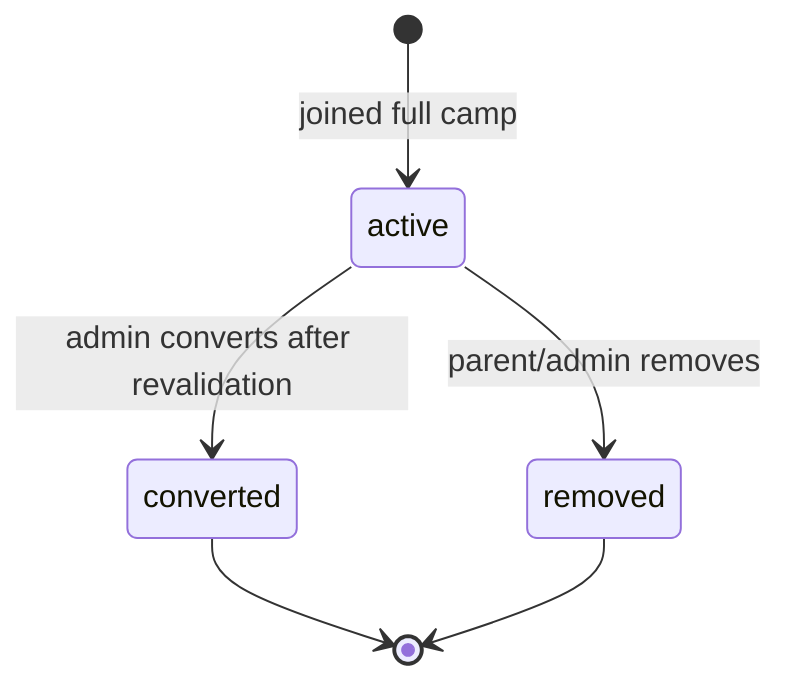

# Data Model: Padel Camps / Camps Registration (F1.25)

**Feature**: `specs/features/010-padel-camps/spec.md` | **Research**: `research.md`
**Date**: 2026-09-08

## Design rules (from constitution + spec)

1. New Camp/child/registration tables are **additive**; `bookings`, `lessons`, `invoices`, `profiles`, and the existing `billing_*` semantics are unchanged (constitution §III/§V).
2. Money is `numeric` in CHF (constitution §V, XR-001). No `text` prices on new tables.
3. Every new table ships with RLS enabled and least-privilege policies in the same migration; writes are owner-scoped or admin-scoped, and service-role writes stay inside Edge Functions (constitution §IV).
4. Child data is dependent data owned by a parent profile, never a login identity (F1.04). Child PII never enters analytics or public projections (FR-038/FR-039).
5. Camp invoices reuse the F1.03 provider-neutral `billing_*` spine; Camp references are additive columns, not a parallel financial schema (research R-02).

## Entity overview

## New tables

### `camps`

Admin-managed reusable Camp configuration (FR-001/FR-002).

| Column | Type | Constraints | Notes |
|---|---|---|---|
| `id` | uuid | PK, default `gen_random_uuid()` | |
| `slug` | text | NOT NULL UNIQUE | public URL-safe identifier |
| `name` | text | NOT NULL | display name |
| `description` | text | NULL | marketing copy |
| `start_date` | date | NOT NULL | academy-local calendar date |
| `end_date` | date | NOT NULL, CHECK `end_date >= start_date` | inclusive |
| `daily_start_time` | time | NULL | e.g. 09:00 |
| `daily_end_time` | time | NULL | e.g. 16:00 |
| `schedule_text` | text | NULL | optional human schedule notes |
| `min_age` | smallint | NULL, CHECK `min_age >= 0` | age at `start_date` |
| `max_age` | smallint | NULL, CHECK `max_age >= min_age` when both set | |
| `eligibility_text` | text | NULL | e.g. “players with previous experience” |
| `price_amount` | numeric(10,2) | NOT NULL, CHECK `price_amount >= 0` | base CHF (usual price) |
| `member_price_amount` | numeric(10,2) | NULL, CHECK `member_price_amount >= 0` | **added 2026-09-09 (C2)** — optional academy-member price |
| `flyer_path` | text | NULL | **added 2026-09-09 (C2)** — object path inside the private `camp-flyers` bucket (`{camp_id}/{file}`) |
| `camp_type` | text | NULL | **added 2026-09-09 (C3)** — admin-configured type label for `/camps` filters; not an enum of Mini/Junior/Competition |
| `currency` | text | NOT NULL DEFAULT `'CHF'` | |
| `max_capacity` | integer | NOT NULL, CHECK `max_capacity > 0` | |
| `registration_opens_at` | timestamptz | NULL | when NULL, open immediately while published |
| `registration_deadline_at` | timestamptz | NULL | after this, registration refused |
| `is_published` | boolean | NOT NULL DEFAULT false | |
| `waitlist_enabled` | boolean | NOT NULL DEFAULT false | |
| `practical_info` | text | NULL | used in confirmation email |
| `created_at` / `updated_at` | timestamptz | NOT NULL DEFAULT `now()` | |

**RLS**: `SELECT` published Camps to everyone (public `/camps`); all rows to admins. `INSERT/UPDATE/DELETE` admin-only via `public.is_admin()`.

**Flyer storage (2026-09-09, C2)**: private `camp-flyers` bucket; object path `{camp_id}/{file}`; images ≤ 5 MB. `storage.objects` policies: `SELECT` for anon/authenticated when the first path segment is a **published** Camp id, or the caller is an admin; `INSERT/UPDATE/DELETE` admin-only. The SPA reads flyers through short-lived signed URLs. Unpublished Camps' flyers are never publicly readable (convergence-2 §4).

**Dual pricing (2026-09-09, C2)**: `member_price_amount` is optional. Interim (until F1.09): the parent self-declares an active membership at registration (`register_camp_child.p_member_price_claimed`); when claimed and a member price exists, the registration snapshots the member price as `base_price` and sets `member_price_claimed = true` (admin-visible); a claim on a Camp without a member price fails with `member_price_unavailable`. F1.09 handover: automatic active-at-registration membership check, member-only price display for members, and a pending-membership-payment admin flag.

**Camp type (2026-09-09, C3)**: `camp_type` is optional free text set by the admin. `/camps` derives filter chips from distinct non-empty types among the loaded published Camps; Camps with a null/empty type appear only when All Camps is selected. The SPA MUST NOT hardcode Mini / Junior / Competition as the only filter values. `camp_public_list` exposes `camp_type`.

### `camp_registrations` — C2 addition

`member_price_claimed` boolean NOT NULL DEFAULT false — set when the registration used the self-declared member price; surfaced in the admin registration list and CSV export (decision 3).

### `camp_extras`

Optional configured extras (FR-016). Lunch is data, not code.

| Column | Type | Constraints | Notes |
|---|---|---|---|
| `id` | uuid | PK, default | |
| `camp_id` | uuid | NOT NULL, FK → `camps(id)` ON DELETE CASCADE | |
| `name` | text | NOT NULL | |
| `description` | text | NULL | |
| `price_amount` | numeric(10,2) | NOT NULL, CHECK `price_amount >= 0` | |
| `is_active` | boolean | NOT NULL DEFAULT true | |
| `sort_order` | smallint | NOT NULL DEFAULT 0 | |
| `created_at` / `updated_at` | timestamptz | NOT NULL | |

**RLS**: `SELECT` everyone for extras of published Camps; admin-only writes.

### `children`

Parent-owned dependents (FR-006/FR-006a). Not logins.

| Column | Type | Constraints | Notes |
|---|---|---|---|
| `id` | uuid | PK, default | |
| `parent_id` | uuid | NOT NULL, FK → `profiles(id)` ON DELETE RESTRICT | never cascade-delete history |
| `first_name` | text | NOT NULL | |
| `last_name` | text | NOT NULL | |
| `date_of_birth` | date | NULL, CHECK not future | same rule as profile DOB |
| `padel_level` | text | NULL | declared experience; **not collected on the create form (2026-09-09)** — maintained on the child profile-management view |
| `allergies` | text | NULL | important information |
| `emergency_contact_name` | text | NULL | |
| `emergency_contact_phone` | text | NULL | E.164; captured as prefix + national number in the UI |
| `avatar_path` | text | NULL | **added 2026-09-09** — object path inside the private `child-avatars` bucket |
| `archived_at` | timestamptz | NULL | legacy archive marker; the Archive UI action was removed 2026-09-09 |
| `created_at` / `updated_at` | timestamptz | NOT NULL | |

**RLS**: `SELECT/INSERT/UPDATE` where `parent_id = auth.uid()` and the parent profile is active; `SELECT` for admins. **(Amended 2026-09-09)** A `DELETE` policy exists for owner-or-admin, but removal succeeds only when the child has no registrations/invoices — `camp_registrations.child_id` is `ON DELETE RESTRICT`, so the database refuses the delete with FK violation 23503 when history exists (FR-006d/FR-006f, decision 2).

**Profile image storage (2026-09-09)**: private `child-avatars` bucket; object path `{parent_id}/{child_id}/{file}`; `storage.objects` policies are owner-path-or-admin (SELECT/INSERT/UPDATE/DELETE), modeled on the `payment-proofs` pattern from migration `0008`; the SPA reads images through short-lived signed URLs. Images are restricted to common image MIME types and ≤ 5 MB at bucket level.

**Emergency contact (analysis A2)**: `emergency_contact_*` may stay empty on the child record; `register_camp_child` rejects a submission without a usable emergency contact (FR-007), so the snapshot on `camp_registrations` is always populated for chargeable registrations.

### `camp_registrations`

One saved child on one Camp, submitted by a parent (FR-007). Place-holding states consume capacity (research R-04).

| Column | Type | Constraints | Notes |
|---|---|---|---|
| `id` | uuid | PK, default | |
| `camp_id` | uuid | NOT NULL, FK → `camps(id)` ON DELETE RESTRICT | |
| `child_id` | uuid | NOT NULL, FK → `children(id)` ON DELETE RESTRICT | |
| `parent_id` | uuid | NOT NULL, FK → `profiles(id)` ON DELETE RESTRICT | denormalized owner for RLS/invoicing |
| `status` | text | NOT NULL DEFAULT `'pending_payment'` | `pending_payment`, `confirmed`, `cancelled` |
| `payment_status` | text | NOT NULL DEFAULT `'pending'` | `pending`, `confirmed`, `cancelled` (document-level paid lives on `billing_documents.status`) |
| `child_first_name` / `child_last_name` | text | NOT NULL | snapshot at submit (FR-018a) |
| `child_date_of_birth` | date | NULL | snapshot |
| `padel_level` | text | NULL | snapshot |
| `allergies` | text | NULL | snapshot |
| `emergency_contact_name` / `emergency_contact_phone` | text | NULL | snapshot; REQUIRED at submit time (validated by `register_camp_child`, FR-007) even though the stored child record may leave them empty |
| `parent_full_name` | text | NOT NULL | snapshot from profile |
| `parent_email` | text | NOT NULL | snapshot |
| `parent_phone` | text | NULL | snapshot |
| `camp_name` / `camp_start_date` / `camp_end_date` | text / date / date | NOT NULL | camp context snapshot |
| `camp_schedule_text` | text | NULL | snapshot for confirmation |
| `base_price` | numeric(10,2) | NOT NULL | snapshot |
| `extras_total` | numeric(10,2) | NOT NULL DEFAULT 0 | snapshot |
| `total_amount` | numeric(10,2) | NOT NULL | `base_price + extras_total` |
| `currency` | text | NOT NULL DEFAULT `'CHF'` | |
| `terms_version` | text | NULL | deploy-time constant matching the current `/terms` copy (e.g. `YYYY-MM` of the terms publication), consistent with the existing reservation convention |
| `terms_accepted_at` | timestamptz | NULL | |
| `payment_confirmation_source` | text | NULL CHECK IN (`'bexio_reconciliation'`) | attribution (mirrors `bookings`) |
| `payment_confirmed_at` | timestamptz | NULL | |
| `cancelled_at` | timestamptz | NULL | |
| `created_at` / `updated_at` | timestamptz | NOT NULL | |

**Capacity rule**: `status IN ('pending_payment','confirmed')` are the canonical active place-holding states. `cancelled` releases capacity.

**Duplicate rule**: partial UNIQUE index on `(parent_id, child_id, camp_id) WHERE status IN ('pending_payment','confirmed')` — refuses a duplicate active registration for the same child on the same Camp while still allowing a re-registration after cancellation.

**RLS**: `SELECT` own rows (parent) or admin. `INSERT` only via the transactional registration function (service role). `UPDATE` restricted to the owner’s unpaid cancellation path and admin/service-role reconciliation.

### `camp_registration_extras`

Selected extras snapshotted on the registration (FR-018).

| Column | Type | Constraints | Notes |
|---|---|---|---|
| `id` | uuid | PK, default | |
| `camp_registration_id` | uuid | NOT NULL, FK → `camp_registrations(id)` ON DELETE CASCADE | |
| `camp_extra_id` | uuid | NULL, FK → `camp_extras(id)` ON DELETE SET NULL | keep history even if extra later removed |
| `name` | text | NOT NULL | snapshot |
| `price_amount` | numeric(10,2) | NOT NULL | snapshot |
| `created_at` | timestamptz | NOT NULL | |

**RLS**: `SELECT` own (via parent registration) or admin. No client writes.

### `camp_waitlist_entries`

Interest in a full Camp (FR-024/FR-025). Not a place.

| Column | Type | Constraints | Notes |
|---|---|---|---|
| `id` | uuid | PK, default | |
| `camp_id` | uuid | NOT NULL, FK → `camps(id)` ON DELETE CASCADE | |
| `child_id` | uuid | NOT NULL, FK → `children(id)` ON DELETE CASCADE | |
| `parent_id` | uuid | NOT NULL, FK → `profiles(id)` ON DELETE CASCADE | |
| `status` | text | NOT NULL DEFAULT `'active'` | `active`, `converted`, `removed` |
| `created_at` / `updated_at` | timestamptz | NOT NULL | deterministic order = `created_at` asc |

**Uniqueness**: partial UNIQUE on `(parent_id, child_id, camp_id) WHERE status = 'active'`.

**Join guard (analysis U1)**: a `guard_camp_waitlist_join` BEFORE INSERT trigger raises `camp_waitlist_unavailable` unless the Camp is published, `waitlist_enabled`, and currently full (active registrations ≥ `max_capacity`). This enforces FR-024/US8 for direct PostgREST inserts, not only UI joins.

**RLS**: `SELECT/INSERT` own active parent; admin `SELECT/UPDATE` for conversion/management. No place capacity consumed.

### `camp_funnel_events`

PII-free conversion funnel events (FR-039; research R-13; analysis A1).

| Column | Type | Constraints | Notes |
|---|---|---|---|
| `id` | bigint | PK, generated always as identity | |
| `camp_id` | uuid | NULL, FK → `camps(id)` ON DELETE SET NULL | NULL for the `/camps` page-level visit |
| `event` | text | NOT NULL, CHECK IN (`'camps_page_view'`, `'camp_registration_started'`, `'camp_registration_completed'`, `'camp_payment_confirmed'`) | |
| `created_at` | timestamptz | NOT NULL DEFAULT `now()` | |

No name/contact/DOB/allergy columns exist by design, so PII cannot be recorded. **RLS**: `INSERT` for `anon` and `authenticated`; `SELECT` admin-only.

## Additive extensions to existing billing tables

### `billing_documents`

| New column | Type | Constraints | Notes |
|---|---|---|---|
| `camp_registration_id` | uuid | NULL, UNIQUE, FK → `camp_registrations(id)` ON DELETE RESTRICT | idempotency anchor for camp invoices |

New CHECK: exactly one of `booking_id` / `camp_registration_id` is set.

RLS owner clause extended: owner = `bookings.user_id` **or** the registration’s `parent_id`.

### `billing_operations`

| New column | Type | Constraints | Notes |
|---|---|---|---|
| `camp_registration_id` | uuid | NULL, FK → `camp_registrations(id)` | subject for camp retries |

**Decision (2026-09-08, analysis I1):** the existing `kind` CHECK from migration `0003` is **altered** to add `camp_invoice_issue` and `camp_invoice_cancel`. Deterministic idempotency keys: `camp-registration:{id}:invoice:v1` (issue) and `camp-registration:{id}:invoice_cancel:v1` (cancel). Lesson kinds are unchanged.

### `billing_events`

| New column | Type | Constraints | Notes |
|---|---|---|---|
| `camp_registration_id` | uuid | NULL, FK → `camp_registrations(id)` | audit subject |

New event types: `camp.registration_submitted`, `camp.invoice.issued`, `camp.payment.reconciled`, `camp.confirmation.sent`, `camp.waitlist.joined`, `camp.waitlist.converted`.

## Public projection

### `camp_public_list` (view)

Security-invoker view over published Camps exposing: `slug`, `name`, `description`, `start_date`, `end_date`, `daily_start_time`, `daily_end_time`, `schedule_text`, `min_age`, `max_age`, `eligibility_text`, `price_amount`, `member_price_amount`, `flyer_path`, `camp_type`, `currency`, `registration_opens_at`, `registration_deadline_at`, `waitlist_enabled`, `is_full`, `places_remaining` (derived, non-negative), plus active extras. No parent/child columns. Granted `SELECT` to `anon` and `authenticated`.

## State machines

### Camp registration (`camp_registrations.status` / `payment_status`)

`payment_status` moves `pending → confirmed → cancelled` in lockstep; invoice state stays on `billing_documents.status` (`issued`/`partially_paid`/`paid`/`cancelled`).

### Waitlist entry (`camp_waitlist_entries.status`)

## Transactional capacity function

`public.register_camp_child(p_camp_id uuid, p_child_id uuid, p_parent_id uuid, p_extra_ids uuid[], p_terms_version text)` (SECURITY DEFINER, service-role only):

1. Lock the Camp row `FOR UPDATE`.
2. Revalidate: Camp exists, `is_published`, window open, deadline not passed, child belongs to `p_parent_id` and is not archived, age within range when configured.
3. Count active registrations (`pending_payment`,`confirmed`). If `count >= max_capacity` → raise `camp_full`.
4. Insert the registration with snapshots and computed totals; insert selected extras (validated active and belonging to the Camp).
5. Return the registration id.

All steps are one transaction, so two concurrent submissions cannot both take the final place (research R-04).

## Migration plan

One additive migration `supabase/migrations/0014_f125_padel_camps.sql` (confirm remote numbering before apply; historical tracking has gaps):

1. Create `camps`, `camp_extras`, `children`, `camp_registrations`, `camp_registration_extras`, `camp_waitlist_entries` with constraints/indexes above.
2. Add `camp_registration_id` to `billing_documents` / `billing_operations` / `billing_events`; extend the document CHECK and RLS owner clause.
3. Create `camp_public_list` view + grants.
4. Create `register_camp_child` (and a companion `cancel_camp_registration` used by the unpaid-cancel path) with service-role-only EXECUTE.
5. RLS enable + policies for all new tables; no client writes except owner-scoped children and owner waitlist join.

**Backward compatibility**: nothing existing is altered in meaning; rollback = drop new objects and the three additive columns. Lesson bookings, My Payments, Bexio connection, and legacy invoices are untouched.

## Validation rules mapped from requirements

| Requirement | Enforcement point |
|---|---|
| FR-001/FR-002 configurable Camps | `camps` columns + admin RLS |
| FR-006/FR-006a parent-owned children | `children.parent_id` RLS |
| FR-006d no child hard delete | no `DELETE` policy; `archived_at` only |
| FR-009 age eligibility | transactional function age check at `start_date` |
| FR-010/FR-011 window/full/idempotent submit | transactional function + partial UNIQUE index |
| FR-017/FR-018 decimal totals + snapshots | `numeric(10,2)` snapshots on registration/extras |
| FR-019/FR-020 capacity | derived count + `FOR UPDATE` lock in one transaction |
| FR-024–FR-026 waitlist | partial UNIQUE + deterministic order + admin conversion path |
| FR-028–FR-032 F1.03 invoice/payment | additive `billing_*` columns + existing reconcile worker |
| FR-033/FR-034 confirmation once | `notifications_log` sent-guard + reconcile event |
| FR-037 server-side authorization | RLS + Edge Function ownership checks |
