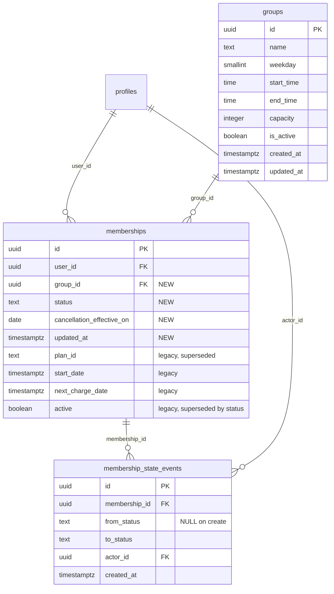
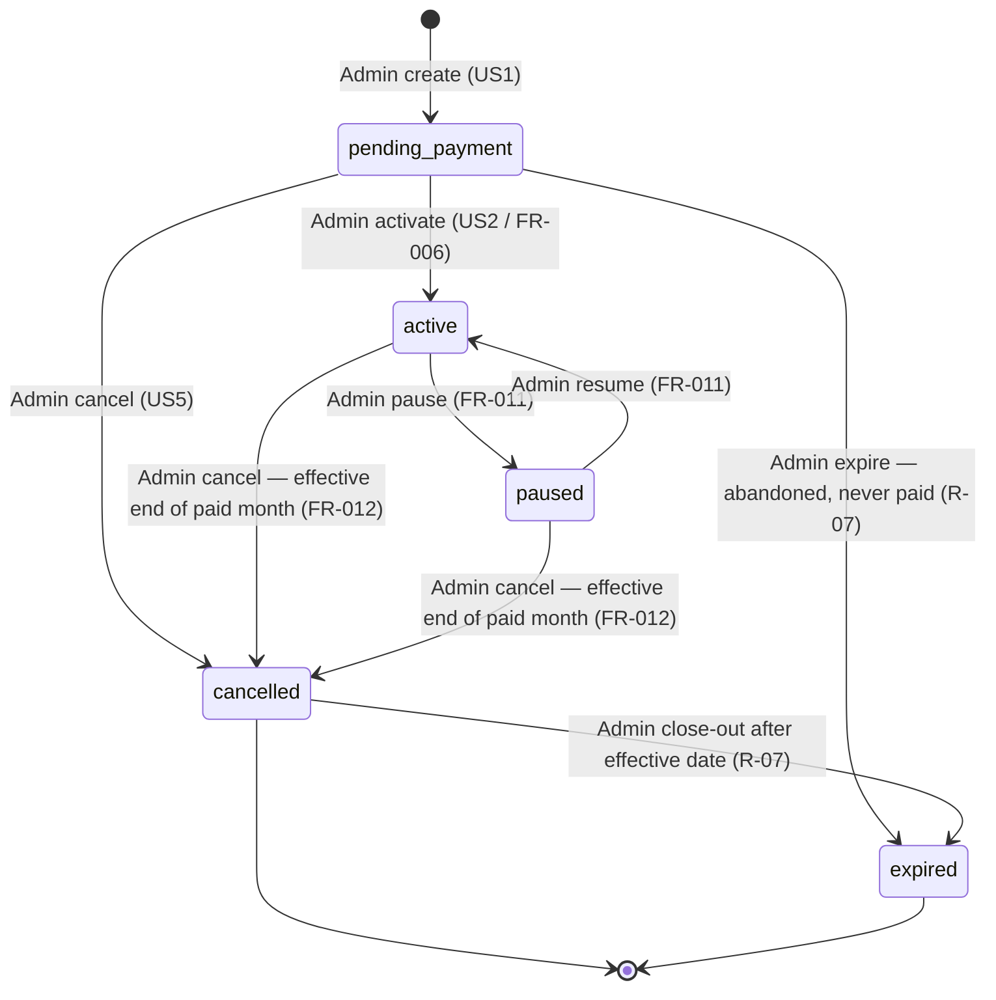

# Data Model: Adult Memberships (F1.09)

**Feature**: `011-adult-memberships` | **Date**: 2026-10-05 | **Spec**: [spec.md](spec.md) | **Research**: [research.md](research.md)

Additive evolution of the existing unused `memberships` table plus two new tables and
one contract view. Forward-only migration `0020_f109_adult_memberships.sql` (confirm
remote numbering before applying; local head is `0019`). No column is dropped or
retyped (constitution III/V).

---

## Entity overview



---

## `groups` (NEW — minimal anchor, owned long-term by F1.08)

Recurring academy training arrangement. This migration creates **only** the columns the
Membership FK and FR-004 validation need. F1.08 evolves this table (Club, Coach, level,
category, roster) and owns all Group-management UI; F1.09 ships no Group CRUD surface
(research R-01).

| Column | Type | Constraints | Notes |
|---|---|---|---|
| `id` | `uuid` | PK, `default gen_random_uuid()` | |
| `name` | `text` | NOT NULL, `char_length(name) BETWEEN 1 AND 120` | e.g. "Tuesday Evening Adults" |
| `weekday` | `smallint` | NOT NULL, CHECK `0–6` | 0 = Sunday (Postgres `extract(dow …)` convention) |
| `start_time` | `time` | NOT NULL | recurring local start |
| `end_time` | `time` | NOT NULL, CHECK `end_time > start_time` | |
| `capacity` | `integer` | nullable, CHECK `> 0` | informational until F1.08/F1.11 enforce it |
| `is_active` | `boolean` | NOT NULL, default `true` | `false` = retired Group; FR-004 refuses it on create |
| `created_at` / `updated_at` | `timestamptz` | NOT NULL, default `now()` | |

**Validation rules**
- FR-004: a Membership create MUST reference an existing `groups` row with
  `is_active = true`; missing/invalid/inactive Group is refused.
- No duplicate-place rule lives here; capacity enforcement belongs to F1.08/F1.11.

**RLS** (enabled, least privilege)
| Policy | Role | Operation | Expression |
|---|---|---|---|
| `groups_admin_all` | authenticated | ALL | `public.is_admin()` (WITH CHECK same) |
| `groups_member_read` | authenticated | SELECT | `EXISTS (SELECT 1 FROM public.memberships m WHERE m.group_id = id AND m.user_id = (SELECT auth.uid()))` |

No `anon` access. Coaches receive no policy in this slice (roster access is F1.02/F1.08).

## `memberships` (EVOLVED — existing table, 0 rows)

Adult commercial/lifecycle commitment: exactly one Client (`profiles`) × exactly one
Group. Not a credit wallet (FR-002); the legacy credit-token semantics in
`domain-model.md` §2.9 are superseded (spec Discrepancy #1).

| Column | Type | Constraints | Notes |
|---|---|---|---|
| `id` | `uuid` | PK (existing) | |
| `user_id` | `uuid` | NOT NULL, FK → `profiles.id` (existing) | the Client (F1.04 profile) |
| `group_id` | `uuid` | **NEW** NOT NULL, FK → `groups.id` (ON DELETE RESTRICT) | the recurring Group |
| `status` | `text` | **NEW** NOT NULL, default `'pending_payment'`, CHECK in (`pending_payment`,`active`,`paused`,`cancelled`,`expired`) | lifecycle state |
| `cancellation_effective_on` | `date` | **NEW** nullable | set by the transition trigger on cancel (R-06); NULL otherwise |
| `updated_at` | `timestamptz` | **NEW** NOT NULL, default `now()` | maintained by trigger |
| `plan_id` | `text` | legacy — **superseded**, unused | kept per constitution; do not read/write |
| `start_date` | `timestamptz` | legacy NOT NULL (existing default) | retained; creation sets `now()` |
| `next_charge_date` | `timestamptz` | legacy nullable | retained, unused (no auto-billing in V1) |
| `active` | `boolean` | legacy NOT NULL default `true` | **superseded by `status`**; left untouched (R-02) |

**Indexes / constraints (NEW)**
- `memberships_one_live_per_client_group` — UNIQUE `(user_id, group_id)`
  `WHERE status IN ('pending_payment','active','paused')` (FR-004 duplicate rule; R-05).
- `memberships_user_id_idx` on `(user_id)` — serves FR-014 owner reads (also closes the
  known unindexed-FK advisor finding for this table; in-scope because we rewrite its
  policies).
- `memberships_group_id_idx` on `(group_id)` — FK index.

**Validation rules**
- FR-001: exactly one Client + one Group; both FKs NOT NULL; no shadow person/Group rows.
- FR-004: create refuses missing/invalid/inactive Group, deactivated Client
  (`profiles.is_active = false` — checked in the create path), and duplicate live
  Membership (partial unique index).
- FR-012: `cancellation_effective_on` is set only by the transition trigger; direct
  client writes cannot forge it (RLS + trigger).
- Cancelled/Expired rows never block a new Membership for the same Client+Group.

**RLS** (enabled; legacy self-read policy rewritten to advisor-compliant form)
| Policy | Role | Operation | Expression |
|---|---|---|---|
| `memberships_admin_all` | authenticated | ALL | `public.is_admin()` (WITH CHECK same) |
| `memberships_owner_read` | authenticated | SELECT | `(SELECT auth.uid()) = user_id` |

No DELETE policy for any role (history is preserved — spec Non-goals). No client
INSERT/UPDATE. Status changes additionally pass the transition trigger (R-03).

## `membership_state_events` (NEW — audit)

Append-only audit of every creation and state change (FR-005). Written exclusively by
trigger; no role can INSERT/UPDATE/DELETE directly.

| Column | Type | Constraints | Notes |
|---|---|---|---|
| `id` | `uuid` | PK, `default gen_random_uuid()` | |
| `membership_id` | `uuid` | NOT NULL, FK → `memberships.id` ON DELETE RESTRICT | history cannot be orphaned |
| `from_status` | `text` | nullable, same CHECK domain as `memberships.status` | NULL = creation event |
| `to_status` | `text` | NOT NULL, same CHECK domain | |
| `actor_id` | `uuid` | nullable, FK → `profiles.id` | `(SELECT auth.uid())`; NULL only for service-role maintenance |
| `created_at` | `timestamptz` | NOT NULL, default `now()` | |

**RLS**: `membership_state_events_admin_read` — authenticated SELECT where
`public.is_admin()`. No other policies.

## `membership_fixed_places` (NEW — contract view, security invoker)

The single participation predicate consumed by F1.08/F1.10/F1.11 (R-10):

```sql
SELECT id AS membership_id, user_id, group_id
FROM public.memberships
WHERE status = 'active'
   OR (status = 'cancelled' AND cancellation_effective_on >= CURRENT_DATE);
```

- Security-invoker: inherits `memberships` RLS (owner sees own rows, Admin sees all).
- Granted SELECT to `authenticated`; not to `anon`.
- Encodes FR-007 + FR-012: Active participates; Cancelled participates only until the
  end of the already-paid month; Pending Payment / Paused / Expired never participate.

---

## State machine



| From → To | Allowed | Rule |
|---|---|---|
| `pending_payment → active` | ✅ | Manual Admin activation only; payment alone never activates (FR-006) |
| `pending_payment → cancelled` | ✅ | Admin cancel; no fixed place was ever granted |
| `pending_payment → expired` | ✅ | Admin close-out of abandoned pending Membership |
| `active → paused` | ✅ | Admin pause; fixed place stops while Paused (FR-011) |
| `paused → active` | ✅ | Admin resume; fixed place restored (FR-011) |
| `active → cancelled` | ✅ | Trigger sets `cancellation_effective_on` = last day of current calendar month (R-06) |
| `paused → cancelled` | ✅ | Same effective-date rule |
| `cancelled → expired` | ✅ | Admin close-out after the effective date has passed |
| anything → `pending_payment` | ❌ | Never reopens; a new Membership is created instead |
| `cancelled`/`expired` → `active`/`paused` | ❌ | Terminal for participation (spec Edge Cases; US6.4) |
| `expired →` anything | ❌ | Terminal |
| same → same | ❌ | No-op transitions rejected |

Enforcement: `guard_membership_status_transition()` (BEFORE UPDATE OF status) rejects
any pair not listed, rejects non-admin callers (defense in depth behind RLS), sets
`cancellation_effective_on` on entry to `cancelled`, clears it if a transition ever
leaves `cancelled` back to a live state (none in V1 — kept as a guard), and maintains
`updated_at`. `record_membership_state_event()` (AFTER INSERT, AFTER UPDATE OF status)
writes the audit row. Both functions follow the migration `0011` style:
`SECURITY INVOKER`, `SET search_path = ''`, qualified names.

---

## Migration plan (`0020_f109_adult_memberships.sql`)

1. Confirm remote migration head (local head `0019`); renumber if remote advanced.
2. Create `groups` (constraints, indexes, RLS, grants).
3. Alter `memberships`: add `group_id`, `status`, `cancellation_effective_on`,
   `updated_at`; add CHECK + partial unique index + FK/FK indexes; comment legacy
   columns as superseded.
4. Replace the legacy `memberships` self-read policy with `memberships_owner_read`
   (`(SELECT auth.uid())` form) and add `memberships_admin_all`.
5. Create `membership_state_events` (RLS, grants, no write policies).
6. Create `guard_membership_status_transition()` + `record_membership_state_event()`
   triggers on `memberships`.
7. Create `membership_fixed_places` view (security invoker) and grant SELECT to
   `authenticated`.
8. Seed nothing. Group anchor rows are inserted by an Admin via the Supabase dashboard
   until F1.08 (research R-01).

**Rollback strategy**: forward-only; compensation migration would drop the new objects
and columns. Not written unless requested (constitution V).

## Out of scope (owned elsewhere)

- Group CRUD UI, roster operations, capacity enforcement → F1.08 / F1.11.
- Session generation consuming `membership_fixed_places` → F1.10.
- Booking duplicate-prevention → F1.11 (contract in
  [contracts/fixed-place-participation.md](contracts/fixed-place-participation.md)).
- Session cancellation / Recovery → F1.12 / F1.13 (must not touch Membership state).
- Automatic payment-triggered activation → F1.26 (contract in
  [contracts/membership-lifecycle.md](contracts/membership-lifecycle.md)).
- `credits` table → stays unused (FR-002).
