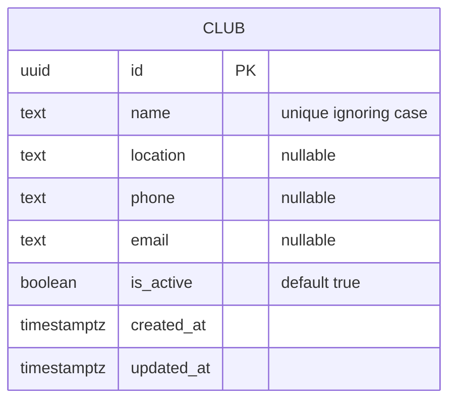
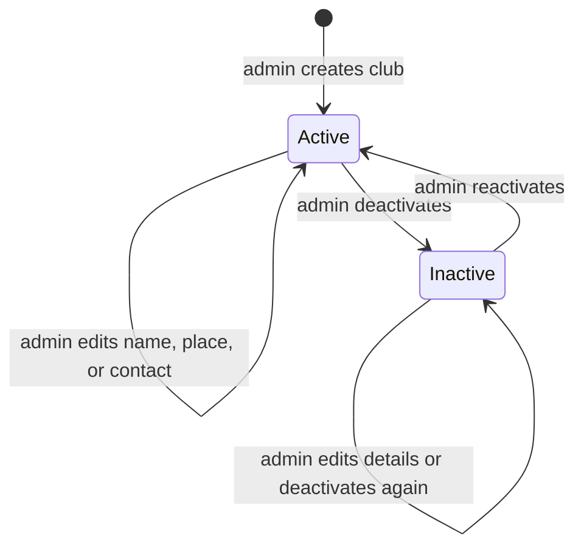
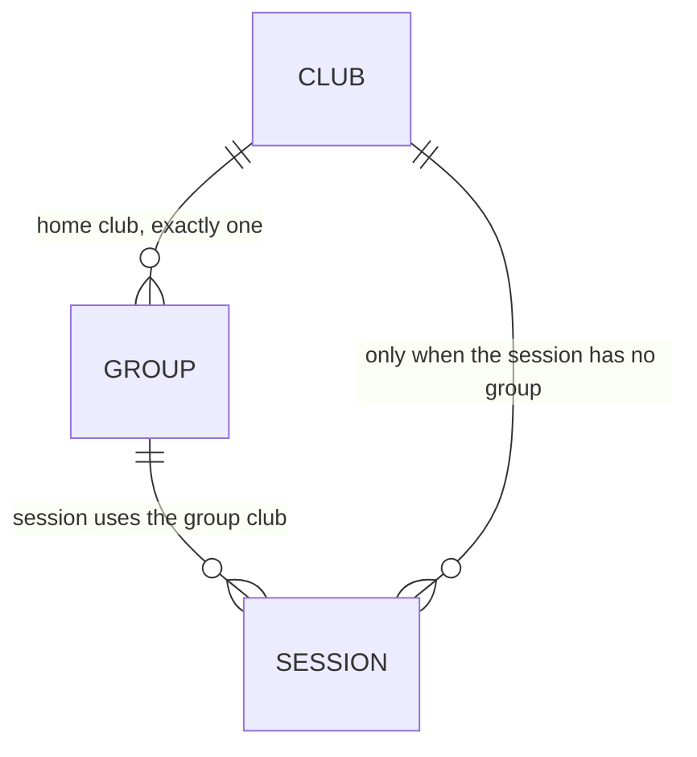

# Data Model: Club Management (F1.07)

**Feature**: [spec.md](spec.md)
**Research**: [research.md](research.md)
**Date**: 2026-10-07

## 1. Model summary

F1.07 adds one location entity, `public.clubs`. Existing people, bookings, lessons, and camps do not gain a club foreign key in this feature. Group and session tables stay absent; section 6 records the relationship the next feature must use.

No edges are drawn to Profile, Booking, Lesson, or Camp. Those tables are unchanged.

## 2. `public.clubs`

| Column | Type | Required | Rule |
|---|---|---|---|
| `id` | `uuid` | yes | Default `gen_random_uuid()`. Never updated. |
| `name` | `text` | yes | Trimmed. Length 1–120. Unique on `lower(name)`. |
| `location` | `text` | no | Trimmed place or address. Blank stored as null. Max 500. |
| `phone` | `text` | no | Trimmed. Blank stored as null. Max 40. No format regex. |
| `email` | `text` | no | Trimmed. Blank stored as null. Max 254. No format regex. |
| `is_active` | `boolean` | yes | Default `true`. |
| `created_at` | `timestamptz` | yes | Default `now()`. Not client-writable. |
| `updated_at` | `timestamptz` | yes | Default `now()`. Set on every update. Not client-writable. |

RLS is enabled. Active admins (`public.is_admin()`) may select, insert, and update. Nobody may delete. See [contracts/clubs.md](contracts/clubs.md).

### Write normalization

A `BEFORE INSERT OR UPDATE` trigger:

- rejects a change to `id`
- trims `name`, `location`, `phone`, and `email`
- rejects a name that is empty after trim, or longer than 120 characters
- stores null for optional fields that are empty after trim
- rejects optional fields over their maximum length
- sets `updated_at` to `now()` on update
- does not overwrite `created_at` from the client

The unique index then rejects a second club whose trimmed name differs only by letter case.

### Delete

A `BEFORE DELETE` trigger raises and aborts the statement for every role. There is no delete grant and no delete policy.

## 3. Lifecycle

There is no deleted state. Deactivate and reactivate keep the same `id`. Repeating the current status is a successful no-op.

## 4. Choice set for new use

`public.clubs_for_new_use` is a security-invoker view:

| Column | Source |
|---|---|
| `id` | `clubs.id` |
| `name` | `clubs.name` |
| `location` | `clubs.location` |

Predicate: `is_active = true`.

Because the view uses the caller’s privileges, a non-admin receives no rows even though `authenticated` may select the view. The admin catalogue continues to read `public.clubs`, including inactive rows.

`private.club_is_selectable_for_new_use(p_club_id uuid) returns boolean` is `SECURITY DEFINER` with an empty `search_path`. It returns true only when `p_club_id` matches an active club. It returns no other column. `EXECUTE` is granted to `authenticated` and revoked from `anon` and `PUBLIC`.

## 5. Explicit non-changes

| Table | This feature |
|---|---|
| `public.profiles` | No home-club column. Clients are not owned by a club. |
| `public.bookings` | No `club_id`. Coach assignment stays `coach_id`. |
| `public.lessons` | No location column. |
| `public.camps` and camp child tables | Unchanged. A camp is not a club. |
| Footer, contact, and terms copy | Hardcoded academy address stays as it is. It is not a `clubs` row. |

## 6. Future relationship (not created here)

When groups and sessions are built, they must use `public.clubs` and must not add a venue or location table.

Rules for that later migration:

- `groups.club_id uuid NOT NULL REFERENCES public.clubs(id) ON DELETE RESTRICT`.
- A group has one home club, not many.
- A session with a group does not store a different club. It uses the group’s `club_id`.
- A session without a group has `club_id uuid NOT NULL REFERENCES public.clubs(id) ON DELETE RESTRICT`.
- Insert, or an update that changes `club_id`, must fail when `private.club_is_selectable_for_new_use(club_id)` is false.
- An update that keeps the same `club_id` must succeed while the club is inactive.
- Deactivating a club must not null, move, or delete existing group, session, booking, attendance, or financial rows.

Booking location, if a later feature needs it, follows the same foreign key and the same active-club check. This feature does not add that column.

## 7. Migration behavior

One forward migration, expected name `0024_f107_club_management.sql` while remote history ends at `0023`. It creates the table, index, triggers, policies, grants, view, and private function. It inserts no clubs. Applied migrations are not edited.
