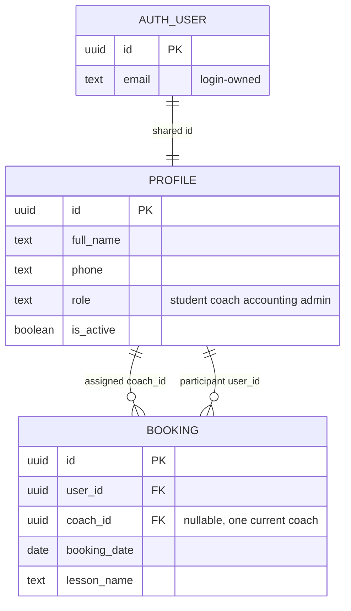
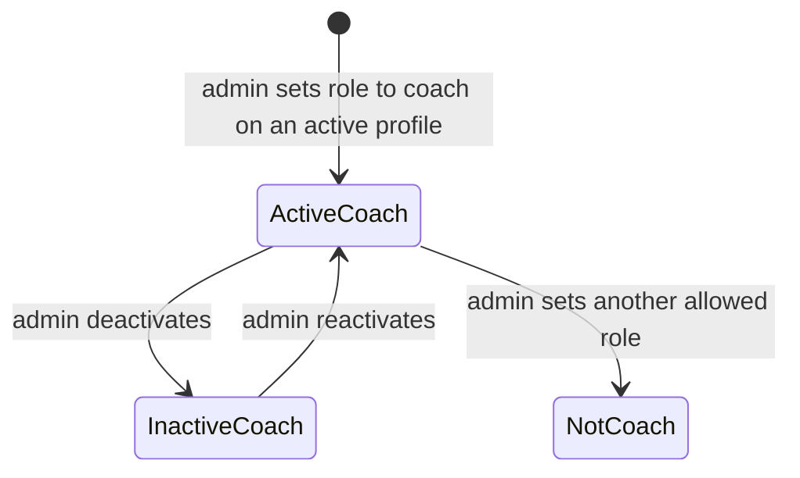
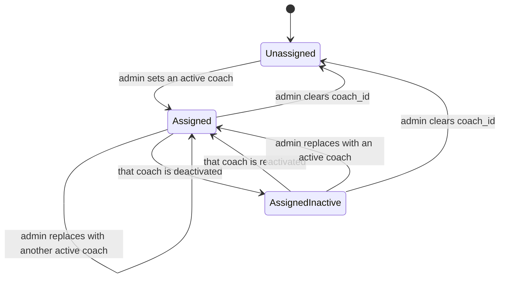

# Data Model: Coach Management (F1.06)

**Feature**: [spec.md](spec.md)
**Research**: [research.md](research.md)
**Date**: 2026-10-07

## 1. Model summary

F1.06 adds no table and no column. A Coach is the existing profile. A session assignment is the existing nullable Coach on a lesson reservation.

`availability.trainer_id` is not part of this model. There is no Group entity and no attendance entity.

## 2. Coach

| Item | Rule |
|---|---|
| Identity | `profiles.id = auth.users.id` |
| Recognition | `profiles.role = 'coach'` |
| Existing rows | Already-valid Coaches stay. No backfill and no second row |
| Personal fields | Same client-controlled set as F1.04: first name, last name, full name, phone, address, postal code, city, country, country code, date of birth |
| Academy fields | `role`, `is_active`. Admin updates them on another person. The Coach cannot |
| Email | Login-owned. Not changed here |

## 3. Assignment

| Item | Rule |
|---|---|
| Store | `bookings.coach_id` → `profiles.id`, `ON DELETE SET NULL` (unchanged) |
| Cardinality | At most one current Coach per booking |
| Unassigned | `coach_id` is null |
| New or changed non-null value | Target `role = 'coach'` and `is_active = true` |
| Unchanged value | Kept even if that Coach is later inactive |
| Clear | Admin may set null. Does not delete the booking |
| Who may change it | Admin only, for `authenticated` and `anon` callers. Same trigger as F1.02 |

Inactive-coach error text: `coach_id must reference an active coach`.

Non-coach error text stays: `coach_id must reference a profile with role coach`.

Non-admin error text stays: `only an administrator can change coach assignment`.

## 4. State transitions

Deactivation and reactivation do not insert, update, or delete bookings.

`AssignedInactive` is the same column value. The Coach no longer passes `is_coach()`, so roster access stops. The booking still names them.

## 5. Access that already follows this model

| Capability | Rule already in force |
|---|---|
| Coach roster | `is_coach()` (active Coach) and `bookings.coach_id = auth.uid()` |
| Participant fields | Identity and phone only |
| Own profile | Active owner writes client-controlled fields only. Inactive owner reads own profile and cannot update |
| Admin profile directory | Active admin reads and updates other profiles, including Coaches |
| Non-admin role change | Refused by the profile mutation guard |

## 6. Explicitly absent

- Coach-only columns (qualifications, languages, pay)
- Assignment history table
- Group membership
- Attendance rows
- Availability windows used as assignment
