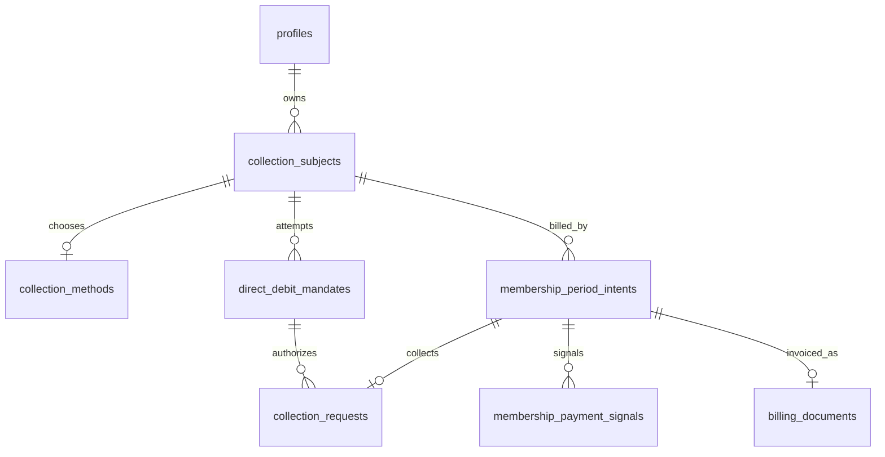
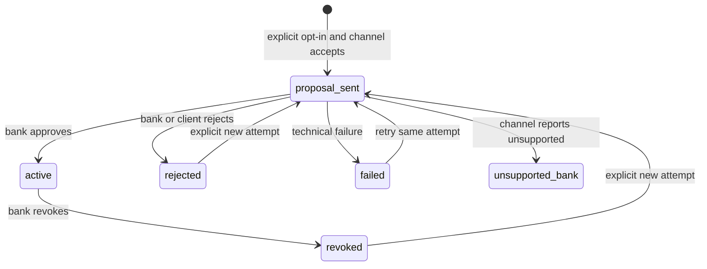
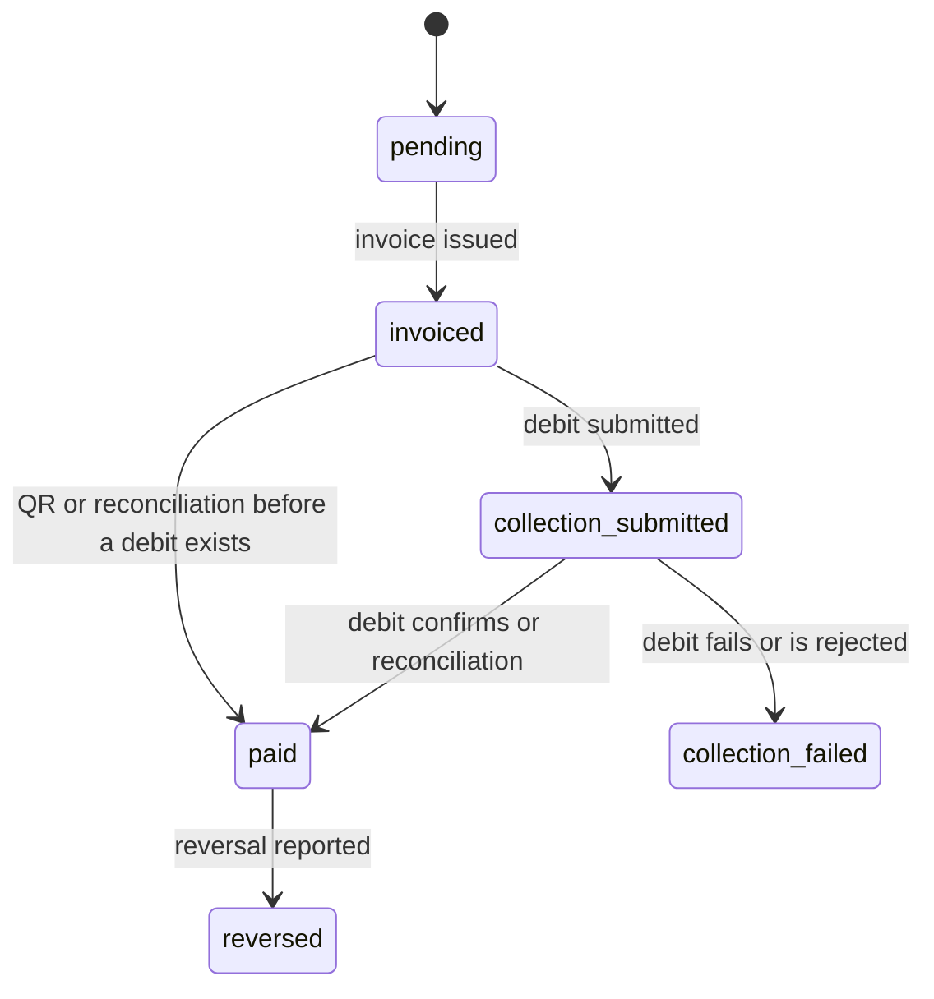

# Data model: Membership Automatic Collection (F1.26)

**Feature**: `specs/features/011-membership-automatic-collection/spec.md`
**Date**: 2026-10-08
**Plan**: [plan.md](plan.md) · **Research**: [research.md](research.md)

Operational collection data only. No Group, fixed place, or Membership lifecycle. `public.memberships` and `public.credits` are not used.

## Relationship

`membership_ref` on a subject is the future F1.09 Membership id. It has no foreign key until that table exists.

## Tables

### `collection_subjects`

| Column | Type | Rules |
|---|---|---|
| `id` | uuid PK | default `gen_random_uuid()` |
| `client_id` | uuid NOT NULL | FK `profiles(id)` |
| `membership_ref` | uuid NOT NULL | unique; not an FK to `memberships` |
| `display_label` | text NOT NULL | operational label for My Payments and Admin |
| `created_at` / `updated_at` | timestamptz | |

Unique `(client_id, membership_ref)`. No insert/update/delete for `authenticated`. Service role inserts the test double; F1.09 will insert the real subject later.

### `collection_methods`

| Column | Type | Rules |
|---|---|---|
| `id` | uuid PK | |
| `subject_id` | uuid NOT NULL UNIQUE | FK `collection_subjects` |
| `method` | text NOT NULL | `automatic_collection` or `qr_invoice` |
| `stopped_at` | timestamptz NULL | set when auto-pay is stopped |
| `updated_by` | uuid NULL | profile that made the change |
| `created_at` / `updated_at` | timestamptz | |

Default method when a subject exists and no row has been written: treat as `qr_invoice`. Opt-in inserts or updates this row. Stop sets `method = qr_invoice` and `stopped_at`. It does not delete mandate history.

### `direct_debit_mandates`

| Column | Type | Rules |
|---|---|---|
| `id` | uuid PK | |
| `subject_id` | uuid NOT NULL | FK `collection_subjects` |
| `attempt_no` | integer NOT NULL | starts at 1 |
| `status` | text NOT NULL | see state machine |
| `external_mandate_ref` | text NULL | provider reference |
| `external_biller_ref` | text NULL | provider reference |
| `failure_reason` | text NULL | |
| `iban` | text NULL | only if a configured channel requires it |
| `channel_status_at` | timestamptz NULL | timestamp from the channel; stale updates ignored |
| `requested_at` / `created_at` / `updated_at` | timestamptz | |

Unique `(subject_id, attempt_no)`.

Partial unique indexes:

- one row per `subject_id` where `status = 'proposal_sent'`
- one row per `subject_id` where `status = 'active'`

`unsupported_bank` is terminal for proposals. A `rejected` or `revoked` row is not moved back to `active`.

### `membership_period_intents`

| Column | Type | Rules |
|---|---|---|
| `id` | uuid PK | |
| `subject_id` | uuid NOT NULL | FK `collection_subjects` |
| `period_key` | text NOT NULL | opaque; unique per subject |
| `amount` | numeric(10,2) NOT NULL | CHF; check `amount > 0` |
| `currency` | text NOT NULL | check `currency = 'CHF'` |
| `status` | text NOT NULL | `pending`, `invoiced`, `collection_submitted`, `paid`, `collection_failed`, `reversed` |
| `paid_at` | timestamptz NULL | |
| `duplicate_receipt` | boolean NOT NULL | default false |
| `created_at` / `updated_at` | timestamptz | |

Unique `(subject_id, period_key)`. Service role inserts. This job does not invent `period_key`.

A second settlement while `paid` sets `duplicate_receipt` and does not insert a second `payment_confirmed` signal. `collection_submitted` is not cancelled by stop or deactivation.

### `collection_requests`

| Column | Type | Rules |
|---|---|---|
| `id` | uuid PK | |
| `intent_id` | uuid NOT NULL UNIQUE | FK `membership_period_intents` |
| `mandate_id` | uuid NOT NULL | FK `direct_debit_mandates` |
| `status` | text NOT NULL | `submitted`, `confirmed`, `failed`, `rejected` |
| `external_collection_ref` | text NULL | |
| `failure_reason` | text NULL | |
| `channel_status_at` | timestamptz NULL | stale updates ignored |
| `submitted_at` / `updated_at` | timestamptz | |

Unique `(external_collection_ref)` where not null. Lost response recovery looks up this row, or the external ref, before inserting another.

### `membership_payment_signals`

| Column | Type | Rules |
|---|---|---|
| `id` | uuid PK | |
| `intent_id` | uuid NOT NULL | FK `membership_period_intents` |
| `subject_id` | uuid NOT NULL | |
| `client_id` | uuid NOT NULL | |
| `kind` | text NOT NULL | `payment_confirmed` or `payment_reversed` |
| `source` | text NOT NULL | `collection_channel` or `accounting_reconciliation` |
| `occurred_at` | timestamptz NOT NULL | |
| `consumed_at` | timestamptz NULL | F1.09 sets this later; this feature only inserts |

Unique `(intent_id, kind)`.

## Billing spine (additive)

On `billing_documents`, `billing_operations`, and `billing_events`:

- `membership_period_intent_id uuid NULL` referencing `membership_period_intents(id)`
- documents: `UNIQUE (membership_period_intent_id)`
- replace `billing_documents_exactly_one_subject_check` so exactly one of `booking_id`, `camp_registration_id`, `membership_period_intent_id` is set
- extend the owner SELECT policy: the client owns the document when the intent’s subject `client_id = auth.uid()`

`api_reference` = `agc:membership-period:{intent_id}`.

Lesson and camp documents stay valid. No change to `bookings` or `camp_registrations`.

## RLS

Enable RLS on every new table.

| Table | authenticated SELECT | writes |
|---|---|---|
| all five new tables | `is_admin()` or subject `client_id = auth.uid()` | none; Edge Functions use the service role after an authorization check |

`iban` is excluded from client list views in the application even if the column is selected for a future channel. Admin operational lists may show a masked IBAN only.

## Migration

Next local number after `0019` is `0020_f126_membership_automatic_collection.sql`. Confirm remote migration history before applying. One forward migration. Do not alter `memberships` or `credits`.
