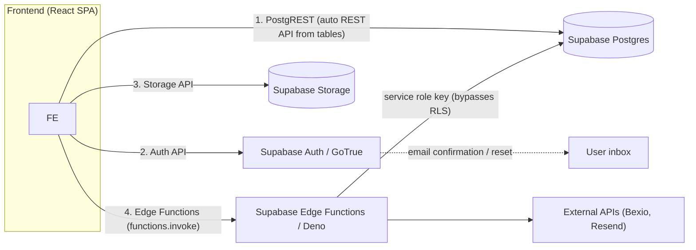

# API Contracts & Integrations — AGC Padel Academy

> Captured 2026-08-07 from: frontend source (`src/`), live Supabase Edge Function source (via MCP), and the DB schema baseline (`specs/baseline-system/supabase-backend.md`).
> Updated 2026-08-07 (PM): all open contract questions resolved by project owner decisions — see §7. Stripe artifacts removed (migration `0004`), atomic invoice numbering added (migration `0005`), `generate-invoice-pdf` v18 and `notify-payment-verification` v2 deployed.
> Updated 2026-08-10: the five unused/legacy Edge Functions (`create-booking`, `handle-stripe-webhook`, `verify-booking-saved`, `generate-booking-receipt`, `assign-booking-time`) and the legacy `receipts` storage bucket were **deleted** by the owner. 8 functions remain.
> Updated 2026-08-10 (PM): **RLS hardening executed** (migration `0006`): `booking_slots` non-PII view created, `bookings` public-read policy replaced by owner/admin SELECT policies, availability grid switched to the view. **Edge Function auth hardened**: `generate-invoice-pdf` v22 and `notify-payment-verification` v6 now run with `verify_jwt: true` (gateway) plus in-function JWT + authorization checks. **Evening fix**: the in-function check must pass the caller JWT **explicitly** (`auth.getUser(token)`) — the implicit global-header variant returns `AuthSessionMissingError` for valid tokens in the pinned `supabase-js@2.39.3` Deno runtime (v21/v5 bug, fixed in v22/v6).
> Updated 2026-08-25 (007 Bexio polish): five in-repo billing functions added (`bexio-oauth`, `billing-issue-invoice`, `billing-invoice-document`, `billing-cancel-invoice`, `bexio-reconcile`). Proof-upload UI and `PaymentVerificationPanel` were removed; paid state comes from Bexio reconciliation. Full HTTP contracts: `specs/features/007-bexio-integration/contracts/edge-functions.md`.
> This document presents the **integration surface** of the application: Edge Function endpoints, direct database (PostgREST) calls, Storage operations, Auth flows, and external services. It is the contract layer referenced by future feature specs.
> Convention: ✅ contract confirmed from source · ⚠️ inferred or unverified, marked with TODO.

---

## 0. Architecture Note — There is No Custom API Server

The application has **no Node.js/Express/REST backend**. All backend interaction happens through three Supabase channels, plus direct calls to third-party APIs from Edge Functions:



- **PostgREST**: every table in `public` is automatically exposed as a REST endpoint (`/rest/v1/<table>`). The frontend uses the JS client (`supabase.from(...)`) which is a wrapper over these. There are **no hand-written REST controllers**.
- **Auth**: `supabase.auth.*` → GoTrue (`/auth/v1/...`).
- **Storage**: `supabase.storage.from(...)` → Storage API (`/storage/v1/...`).
- **Edge Functions**: `supabase.functions.invoke('<slug>')` → Deno serverless functions (`/functions/v1/<slug>`).

> Edge Function gateway auth (`verify_jwt`) — state as of 2026-08-25: **`generate-invoice-pdf`**, **`notify-payment-verification`**, **`billing-issue-invoice`**, **`billing-invoice-document`**, and **`billing-cancel-invoice`** run with `verify_jwt: true` plus in-function JWT + authorization. **`bexio-oauth`** and **`bexio-reconcile`** run with `verify_jwt: false` because the OAuth callback and `pg_cron` scheduler cannot send a user JWT — each enforces admin JWT, signed `state`, or `x-scheduler-secret` inside the function. Remaining pre-007 helpers still use `verify_jwt: false` and their own (or no) auth.

---

## 1. Edge Functions (Custom Server Actions)

13 functions are currently **ACTIVE** (8 pre-007 helpers + 5 Bexio billing functions from feature `007-bexio-integration`). This section is the current authority; the baseline `supabase-backend.md §3` was reconciled on 2026-08-07, 2026-08-10, and 2026-08-25.

### 1.1 Actively used by the frontend

These are invoked from `src/` via `supabase.functions.invoke(...)`.

---

#### `generate-invoice-pdf` (v22) ✅ confirmed from source
**Purpose:** generate an invoice PDF (A4, branded, with logo and an appended Swiss QR payment page), store it in the `invoices` bucket, persist/refresh the `invoices` row, and set `bookings.receipt_url`.
**Invoked from:** `src/lib/bookings.js` (`requestInvoice()`), **only when** `billing_public_config.integration_enabled` is false/absent (legacy path). When Bexio is connected, `requestInvoice()` calls `billing-issue-invoice` instead (007 US2). Callers: `src/pages/LessonsPage.jsx`, `src/pages/PaymentsPage.jsx`.
**Auth (v22, 2026-08-10):** `verify_jwt: true` at the gateway, plus in-function verification: the caller's JWT is validated via `auth.getUser(token)` (**explicit token argument required** — the implicit-header variant fails in this supabase-js runtime), and the caller must **own the booking** (`bookings.user_id = auth user`) or have `profiles.role = 'admin'`. ⚠️ Callers must attach the token explicitly (`headers: { Authorization: 'Bearer <session.access_token>' }`): `functions.invoke` does not reliably refresh its captured Authorization header when sign-in happens after client construction (this caused 401s on 2026-08-10 and is why `src/lib/bookings.js` and `PaymentVerificationPanel.jsx` fetch the session before invoking).

**Request** — `POST /functions/v1/generate-invoice-pdf`, body JSON:
```json
{
  "booking_id":            "uuid (required)",
  "amount":                "number | string e.g. '120' or '120 CHF' (required)",
  "invoice_date":          "string ISO 'YYYY-MM-DD' (optional; defaults to today UTC)",
  "invoice_number":        "string (optional; if omitted, allocated atomically as INV-YYYY/MM/DD-XX)",
  "customer_fullname":     "string (optional)",
  "customer_address":      "string (optional)",
  "customer_postal_city":  "string (optional)",
  "customer_country":      "string (optional)",
  "lesson_name":           "string (optional; default 'Lesson Booking')",
  "qty":                   "number (optional; default 1)",
  "invoice_id":            "uuid (optional; if present, UPDATE existing invoices row instead of INSERT)"
}
```

**Response 200:**
```json
{
  "success": true,
  "url":            "string — public URL of the uploaded PDF in the invoices bucket",
  "invoice_id":     "uuid | null",
  "invoice_number": "string — e.g. 'INV-2026/08/07-01'"
}
```
**Response 400:** `{ "success": false, "error": "Missing required: booking_id, amount" }`
**Response 401:** `{ "success": false, "error": "Missing Authorization header" | "Invalid or expired token" }` (also rejected at the gateway when `verify_jwt` fails)
**Response 403:** `{ "success": false, "error": "Forbidden: booking does not belong to caller" }`
**Response 404:** `{ "success": false, "error": "Booking not found" }`
**Response 500:** `{ "success": false, "error": "<message>" }`

**Side effects:**
- Downloads `assets/logo.png` from the `invoices` bucket (embedded as logo; silently skipped if missing).
- Downloads `QR_<amount>.pdf` from the `qr-codes` bucket and appends it as the payment page. ⚠️ **The QR PDF must exist at exactly `QR_<numeric amount>.pdf`** — e.g. `QR_120.pdf`. If absent, the invoice has no payment QR (logged as a warning, not an error).
- Uploads PDF to `invoices/Pending/YYYY/MM/DD/invoice_INV-YYYY-MM-DD-XX.pdf` (public bucket).
- INSERTs or UPDATEs `invoices` (status `pending`, `pdf_url`, `invoice_number`).
- UPDATEs `bookings.receipt_url = <pdf url>`.

**Invoice numbering (v18, race-safe):** numbers are allocated via the `next_invoice_number(p_date_key)` RPC (migration `0005`), which increments a row in `invoice_counters` inside a single atomic upsert. The counter table was seeded from existing invoice numbers, so sequences continue from the highest number already issued per day. The previous `count+1` approach could produce duplicate numbers under concurrent bookings. ✅ RESOLVED 2026-08-07.

> ⚠️ **Contract quirk:** the PDF is stored under a **`Pending/`** prefix even for confirmed bookings. DECISION (2026-08-07): once the finance team verifies an invoice, it must be moved to `Paid/` (or `Refused/` if rejected). The move logic is a future feature — see §7.

---

#### `submit-contact-form` (v13) ✅ confirmed from source
**Purpose:** persist a contact message and send two emails (notification to the trainer, confirmation to the customer).
**Invoked from:** `src/pages/ContactPage.jsx:34`.

**Request** — body JSON:
```json
{
  "name":    "string",
  "email":   "string",
  "phone":   "string (optional)",
  "subject": "string",
  "message": "string"
}
```

**Response 200:** `{ "success": true }`
**Response 400:** `{ "error": "<message>" }` (DB insert failure or unexpected error)

**Side effects:**
- INSERT into `contact_messages` with `status = 'new'`.
- Email to trainer at `TRAINER_EMAIL` env var (default `agcpadelacademy@gmail.com`).
- Confirmation email to the customer.
- ⚠️ Both emails are sent via a raw `fetch` to Supabase's **GoTrue admin endpoint** `POST /auth/v1/admin/send` using the service role key. This is an internal/undocumented GoTrue API — it depends on SMTP being configured in the Supabase project and may not be a stable public interface. Email failures are logged but **do not fail the request** (the function still returns `{success:true}`).

---

#### `notify-payment-verification` (v6) ✅ confirmed from source — **no frontend caller since 2026-08-24**
**Purpose:** email the customer after an admin approves/rejects their payment proof, and record the outcome in `notifications_log`.
**Invoked from:** none. `PaymentVerificationPanel.jsx` was deleted with the proof-of-payment product path (007 US4 / Decision 2026-08-24). Function remains deployed; do not schedule or re-wire without a new spec.
**Auth (v6, 2026-08-10):** `verify_jwt: true` at the gateway, plus in-function JWT verification (`auth.getUser(token)` with explicit token — same supabase-js@2.39.3 caveat as `generate-invoice-pdf`) and an **admin-only** check (`profiles.role = 'admin'` for the caller). Returns 401 without a valid token, 403 for non-admin callers.

**Request** — body JSON:
```json
{
  "booking_id":  "uuid",
  "user_email":  "string",
  "status":      "'approved' | 'rejected'",
  "admin_notes": "string (optional — shown in the rejection email)"
}
```

**Response 200:** `{ "success": true }`, or `{ "success": true, "message": "No API key, skipped email" }` if no email provider is configured.
**Response 500:** `{ "success": false, "error": "<message>" }` (email provider failure).

**Side effects / external calls:**
- Sends a plain-text email through **SendGrid** (`https://api.sendgrid.com/v3/mail/send`) if `SENDGRID_API_KEY` is set, else **Resend** (`https://api.resend.com/emails`) if `RESEND_API_KEY` is set.
- From address: `no-reply@agcpadelacademy.com`.
- **v2 (2026-08-07):** every outcome is now audited in `notifications_log` — `notification_type='email'`, `recipient_type='client'`, `recipient_email`, `message_subject`, `status='sent'|'failed'` (with `error_message`), `sent_at`. A missing API key is logged as `failed` with an explanatory error message. Insert failures are logged to the console but never fail the request.

---

### 1.1a Bexio billing (in-repo, 007) ✅ confirmed from source

Authoritative request/response shapes: `specs/features/007-bexio-integration/contracts/edge-functions.md`. Frontend wrappers: `src/lib/billing.js`. Shared orchestration: `supabase/functions/_shared/billing/`.

| Function | Gateway JWT | Who may call | Purpose |
|---|---|---|---|
| `bexio-oauth` | off | admin JWT for `start`/`status`/`disconnect`/`initialize`/`configure`; signed `state` for `callback` | OAuth connect, token Vault storage, config discovery |
| `billing-issue-invoice` | on | booking owner or admin | One Bexio contact + issued invoice per booking; emails PDF via Resend; never fails the booking |
| `billing-invoice-document` | on | booking owner or admin | Stream Bexio PDF (`application/pdf` inline); nothing written to Storage |
| `billing-cancel-invoice` | on | booking owner (admin JWT allowed, no admin UI) | Cancel unpaid issued invoice + AGC booking; 409 if paid |
| `bexio-reconcile` | off | `x-scheduler-secret` or admin JWT | Poll issued/partial invoices; confirm paid bookings; retry `billing_operations` |

**Frontend cutover:** `isBexioBillingEnabled()` reads `billing_public_config.integration_enabled` (boolean only). True → `issueBexioInvoice`; false → `generate-invoice-pdf`.

**Student cancel:** `PaymentsPage.jsx` → `cancelBooking()` → `billing-cancel-invoice` when Bexio is on.

**Admin integrations:** `IntegrationsPanel.jsx` → `bexio-oauth` + `runBexioReconciliation()`. No invoice-cancel or refund controls.

---

### 1.2 Active but NOT invoked from the current frontend

These functions exist and are ACTIVE but have **no caller in `src/`**. They are either invoked from somewhere else (another client, cron, dashboard), or are dormant/legacy.

| Function | Version | Request body | Response | Notes |
|---|---|---|---|---|
| `cleanup-pending-bookings` | 15 | *(none)* | `{ success: true, cleaned_count: n }` | ✅ confirmed. Cancels bookings with `payment_status='pending'` older than 30 min. **DECISION 2026-08-07:** this time-based auto-cancel is **rejected** — on the bank-transfer flow a booking legitimately stays `pending` for days while awaiting payment proof, so scheduling this function would mass-cancel valid bookings. Cancellation must instead be **explicit** (by the customer, admin, or coach) and will be implemented as a dedicated cancel-reservation flow in a future feature spec (with refund/credit logic TBD). **Until then: do NOT schedule this function.** |
| `merge-invoice-qr` | 1 | `{ invoice_pdf: base64, qr_code_pdf_url: string }` | `{ success, mergedBase64 }` | ✅ confirmed. Loads a base64 invoice PDF and appends pages from a QR PDF. Superseded in practice: `generate-invoice-pdf` merges the QR inline. |
| `upload-invoice-to-storage` | 2 | `{ invoice_id, pdf_url }` | `{ success, invoice }` | ✅ confirmed. Verifies a PDF exists in the `invoices` bucket and sets the invoices row status to **`'completed'`** — a value outside the CHECK constraint (`pending`, `paid`, `cancelled`). **DECISION 2026-08-07 (annotated, no code change yet):** this function should become the single invoice status-transition helper — used on initial upload, on finance verification (status must become `'paid'`, not `'completed'`), and on cancellation — driven by a flag. To be implemented in a future feature spec together with the `Pending/`→`Paid/`/`Refused/` storage move. |
| `verify-invoice-generation` | 1 | `{ filename, expected_data? }` | `{ success, unexpected_placeholders[], data_found }` | ✅ confirmed. Downloads a PDF from the `invoices` bucket and scans raw bytes for unresolved `{{placeholder}}` tokens. QA/debug utility. |
| `upload-logo-once` | 1 | `{ base64: string }` | `{ success, url }` | ✅ confirmed. One-off setup helper: uploads `assets/logo.png` to the `invoices` bucket. Not part of any runtime flow. |

> Deleted 2026-08-10 (verified unused or superseded): `verify-booking-saved` (validated the dropped Stripe column), `generate-booking-receipt` and `assign-booking-time` (no callers, no log invocations, broken source bundles).

---

### 1.3 Stripe — fully decommissioned

Stripe was removed (decision 2026-08-07: "remove anything that has correlation with Stripe"). Done: `bookings.stripe_session_id` column and the two Stripe-named RLS policies on `profiles` dropped (migration `0004`); `TermsPage.jsx` legal copy updated; the `create-booking` and `handle-stripe-webhook` Edge Functions deleted 2026-08-10; Stripe secrets removed from Edge Function secrets (confirmed 2026-08-10). Only remaining manual step: delete the stale webhook endpoint in the Stripe dashboard — harmless while it exists, since the target function is gone.

---

## 2. Database API (PostgREST)

All tables are auto-exposed at `/rest/v1/<table>`. The frontend calls these via `supabase.from('<table>')`. RLS governs access (live policy state verified 2026-08-07 — see §7 RLS hardening). This section documents **how the frontend actually uses each endpoint**, including filters and payload shapes.

### 2.1 `profiles`

Profile read/write goes through `src/lib/profileService.js` (single owner of query shapes since 2026-08-10):

| Operation | Caller | Filter / payload | Response shape |
|---|---|---|---|
| SELECT | `Header.jsx:26` | `.select('full_name').eq('id', user.id).single()` | `{ full_name }` |
| SELECT | `SupabaseAuthContext.jsx:43` | `.select('role').eq('id', userId).maybeSingle()` | `{ role } \| null` |
| SELECT (full) | `profileService.fetchProfile` (used by `ProfileCompletionModal`, `LessonsPage`) | `.select('*').eq('id', userId).single()` | full profile row or `null` (PGRST116) |
| SELECT or INSERT | `profileService.getOrCreateProfile` (used by `useProfile` → `ProfileManagementPage`) | fetch, then insert `{ id, full_name, email }` if missing | profile row |
| UPSERT | `SupabaseAuthContext.jsx:19` | `{ id, email, full_name, phone, updated_at }` | upserted row |
| UPDATE | `profileService.updateProfile` (used by `ProfileManagementPage`, `ProfileCompletionModal`) | `{ full_name, phone, address, postal_code, city, country, updated_at }` | updated row |

### 2.2 `lessons`

| Operation | Caller | Filter / payload |
|---|---|---|
| SELECT | `LessonsPage.jsx:99` | `.select('*').eq('is_active', true).order('price_amount', ascending)` → all active lessons |

> Live policy verified 2026-08-07: `lessons_public_read` (SELECT, `true`) exists — public catalogue read is intentional. The baseline's "no policies" finding was stale.

### 2.3 `bookings` + `booking_slots` (view)

| Operation | Caller | Filter / payload |
|---|---|---|
| SELECT (availability, via view) | `src/lib/bookings.js` `fetchDayBookings` (called by `LessonsPage.jsx`) | `.from('booking_slots').select('booking_date, start_time, end_time, payment_status').eq('booking_date', <date>).in('payment_status', ['confirmed','pending'])` |
| SELECT (own) | `PaymentsPage.jsx` | `.select('*, billing_documents(status, document_nr)').eq('user_id', user.id).order('created_at', desc)` (falls back to `.select('*')` if the embed is unavailable) |
| INSERT | `src/lib/bookings.js` `createBooking` (called by `LessonsPage.jsx`) | booking object — see shape below |

**`booking_slots` view (migration `0006`, 2026-08-10):** exposes only `booking_date, start_time, end_time, payment_status` — no `client_email`/`client_phone`/`notes`/`user_id`. Granted to `anon` + `authenticated`; runs with view-owner rights (deliberately bypasses `bookings` RLS for this non-PII projection). It is the public availability surface.

**Booking INSERT payload (LessonsPage):**
```json
{
  "user_id":          "uuid",
  "lesson_code":      "string (FK → lessons.lesson_code, e.g. 'sub_afternoon')",
  "lesson_name":      "string",
  "price":            "string e.g. '120 CHF' (⚠️ stored as text)",
  "booking_date":     "date 'YYYY-MM-DD' | null",
  "start_time":       "time 'HH:mm' | null",
  "end_time":         "time 'HH:mm' | null",
  "duration_minutes": "number",
  "status":           "'pending_payment'",
  "payment_status":   "'pending'",
  "client_email":     "string",
  "client_phone":     "string",
  "notes":            "string"
}
```

> ✅ RESOLVED 2026-08-10 (migration `0006`): the public-read `bookings` SELECT policy was dropped and replaced by `Users can view own bookings` (`auth.uid() = user_id`) and `Admins can view all bookings` (`is_admin()`). Public availability now flows through the non-PII `booking_slots` view, so the grid keeps working for anonymous visitors without exposing PII.

### 2.4 `payment_proofs` — unused by the product UI (Decision 2026-08-24)

Table and `payment-proofs` bucket remain. There is **no** `supabase.from('payment_proofs')` caller in `src/` after 007 US4. Paid confirmation is Bexio reconciliation only.

### 2.5 `invoices`

No direct frontend calls — legacy invoices are written by `generate-invoice-pdf` (service role) and read via `bookings.receipt_url`. Post-cutover invoices live in `billing_documents` + Bexio PDF via `billing-invoice-document`. RLS on `invoices` is enabled with **zero policies** — client-side reads are blocked (only service role).
> DECISION 2026-08-25: 007 does **not** add an admin invoice ledger (US6 deferred). Students see status on My Payments; receivables stay in Bexio.

### 2.6 `contact_messages`

Write-only from the frontend's perspective — inserts happen inside `submit-contact-form` (service role). No direct frontend reads.

### 2.7 Not accessed by the frontend

`availability`, `credits`, `memberships`, `notifications_log`, `invoice_counters`, `billing_integrations`, `billing_contacts`, `billing_operations`, `billing_events` — no `supabase.from()` calls in `src/` (billing writes are service-role inside Edge Functions; admin/student reads of documents go through functions or the `billing_documents` embed on bookings).

### 2.8 `billing_public_config` (view) + `billing_documents`

| Operation | Caller | Filter / payload |
|---|---|---|
| SELECT | `src/lib/billing.js` `isBexioBillingEnabled` | `.from('billing_public_config').select('integration_enabled').maybeSingle()` — boolean only |
| SELECT (embed) | `PaymentsPage.jsx` | `bookings` select includes `billing_documents(status, document_nr)` for owner rows |

> **Semantics clarified 2026-08-07:** `bookings` pairs a lesson with a client (a reservation). `memberships` is where the *actual* session bookings will live in the future, drawing down `credits` (tokens) acquired with the same membership. See `domain-model.md` for the membership/credit model. Membership billing is **out of 007**.

---

## 3. Storage API

**Bucket structure decision (2026-08-07): keep `invoices` and `payment-proofs` as separate buckets.** Bucket publicity is bucket-level and cannot differ per folder: `payment-proofs` must stay **private** (bank receipts are sensitive; access via 24h signed URLs), while `invoices` must stay **public** (customers download invoice PDFs via public URLs stored in `bookings.receipt_url`). Merging them would either expose proofs publicly or break invoice downloads. Instead, the `invoices` bucket gains a **status lifecycle by prefix**: `Pending/` (current), `Paid/` and `Refused/` — files are moved when the finance team verifies/rejects (future feature, together with the `upload-invoice-to-storage` rework in §1.2). Putting invoice and proof in the same per-user folder was considered and rejected — it would multiply folders and still not solve the privacy split.

| Bucket | Public | Operation | Caller | Details |
|---|---|---|---|---|
| `payment-proofs` | No | *(none in `src/`)* | — | Bucket retained; upload/preview UI removed 2026-08-24. Historical objects may remain. |
| `invoices` | Yes | *(service role)* upload/download | Edge Functions only (legacy `generate-invoice-pdf`) | `Pending/YYYY/MM/DD/invoice_*.pdf`, `assets/logo.png`. Bexio PDFs are **not** stored here. |
| `qr-codes` | Yes | *(service role)* download | `generate-invoice-pdf` | `QR_<amount>.pdf` — unused on the Bexio path (QR is on the Bexio PDF). |
| ~~`receipts`~~ | — | — | — | **Deleted 2026-08-10** (legacy Stripe-era invoice PDFs; verified unreferenced before deletion). |

> TODO: no file-size or MIME-type limits are configured on any bucket — uploads accept anything (any file type/size the browser provides). Add limits in the payment-proof upload feature spec.

---

## 4. Auth API (GoTrue via `supabase.auth`)

All auth calls live in `src/contexts/SupabaseAuthContext.jsx`:

| Method | Purpose | Key parameters |
|---|---|---|
| `auth.signUp` | Register | `{ email, password, options: { data: { full_name, phone }, emailRedirectTo: 'https://agcpadelacademy.com' } }` |
| `auth.signInWithPassword` | Login | `{ email, password }` |
| `auth.signOut` | Logout | — |
| `auth.resend` | Resend confirmation | `{ type: 'signup', email }` ⚠️ exact options shape per source |
| `auth.resetPasswordForEmail` | Start reset | `(email, { redirectTo })` ⚠️ redirect URL per source |
| `auth.updateUser` | Set new password | `{ password }` — used from `ResetPasswordPage.jsx` with the recovery session |
| `auth.signInWithOAuth` | OAuth login | provider config present; **Google button disabled** until provider setup |
| `auth.getSession` / `auth.onAuthStateChange` | Session lifecycle | on every auth event, the app upserts `profiles` and fetches `role` |

> TODO: `emailRedirectTo` for sign-up and the `redirectTo` for password reset — confirm both are whitelisted in the Supabase Auth dashboard's redirect URL allowlist.

---

## 5. RPC Functions (Postgres)

Custom functions in the `public` schema (callable via `/rest/v1/rpc/<name>` when granted):

| Function | Type | Called by | Contract |
|---|---|---|---|
| `next_invoice_number(p_date_key text) → integer` | FUNCTION (SECURITY DEFINER) | `generate-invoice-pdf` v18 | **Added 2026-08-07 (migration `0005`).** Atomically increments and returns the per-day sequence from `invoice_counters` (single-statement upsert = row lock; concurrent calls cannot collide). EXECUTE revoked from `PUBLIC`/`anon`/`authenticated`; granted to `service_role` only. `invoice_counters` has RLS enabled with no policies (service-role-only table). |
| `is_admin()` | FUNCTION → boolean | RLS policies (`payment_proofs`, `bookings`, `billing_*`) | Returns whether the current JWT user has `profiles.role = 'admin'`. Not called from the frontend directly. |
| `billing_get_secret` / `billing_put_secret` / `billing_delete_secret` | FUNCTION (SECURITY DEFINER) | Edge Functions via service role | Vault name/value helpers (007 migration `0003`). EXECUTE revoked from `PUBLIC`/`anon`/`authenticated`. |
| `handle_new_user()` | trigger function | DB trigger on `auth.users` | Creates the `profiles` row on signup. Not an API surface. |
| `rls_auto_enable` | event trigger | internal | Infrastructure helper. Not an API surface. |

---

## 6. External Services

| Service | Where used | How | Config / Status |
|---|---|---|---|
| ~~**Stripe**~~ | — | — | **REMOVED 2026-08-07.** DB artifacts dropped (migration `0004`), TermsPage copy updated. Pending manual cleanup: `create-booking` + `handle-stripe-webhook` functions, Stripe secrets, Stripe dashboard webhook endpoint (see §1.3). |
| **SendGrid** | `notify-payment-verification` | `POST https://api.sendgrid.com/v3/mail/send` | `SENDGRID_API_KEY` — unused by the 007 product path |
| **Resend** | `billing-issue-invoice` (Bexio PDF email); also fallback in `notify-payment-verification` | `POST https://api.resend.com/emails` | `RESEND_API_KEY`; from `no-reply@agcpadelacademy.com` |
| **Bexio** | `_shared/billing/bexio/*` via the five billing functions | OAuth at `auth.bexio.com`; REST at `api.bexio.com` | Client id/secret in Edge Function env; refresh/access tokens in Vault only |
| **Supabase GoTrue admin mailer** | `submit-contact-form` | `POST /auth/v1/admin/send` with service role key | Internal endpoint; relies on project SMTP config. Undocumented/unstable interface. |
| **DeepL** | none yet | planned runtime i18n | Planned (see `architecture.md §7`). Not implemented. |

---

## 7. Decisions & Resolved Questions (2026-08-07)

All TODOs from the initial capture have been resolved by the project owner:

| # | Question | Resolution |
|---|---|---|
| 1 | What triggers `cleanup-pending-bookings`? | Nothing — no scheduler exists, and none should be added. Time-based auto-cancellation is **rejected**: on the bank-transfer flow, bookings legitimately stay `pending` for days. Cancellation will be **explicit** (customer, admin, or coach) → status `cancelled` + refund/credit logic, defined in a future feature spec. Also clarified: `bookings` pairs lesson↔client; `memberships` will hold actual session bookings drawing down membership `credits`. |
| 2 | Invoice-number race (`count+1`) | **FIXED.** `invoice_counters` table + `next_invoice_number()` RPC (migration `0005`), used by `generate-invoice-pdf` v18. Counter seeded from existing invoices. |
| 3 | Merge `invoices` + `payment-proofs` buckets? | **No — keep separate** (publicity is bucket-level; proofs must stay private, invoices public). `invoices` gains `Paid/` + `Refused/` prefixes next to `Pending/`; files move on finance verification (future feature). `receipts` bucket deletion ordered — pending manual dashboard deletion (SQL blocked by `storage.protect_delete()`). |
| 4 | `upload-invoice-to-storage` writes `'completed'` | Annotated for future rework: it becomes the single invoice status-transition helper (initial upload / verify → `'paid'` / cancel), flag-driven. The `'completed'` value is wrong (outside the CHECK) and must become `'paid'` when implemented. No code change now. |
| 5 | Log to `notifications_log`? Is the table useful? | **Yes, useful** — audit trail for payment disputes and finance reconciliation (who was notified, when, delivery status). **Implemented** in `notify-payment-verification` v2 (respects the CHECK constraints: `email`/`sms`, `client`/`admin`, `sent`/`failed`/`pending`). Keep the table. |
| 6 | Stripe decommission | **Complete.** DB artifacts removed (migration `0004`), `TermsPage.jsx` copy updated, `create-booking` + `handle-stripe-webhook` deleted 2026-08-10, secrets confirmed removed 2026-08-10. Remaining manual step: delete the webhook endpoint in the Stripe dashboard (harmless — target function is gone). |
| 7 | RLS: none applied now; what breaks when adding policies? | **Correction:** RLS is already **enabled on every table** and a live policy set exists (verified 2026-08-07 — see below). The question is therefore about **hardening** existing permissive policies, and the production impact of doing so. See analysis below. |
| 8 | `verify-booking-saved` | **Deleted 2026-08-10** (it validated the dropped Stripe field). |
| 9 | Proof upload path pattern | Resolved during capture: `<booking_id>/<booking_id>_<unix_ms>.<ext>`; **superseded 2026-08-12** by semantic attempt numbering `<booking_id>/attempt-<n>.<ext>` (§3). |
| 10 | Admin UI reading `invoices`? | Decision: a **unified admin finance view** (invoices + payment proofs together) will be spec'd after the brownfield definition is complete. |

### 7.1 RLS — live state and production-impact analysis (answer to #7)

RLS is **already enabled on all 10 business tables** plus `invoice_counters`. Live policies (verified via `pg_policies`, 2026-08-10 after migration `0006`):

| Table | Policies (live) |
|---|---|
| `profiles` | Public SELECT (`true`) ⚠️ · INSERT own · SELECT own-or-admin (`role` read) · UPDATE own |
| `bookings` | ~~Public SELECT (`true`)~~ **REPLACED 2026-08-10** → SELECT own (`auth.uid() = user_id`) · SELECT admins (`is_admin()`) · INSERT own · UPDATE own · UPDATE admins |
| `booking_slots` (view) | SELECT granted to `anon` + `authenticated` — non-PII availability projection (`booking_date`, `start_time`, `end_time`, `payment_status`) |
| `lessons` | Public SELECT (`true`) — intentional, catalogue is public |
| `availability` | Public SELECT (`true`) |
| `payment_proofs` | INSERT authenticated · SELECT own (via booking) or admin · UPDATE admins |
| `credits` | SELECT own |
| `memberships` | SELECT own |
| `contact_messages` | service_role ALL |
| `notifications_log` | service_role ALL |
| `invoices` | **none** — client reads blocked (writes are service-role only) |
| `invoice_counters` | **none** — service-role only (intended) |

**What would break in production if policies are tightened naively:**

- ~~**`bookings` public SELECT → own-only:**~~ **DONE 2026-08-10 (migration `0006`)** exactly per the safe path described here: the `booking_slots` non-PII view was created, the availability query (`src/lib/bookings.js` → `fetchDayBookings`) switched to it, and the table policy was tightened to own-or-admin. Verified: anonymous visitors still see the grid; owners see their bookings in `/payments`; the admin panel join keeps working.
- **`profiles` public SELECT → own/admin:** `PaymentVerificationPanel` joins `profiles(full_name, email)` through `payment_proofs → bookings` — this runs under the *admin's* JWT, so an admin-readable policy keeps it working. But any public read of profiles elsewhere would break. Also note the join path exposes customer PII to the admin panel only — acceptable.
- **Adding an `invoices` SELECT policy** (users read own via booking): no breakage — currently nothing client-side reads it. Additive only.
- **Edge Functions are unaffected** by any RLS change — they use the service role, which bypasses RLS. The contact form, invoice generation, and notification flows keep working throughout.

**Safe rollout sequence:** ~~(1) author policies mirroring intended access, (2) create the `booking_slots` view and switch the availability query, (3) tighten `bookings` SELECT~~ — **executed 2026-08-10 (migration `0006`)**. Remaining: (4) tighten `profiles` public SELECT, (5) add `invoices` own-read policy, (6) test each role (anonymous, student, coach, accounting, admin) against every page. To be spec'd as a dedicated security feature.

### 7.2 Remaining manual checks (outside MCP/API reach)

1. ~~Delete Edge Functions `create-booking`, `handle-stripe-webhook`, `verify-booking-saved`, `generate-booking-receipt`, `assign-booking-time`~~ — **done 2026-08-10**.
2. ~~Delete the `receipts` storage bucket~~ — **done 2026-08-10**.
3. ~~Confirm/remove Stripe secrets from Edge Function secrets~~ — **done 2026-08-10**. Remaining: delete the webhook endpoint in the [Stripe dashboard](https://dashboard.stripe.com/webhooks) (Developers → Webhooks → endpoint pointing to `https://jokjxpogvwxbwdaroqkc.supabase.co/functions/v1/handle-stripe-webhook` → **Delete endpoint**; check both Live and Test mode). Harmless while it exists — the target function is gone, so deliveries just fail.

---

## 8. Baseline Reconciliation

`specs/baseline-system/supabase-backend.md §3` previously listed 14 Edge Functions including `create-booking-with-invoice` and `generate-invoice-pdf-v2`, neither of which exists in the live project. After 2026-08-10 cleanup, 8 pre-007 helpers remained. **2026-08-25:** five Bexio billing functions were added in-repo (see §1.1a). The live set is those 8 plus the 5 billing functions. The baseline was also reconciled for `booking_slots`, `bookings` RLS, and `generate-invoice-pdf` / `notify-payment-verification` JWT hardening.
