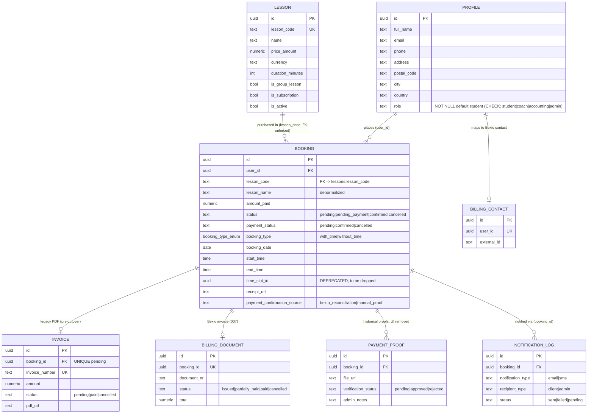
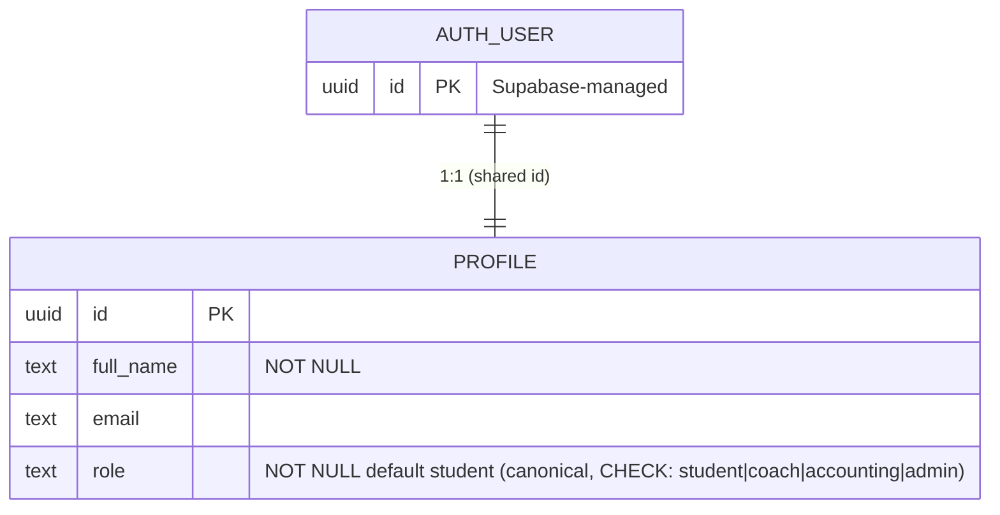
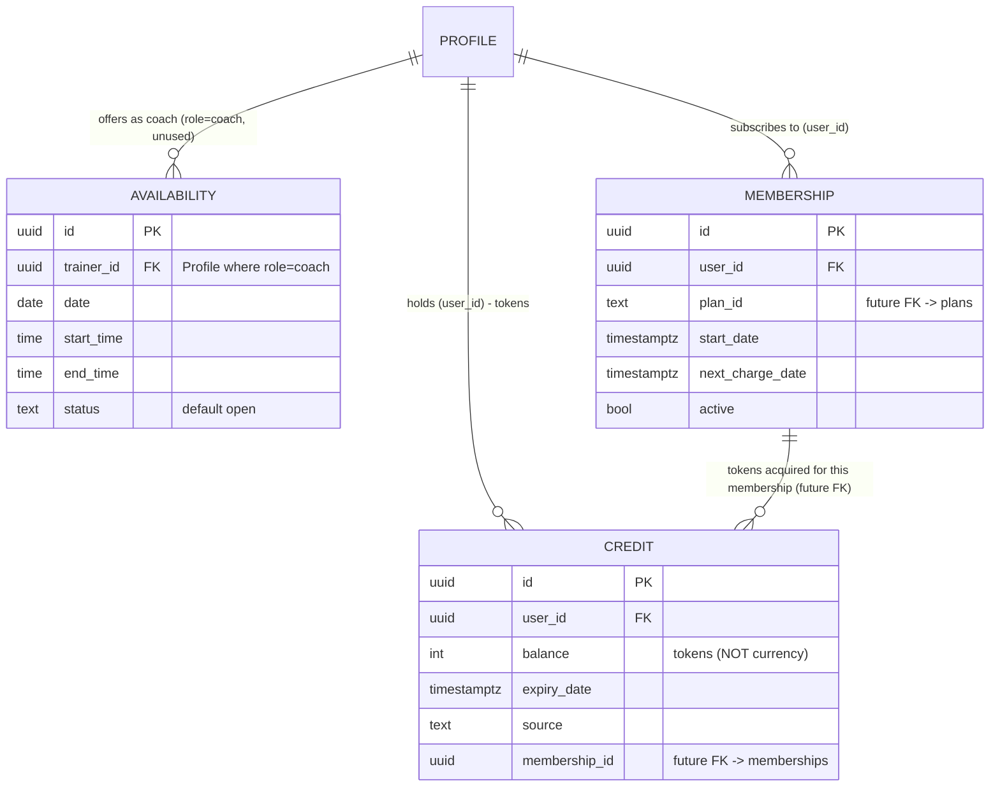
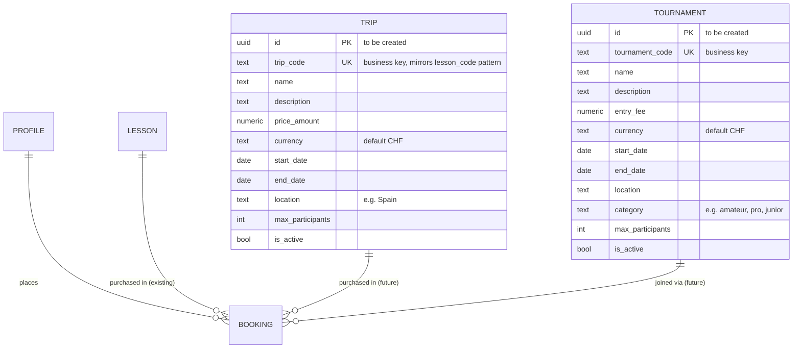
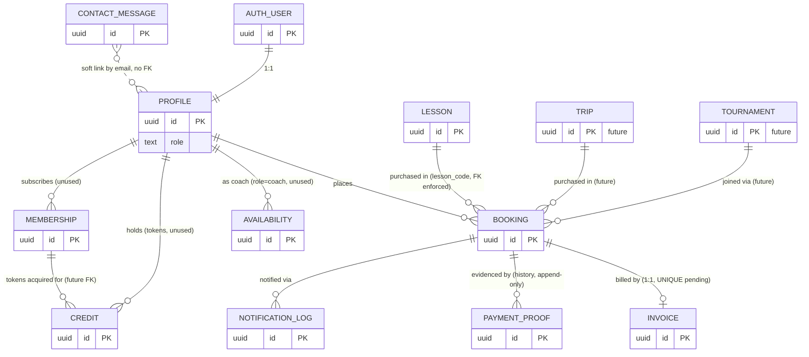

# Domain Model — AGC Padel Academy

> Derived from the technical baseline in `specs/baseline-system/supabase-backend.md` (snapshot 2026-06-28, Supabase MCP), **refreshed 2026-08-06** via Supabase MCP for the `profiles.role` column, the `LessonsPage.jsx` catalogue finding, the `users` table deletion, NOT NULL constraint tightening (migration `0002`), and the `bookings.lesson_code` FK migration (migration `0003`). **Refreshed 2026-08-19:** invariant 3 matches live `next_invoice_number`; invariant 2 splits live booking confirmation from intended invoice `paid`.
> **Refreshed 2026-08-25 (007):** five `billing_*` entities and additive `bookings` payment-confirmation columns. Proof-of-payment is unused by the product UI; Bexio is the financial document of record for new lesson bookings.
> This document presents the **business/domain view** of the data model: entities, attributes, relationships, and cardinalities. For technical details (RLS policies, row counts, indexes, security findings) refer to the baseline document — **nothing was moved out of it**; the two documents are complementary by design.
> Convention: ✅ confirmed from schema/code · ⚠️ inferred, marked with TODO.

---

## 1. Domain Entities Overview

| Entity | Table | Status in domain | One-line definition |
|---|---|---|---|
| **User** (auth identity) | `auth.users` (Supabase-managed) | Active | Login identity (email + password). Technical concern, not business-managed. |
| **Profile** | `public.profiles` | Active — 45 rows | The customer/student: contact details, address, and **role** (`student` / `coach` / `accounting` / `admin`). 1:1 with User. |
| ~~**Legacy User**~~ | ~~`public.users`~~ | **Deleted** | Dropped 2026-08-06 — superseded by `profiles`. |
| **Lesson** | `public.lessons` | Active — 14 rows | A bookable product in the lesson catalogue (private/group/kids, one-off or subscription). |
| **Booking** | `public.bookings` | Active — 31 rows | **Pairs a lesson with a client** — a reservation, and the central transactional entity. |
| **Invoice** | `public.invoices` | Active for **legacy** bookings — 31 rows | Historical AGC-generated PDF (Storage). New bookings after Bexio cutover use `billing_documents` instead. |
| **Billing integration** | `public.billing_integrations` | Active (007) | Singleton Bexio connection row (status, Vault secret **names**, discovered config). |
| **Billing contact** | `public.billing_contacts` | Active (007) | AGC user ↔ Bexio accounting contact mapping. |
| **Billing document** | `public.billing_documents` | Active (007) | Bexio invoice reference for one lesson booking (`issued` / `partially_paid` / `paid` / `cancelled`). |
| **Billing operation** | `public.billing_operations` | Active (007) | Idempotency + retry queue (`contact_sync`, `invoice_issue`, `invoice_cancel`, `reconcile_check`). |
| **Billing event** | `public.billing_events` | Active (007) | Append-only sanitized audit log. |
| **Payment Proof** | `public.payment_proofs` | Table retained — **unused by product UI** (Decision 2026-08-24) | Historical bank-transfer receipts. New paid signal is Bexio reconciliation. |
| **Notification** | `public.notifications_log` | Active — 0 rows | Audit log of emails/SMS sent about a booking (populated by `notify-payment-verification` v2). |
| **Trainer Availability** | `public.availability` | Defined, **unused** — 0 rows | A date/time window in which a trainer (a Profile with role `coach`) can teach. |
| **Credit** | `public.credits` | Defined, **unused** — 0 rows · **retained for future use** | Prepaid token balance a customer can spend on sessions of the **same membership** the tokens were acquired with. |
| **Membership** | `public.memberships` | Defined, **unused** — 0 rows · **retained for future use** | A subscription plan tying a customer to recurring billing. **Future: holds the actual session bookings, drawing down the membership's credits.** Will need a `plans` reference. |
| **Trip** | *(not yet created)* | **To be created** | A padel-trip product (flights, hotel, transfers, training in Spain). Dedicated table. |
| **Tournament** | *(not yet created)* | **To be created** | A tournament in the AGC circuit. Dedicated table. |
| **Contact Message** | `public.contact_messages` | Active — 12 rows | A message sent via the public contact form. Links to Profile by email when matched. |
| ~~**Archived Booking**~~ | ~~`public.bookings_old`~~ | **Dropped** | No longer present in the live schema as of 2026-08-07. |

> **Domain note:** `TripsPage` and `TournamentsPage` are two of the three business lines, yet **no tables exist for trips or tournaments**. `bookings.product_name` and `bookings.lesson_code` suggest they may be shoehorned into the booking flow.
> TODO: Confirm how trips/tournaments are (or will be) modeled — dedicated tables, or generic "products" replacing `lessons`.

---

## 2. Entity Details (Attributes)

### 2.1 Profile — the customer

| Attribute | Type | Required | Domain meaning |
|---|---|---|---|
| `id` | uuid PK | yes | Mirrors `auth.users.id` |
| `full_name` | text | **yes** (NOT NULL) | Customer's name |
| `email` | text | ⚠️ nullable | Contact email (27 profiles still null — incomplete profiles) |
| `phone` | text | ⚠️ nullable | Contact phone (20 profiles still null — incomplete profiles) |
| `address`, `postal_code`, `city`, `country` | text | ⚠️ nullable | Billing address (26 profiles still null — incomplete profiles) |
| `first_name`, `last_name` | text | ⚠️ nullable | Split name for Bexio person contacts (`name_2` / `name_1`) — 007 |
| `country_code` | text | ⚠️ nullable | ISO 3166-1 alpha-2 for Bexio `country_id` — 007 |
| `role` | text | **yes** (NOT NULL, CHECK constraint) | Authorization role. Allowed values: `student`, `coach`, `accounting`, `admin`. Current distribution: `student` (43), `admin` (1). The `coach` role maps to the "trainer" concept referenced by `availability.trainer_id`. |
| `updated_at` | timestamptz | **yes** (NOT NULL) | Last profile update |

> **Role source of truth:** `profiles.role` is the canonical role field (CHECK constraint: `student`, `coach`, `accounting`, `admin`; default `student`). The legacy `users` table has been **deleted** (2026-08-06). `profiles` is linked 1:1 to Supabase Auth via `auth.users.id`. The admin panel's commented-out email guard (`ProtectedRoute.jsx`) must be replaced with a check against `profiles.role = 'admin'` — this is the critical security gap tracked in `architecture.md §5`. Note: the `availability.trainer_id` column name uses "trainer", but the corresponding role value is `coach`.
>
> **Profile completion:** `email`, `phone`, and address fields remain nullable because 20–27 existing profiles are incomplete (users who never finished profile completion). The domain invariant "profile must be complete before booking" is enforced only in the UI layer (`ProfileCompletionModal` + `src/lib/profileValidation.js`), not in the DB.
>
> TODO: Business rules should define which fields are **mandatory before booking** (the frontend enforces this via `ProfileCompletionModal` + `src/lib/profileValidation.js`, but the DB allows nulls everywhere except `id` and `role` — domain invariants live only in the UI layer today).

### 2.2 Lesson — the product

| Attribute | Type | Required | Domain meaning |
|---|---|---|---|
| `id` | uuid PK | yes | Internal identifier |
| `lesson_code` | text UNIQUE | **yes** (NOT NULL) | Business key — **this is what bookings should reference** |
| `name` | text | **yes** (NOT NULL) | Display info |
| `description` | text | ⚠️ nullable | Display info |
| `price_amount` + `currency` | numeric + text | **yes** (NOT NULL) | Price (default `CHF`) |
| `duration_minutes` | integer | **yes** (NOT NULL) | Session length |
| `sessions_per_week` | integer | **yes** (NOT NULL, default 1) | For recurring packages |
| `is_group_lesson`, `is_subscription`, `is_active` | boolean | **yes** (NOT NULL) | Product classification |
| `created_at` / `updated_at` | timestamptz | **yes** (NOT NULL) | Audit timestamps |

> **Referential integrity:** A foreign key from `bookings.lesson_code` → `lessons.lesson_code` is **enforced** (migration `0003_bookings_lesson_code_fk`, 2026-08-06). The column was renamed from `lesson_id` to `lesson_code` and all existing rows were normalized from UUIDs to `lesson_code` values. `lesson_code` is nullable (for future edge cases) but the application layer always sets it for new bookings (`LessonsPage.jsx` stores `selectedLesson.lesson_code`).

### 2.3 Booking — the transaction

Grouped by concern (full column list in baseline §2 `bookings`):

- **Parties:** `user_id` (FK → Profile, NOT NULL), `client_email`, `client_phone`, `email` ⚠️ (all nullable — optional override of profile data)
- **Product (denormalized snapshot):** `lesson_code` (nullable, FK → `lessons.lesson_code` — enforced), `lesson_name` (NOT NULL), `price` (⚠️ text, NOT NULL), `product_name` (nullable)
- **Scheduling:** `booking_date` (nullable — without_time bookings), `start_time`/`end_time` (nullable — without_time bookings), `time_slot` (⚠️ nullable, redundant text), `requires_scheduling` (NOT NULL, default false), `booking_type` (NOT NULL, default `with_time`), `duration_minutes` (NOT NULL), `group_size` (NOT NULL, default 1)
- **Lifecycle:** `status` (NOT NULL, default `pending_payment`), `payment_status` (NOT NULL, default `pending`), `verification_status` (NOT NULL, default `pending`) — three overlapping state fields ⚠️
- **Money:** `amount_paid` (numeric, nullable — set when paid), `payment_date` (nullable — set when paid)
- **Confirmation attribution (007):** `payment_confirmation_source` (`bexio_reconciliation` \| `manual_proof`), `payment_confirmed_at`
- **Documents:** `receipt_url` (nullable — legacy Storage PDF); Bexio PDFs are streamed, not stored
- **Compliance/audit:** `terms_version` (nullable), `ip_address` (nullable), `notes` (nullable)
- **Audit:** `created_at` / `updated_at` (NOT NULL)

> **TODO — drop orphaned column:** `time_slot_id` (uuid) has no target table and is no longer used. Drop it: `ALTER TABLE bookings DROP COLUMN time_slot_id;` — confirm no Edge Function or frontend code reads it first.

### 2.4 Invoice (legacy AGC PDF)

`id` · `booking_id` (FK) · `invoice_number` (UNIQUE — business key) · `amount` + `currency` · `status` (`pending` | `paid` | `cancelled`) · `pdf_url` (Storage) · `paid_at`

> **Post-cutover:** new lesson bookings persist the Bexio invoice on `billing_documents` (see §2.11). Pre-integration bookings keep this table unchanged (no backfill).

### 2.5 Payment Proof — unused by product UI

`id` · `booking_id` (FK) · `file_url` (Storage, private bucket) · `verification_status` (`pending` → `approved` | `rejected`) · `admin_notes`

> **Decision 2026-08-24:** students do not upload proofs; admins do not approve them. Rows and the bucket MAY remain. Paid = Bexio-recorded payment synchronized by `bexio-reconcile`.

### 2.6 Notification (log entry)

`id` · `booking_id` (FK) · `notification_type` (`email` | `sms`) · `recipient_type` (`client` | `admin`) · `recipient_email` / `recipient_phone` · `message_subject` · `status` (`sent` | `failed` | `pending`) · `error_message`

### 2.7 Trainer Availability (unused)

`id` · `trainer_id` (FK → Profile where `role = 'coach'`) · `date` · `start_time` / `end_time` · `status` (default `open`)

> The `coach` role value is allowed by the CHECK constraint but no rows currently use it — to be populated when the trainer/availability feature is spec'd. The column is named `trainer_id` but maps to the `coach` role.

### 2.8 Credit (unused — retained for future use)

`id` · `user_id` (FK → Profile) · `balance` (integer — **tokens, not currency**) · `expiry_date` · `source`

> **Domain rule:** credits are tokens (integer units), not currency. A token is exchangeable for a session of the **same membership** the token was acquired with. This implies a future `credits.membership_id` FK linking tokens to the membership they belong to.
>
> **TODO — when the credit feature is spec'd:** add `membership_id` FK to `credits`; define token earn/redemption rules.

### 2.9 Membership (unused — retained for future use)

`id` · `user_id` (FK → Profile) · `plan_id` (text — references nothing yet) · `start_date` / `next_charge_date` · `active`

> **Domain rule (clarified 2026-08-07):** `bookings` pairs a lesson with a client (a reservation). In the future model, **memberships hold the actual session bookings** — sessions are consumed by spending the **credits (tokens) acquired with that same membership**. Cancellation of a reservation is always an **explicit action** (customer, admin, or coach), never a time-based auto-cleanup; the refund/credit-return logic on cancellation is to be defined in the cancellation feature spec.
>
> **TODO — when the membership feature is spec'd:** create a `plans` table first, then add an FK from `memberships.plan_id` → `plans.id` (or `plans.code`). Define how session bookings link to memberships and how credits are drawn down.

### 2.10 Contact Message

`id` · `name`, `email` · `phone` ⚠️ nullable · `subject`, `message` · `status` (default `new`) · `created_at`

> **Soft link to Profile:** when the contact message's email matches a `profiles.email`, the relationship is resolvable at query time. No hard FK (a profile may not exist yet, and emails can change). Contact-message admin views should join to `profiles` on email to surface customer context.

### 2.11 Billing integration (007)

One row per provider (V1: `bexio`). Status: `not_connected` → `connected` → `degraded` / `requires_reauth` / `disconnected`. Holds Vault **names**, granted scopes, and discovered Bexio IDs in `config` JSONB. Never holds token values.

### 2.12 Billing contact (007)

One external accounting contact per AGC user (`user_id` UNIQUE). `external_id` is the Bexio contact id (text). Email snapshot detects drift; the next invoice updates the mapped contact rather than creating a second one.

### 2.13 Billing document (007)

Exactly one Bexio invoice per lesson booking (`booking_id` UNIQUE). `api_reference = 'agc:booking:{uuid}'`. Status: `issued` → `partially_paid` → `paid`, or `issued` → `cancelled`. Totals/currency are snapshots from Bexio. Membership invoices are out of 007.

### 2.14 Billing operation (007)

Retryable work item with a deterministic `idempotency_key`. Kinds: `contact_sync`, `invoice_issue`, `invoice_cancel`, `reconcile_check`. Worker (`bexio-reconcile`) picks `pending` rows with `next_retry_at <= now()`.

### 2.15 Billing event (007)

Append-only audit (`event_type`, optional actor, subjects, sanitized `details` JSONB). Not a domain-event bus.

---

## 3. Relationships & Cardinalities

| # | Relationship | Cardinality | Basis | Confidence |
|---|---|---|---|---|
| R1 | User **has** Profile | **1 : 1** | `profiles.id = auth.users.id` (shared PK) | ✅ confirmed |
| R3 | Profile **places** Booking | **1 : 0..N** | `bookings.user_id` FK | ✅ confirmed |
| R4 | Lesson **is purchased in** Booking | **1 : 0..N** | `bookings.lesson_code` → `lessons.lesson_code` (FK enforced, migration `0003`) | ✅ confirmed |
| R5 | Booking **generates** Invoice | **1 : 0..1** (legacy) | `invoices.booking_id` FK for pre-Bexio PDFs | ✅ confirmed |
| R5b | Booking **is billed as** Billing document | **1 : 0..1** | `billing_documents.booking_id` UNIQUE; Bexio invoice of record after cutover | ✅ confirmed (007) |
| R6 | Booking **is evidenced by** Payment Proof | **1 : 0..N** (historical) | `payment_proofs.booking_id` FK; **no product UI** after 2026-08-24 | ✅ confirmed |
| R15 | Profile **maps to** Billing contact | **1 : 0..1** | `billing_contacts.user_id` UNIQUE | ✅ confirmed (007) |
| R16 | Booking **enqueues** Billing operation | **1 : 0..N** | `billing_operations.booking_id` | ✅ confirmed (007) |
| R17 | Billing document **is audited by** Billing event | **1 : 0..N** | `billing_events.billing_document_id` | ✅ confirmed (007) |
| R7 | Booking **triggers** Notification | **1 : 0..N** | `notifications_log.booking_id` FK | ✅ confirmed |
| R8 | Profile (role=`coach`) **offers** Availability | **1 : 0..N** | `availability.trainer_id` FK → `profiles.id` where `role = 'coach'` | ✅ confirmed structurally |
| R9 | Profile **holds** Credit | **1 : 0..N** | `credits.user_id` FK; credits are tokens tied to a membership — future `membership_id` FK anticipated | ✅ confirmed structurally |
| R10 | Profile **subscribes to** Membership | **1 : 0..N** (active intent: **1 : 0..1** active) | `memberships.user_id` FK; `plan_id` to reference a future `plans` table | ⚠️ plans table TBD |
| R11 | Contact Message **links to** Profile | **0..1 : 0..N** | no FK; link by email match when present — soft link, resolved at query time | ⚠️ no FK; soft link only |
| R12 | Booking **references** Time Slot | **deprecated** | `bookings.time_slot_id` is an orphan uuid with no target table; drop the column | ✅ confirmed |
| R13 | Trip **is purchased in** Booking *(future)* | **1 : 0..N** | dedicated `trips` table to be created; bookings will reference it analogously to `lessons` | ⚠️ not yet implemented |
| R14 | Tournament **is joined via** Booking *(future)* | **1 : 0..N** | dedicated `tournaments` table to be created; bookings will reference it | ⚠️ not yet implemented |

---

## 4. Mermaid ER Diagrams

### 4.1 Core transactional domain (active today)

### 4.2 Identity & roles

### 4.3 Future / defined-but-unused capabilities

### 4.4 Future product entities (trips & tournaments — to be created)

> **Note on the trips/tournaments design:** the proposed `trips` and `tournaments` tables mirror the `lessons` shape (UUID PK + unique business code + price + active flag) so that the existing booking flow can be extended with minimal friction. The exact column set is a **proposal** to be confirmed in the dedicated feature spec under `specs/features/`. The booking-side question of whether `bookings.lesson_code` should be generalized to a polymorphic `product_id` + `product_type` is left open for that spec.

### 4.5 Full system view

---

## 5. Domain Invariants (derived business rules)

These rules are implied by the frontend flows and schema constraints. They should be made explicit in feature specs:

1. **A Booking requires a complete Profile** — enforced today only in the UI (`ProfileCompletionModal` + `src/lib/profileValidation.js`), not in the DB.
2. **A Booking in `pending_payment` is unconfirmed** until an admin approves its Payment Proof. **Live:** on approval both `bookings.status` and `payment_status` become `confirmed` (student sees “Paid”). **Intended (`invoice-lifecycle`, Decision 2026-08-19):** on approve set `invoices.status = paid`, `paid_at`, move PDF `Pending/` → `Paid/`; on proof reject leave invoice `pending`.
3. **Invoice numbers must be unique** — allocated atomically by `next_invoice_number` as `INV-YYYY/MM/DD-XX` (migration `0005`; `FEAT-INV-002`). The `invoices.invoice_number` column is UNIQUE. **Intended (`invoice-lifecycle`, Decision 2026-08-19):** add `UNIQUE (booking_id)`; a second generate UPDATEs the existing invoice (or passes `invoice_id`), it MUST NOT INSERT a second row.
4. **An Invoice references a PDF** in the public `invoices` Storage bucket; a Payment Proof references a file in the **private** `payment-proofs` bucket.
5. **A rejected Payment Proof returns the Booking to `pending_payment`** — `payment_status` stays `pending`; re-upload path exists (see `architecture.md §4` state machine).

---

## 7. Relationship to the Baseline Document

- **Nothing was moved** out of `specs/baseline-system/supabase-backend.md` — it remains the authoritative technical snapshot (policies, row counts, indexes, findings).
- This domain model **adds** the business interpretation layer: entity definitions, cardinalities, and invariants.
- When a future feature spec (under `specs/features/`) needs to extend this model — e.g. creating the `trips`/`tournaments` tables, the `plans` table, or the `credits.membership_id` FK — update this file **and** the relevant feature spec together.
