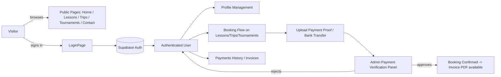

# Project Overview — AGC Padel Academy Web Application

> Scope: high-level overview inferred from repository structure and top-level source files.
> Methodology: Spec-Driven Development (SDD) on a brownfield codebase.
> Sources analyzed: `package.json`, `index.html`, `src/App.jsx`, `src/pages/*`, `src/components/*`, `src/contexts/*`.
> Refreshed 2026-08-12: Hostinger Horizons dev tooling (`plugins/`, generator meta tag, Babel runtime deps) and all Stripe artifacts removed from the project; `sonner`, server-only PDF/QR packages, and dead dependencies also removed. Overview updated to the live state.

---

## 1. Application Purpose

AGC Padel Academy is a **public-facing web application for a padel academy based in Switzerland**. The site acts as both a marketing front-end and a transactional platform that lets visitors discover the academy's offerings and lets registered users book and pay for them.

Based on the landing page copy (`src/pages/HomePage.jsx`) and the route map (`src/App.jsx`), the application supports three core business lines:

1. **Padel lessons** — private, group, and kids classes adapted to different levels.
2. **Tournaments** — the "AGC Tournament" competitive circuit run throughout the year.
3. **Padel trips / camps** — travel packages (flights, hotel, transfers, training) to padel camps, primarily in Spain.

In addition to the marketing surface, the app provides authenticated areas for **profile management, payments, and administrative payment verification**, indicating the platform also serves as an operational tool for the academy staff.

### Business identity & scope
- **Legal entity:** **CAG Padel Academy GmbH** (Swiss GmbH). Source: `src/pages/TermsPage.jsx` (Impressum / Privacy sections).
- **Primary country / market:** **Switzerland**.
- **System of record:** The application is intended to be the **single source of truth for bookings** — no external CRM is in scope.
- **Branding note (inconsistency to track):** the product is branded **"AGC Padel Academy"** in UI copy and the repository name, while the legal entity in the Terms & Conditions is **"CAG Padel Academy GmbH"**. Both spellings currently coexist in the codebase. Treat this as a known discrepancy; it will need a decision (rename one side) during a future spec.

---

## 2. Main Users

Inferred from the routing structure (`src/App.jsx`) and the `ProtectedRoute` / `requireAdmin` guards:

| User type | Description | Evidence |
|---|---|---|
| **Anonymous visitors** | Browse marketing pages, view services, read terms, contact the academy. | Public routes: `/`, `/lessons`, `/trips`, `/tournaments`, `/contact`, `/terms`, `/login` |
| **Authenticated students / customers** | Manage their own profile and pay for lessons / tournaments / trips. | Protected routes: `/profile`, `/payments`; auth via `AuthProvider` (`src/contexts/SupabaseAuthContext.jsx`) |
| **Administrators / academy staff** | Full access; verify customer payments, manage everything. | Admin-only route: `/admin/payment-verification` guarded by `requireAdmin={true}`; `src/components/admin/PaymentVerificationPanel.jsx` |
| **Coaches** (planned) | Authenticated coach role; can see **only their own assigned lessons**. No admin capabilities. | Not yet implemented — to be added as a new feature spec. |
| **Accounting** (planned) | Authenticated accounting role; **same broad read/write access as `admin`** for now (financial oversight). | Not yet implemented — to be added as a new feature spec. |

> **Registration flow:** Sign-up is **self-service** via `/login` (`LoginPage.jsx`). **OAuth sign-in is planned** but the provider strategy is **undecided** — candidates under consideration are (a) a Vercel integration, (b) Supabase Auth's built-in OAuth providers (preferred default, since Supabase already manages auth here), or (c) an external library. Decision to be captured in a dedicated `specs/features/oauth-signin.md` when scoped.
>
> **Open scope question — role permission matrix:** the exact per-role capabilities for `coach` and `accounting` (e.g., can accounting export financial reports? can a coach mark a lesson as completed?) must be defined before implementation. To be captured in `specs/baseline-system/roles-and-permissions.md`.

---

## 3. Major Workflows

The workflows below are inferred from the page set, component names, and the existing `INVOICE_REPORT.md` document.

### 3.1 Discovery & marketing
- Visitor lands on `/` → browses services (Lessons / Tournaments / Trips) → navigates to a service page → optionally goes to `/contact` or `/login`.

### 3.2 Authentication
- `/login` (`LoginPage.jsx`) → Supabase Auth via `SupabaseAuthContext` → session-aware UI.
- A `ProfileCompletionModal` (`src/components/modals/ProfileCompletionModal.jsx`) and `ProfileValidation.js` (`src/lib/`) suggest a **post-login profile completion / validation step** before users can transact.

### 3.3 Booking & payment (customer side)
- User browses `/lessons`, `/trips`, or `/tournaments` and initiates a booking.
- **Current payment model (manual / proof-of-payment):** Users pay by **bank transfer** and upload proof of payment via `PaymentProofUpload.jsx` / `PaymentProofPreview.jsx` (`src/components/payments/`). The uploaded proof is reviewed by an admin (or accounting) before the booking is confirmed.
- `/payments` page (`PaymentsPage.jsx`) lists the user's payment history and pending payments, and lets the user re-download the invoice PDF.
- **Invoice PDFs:** An invoice PDF is generated server-side by the `generate-invoice-pdf` Supabase Edge Function (out of this repo) and rendered in the frontend via `InvoiceModal.jsx` (iframe by URL). No PDF/QR libraries live in this repo's dependencies.
- **Stripe is fully removed** (decommissioned 2026-08-07/10; project cleanup 2026-08-12). Payment is bank transfer only — no Stripe code, columns, policies, secrets, or webhook endpoints remain in the project.

### 3.4 Admin payment verification
- Admin opens `/admin/payment-verification` → reviews uploaded payment proofs → approves or rejects via `PaymentVerificationPanel.jsx`.
- Approval presumably unlocks the booking / marks the payment as settled.

### 3.5 Profile management
- Authenticated user at `/profile` (`ProfileManagementPage.jsx`) can view/update profile data validated against `ProfileValidation.js` rules.


```mermaid
flowchart LR
    V[Visitor] -->|browses| Pub[Public Pages: Home / Lessons / Trips / Tournaments / Contact]
    V -->|signs in| Login[LoginPage]
    Login --> Auth[(Supabase Auth)]
    Auth --> U[Authenticated User]
    U --> Profile[Profile Management]
    U --> Book[Booking Flow on Lessons/Trips/Tournaments]
    Book --> ManualPay[Upload Payment Proof / Bank Transfer]
    ManualPay --> AdminReview[Admin Payment Verification Panel]
    AdminReview -->|approves| BookingConfirmed[Booking Confirmed -> Invoice PDF available]
    AdminReview -->|rejects| U
    U --> Payments[Payments History / Invoices]
```

> **Deferred to `specs/baseline-system/`:** The exact booking → payment-proof → admin-review → confirmation state machine (status values, transitions, who can transition what, what triggers invoice generation) must be reverse-engineered from `src/pages/LessonsPage.jsx`, `TripsPage.jsx`, `TournamentsPage.jsx`, `PaymentsPage.jsx`, plus the Supabase Edge Functions and database schema. The diagram above is the **inferred happy path** only.

---

## 4. Technologies Detected

### Frontend
- **React 18** (`react`, `react-dom` ^18.2.0) — JSX, no TypeScript (project uses `.jsx` files and `jsconfig.json`).
- **Vite 7** (`vite`, `@vitejs/plugin-react`) — dev server / bundler. Dev script: `vite --host :: --port 3000`.
- **React Router DOM 6** — client-side routing in `src/App.jsx`.
- **Tailwind CSS 3** + `tailwindcss-animate`, `tailwind-merge`, `class-variance-authority`, `clsx` — styling system.
- **shadcn/ui-style components** built on **Radix UI primitives** (`@radix-ui/react-*` — accordion, dialog, dropdown-menu, popover, select, toast, tabs, …) — see `src/components/ui/` and `components.json`.
- **Framer Motion** — animations (used in `HomePage.jsx`).
- **lucide-react** — icon set.
- **react-helmet-async** — per-page `<head>` metadata (replaced unmaintained `react-helmet` on 2026-08-10).
- **date-fns**, **react-day-picker** — date utilities and pickers.
- Custom `Toaster` (`@/components/ui/toaster`) + `useToast` — notifications (`sonner` was removed 2026-08-10).

### Backend / Data
- **Supabase** (`@supabase/supabase-js` 2.30.0) — auth, database, storage (payment proofs, invoices, QR codes), and Edge Functions. Client lives at `src/lib/customSupabaseClient.js`.

### PDF / Documents
- Invoice PDFs are generated **server-side only** in the `generate-invoice-pdf` Edge Function; the frontend merely renders the resulting PDF URL. No PDF or QR libraries exist in this repo's `package.json` (removed 2026-08-10).

### Tooling & Build
- **ESLint 9** with `eslint-plugin-react`, `eslint-plugin-react-hooks`, `eslint-plugin-import`, `eslint-import-resolver-alias` (config: `eslint.config.mjs`).
- **Vitest 4** — unit tests for `src/lib/` services; integration suite for the invoice-numbering RPC (auto-skips without test-project secrets). CI (`.github/workflows/ci.yml`) runs lint + tests + build.
- **PostCSS** + **autoprefixer**.
- **Terser** — minifier (via Vite).
- Custom build step: `tools/generate-llms.js` runs before `vite build` (per the `build` script).

### Runtime / environment
- **Node.js ≥ 20.19** (`engines` pin in `package.json`; `.nvmrc` says v22).
- App version **37** (`.version`) — purpose of this file (build/release counter?) to be documented in baseline-system.
- **Deployment:** Vercel (production + preview, long-term host); `vercel.json` present.

---

## 5. Assumptions & Open Questions

Marking explicitly for the SDD process:

- **Supabase backend lives outside this repo (confirmed).** The Edge Functions and the database schema are managed in the Supabase project `jokjxpogvwxbwdaroqkc`; snapshots live in `specs/baseline-system/supabase-backend.md` and are refreshed via the Supabase MCP.
- **The project originated on Hostinger Horizons** (visual editor). All of that tooling was **removed 2026-08-12** (`plugins/` directory, generator meta tag in `index.html`, and the `@babel/*` runtime dependencies). The site is now a plain Vite + React project with no editor integration.
- **i18n strategy — runtime translation via DeepL (planned).** The intent is to use the **DeepL API** to translate UI text at runtime when the user selects a language. Source language is **English** (current copy). Target languages for the Swiss market are not yet fixed but will likely include **French, German, and Italian**.
  - **Open question:** runtime translation has cost, latency, and quality trade-offs vs. a traditional static i18n bundle (e.g. `react-i18next`). To be decided in `specs/features/i18n.md`. Consider caching translated strings to avoid repeated API calls and to handle DeepL outages.
- **Assumption — Single-tenant deployment**: one academy, one brand. No multi-tenant indicators found.

---

## 6. Repository Layout (high level)

```text
web_application/
├── src/
│   ├── App.jsx                  # Router + top-level layout
│   ├── main.jsx                 # React entry point
│   ├── index.css                # Tailwind base styles
│   ├── pages/                   # Route-level pages (Home, Lessons, Trips, Tournaments, Contact, Login, Terms, Profile, Payments, AdminDashboard)
│   ├── components/
│   │   ├── ui/                  # shadcn/Radix UI primitives
│   │   ├── layout/              # Header, Footer
│   │   ├── auth/                # ProtectedRoute
│   │   ├── modals/              # Invoice, InvoicePreview, ProfileCompletion
│   │   ├── payments/            # PaymentProofUpload, PaymentProofPreview
│   │   └── admin/               # PaymentVerificationPanel
│   ├── contexts/                # SupabaseAuthContext (only auth context)
│   ├── hooks/                   # useProfile
│   ├── lib/                     # customSupabaseClient, profileValidation, profileService, bookings, storage, utils
│   └── utils/                   # (empty directory)
├── tools/                       # generate-llms.js, find-dead-code.mjs
├── public/                      # static assets (.htaccess is a legacy Apache leftover, unused by Vercel)
├── specs/                       # SDD specifications (this document lives in specs/project-context/)
│   ├── project-context/
│   ├── baseline-system/
│   └── features/
├── package.json
├── vite.config.js
├── tailwind.config.js
├── eslint.config.mjs
├── components.json              # shadcn config
├── vercel.json                  # Vercel deployment config
├── index.html
└── AGENTS.md                    # Brownfield SDD instructions for AI agents
```

---

## 7. Cleanup Backlog (decisions captured, work deferred)

These are confirmed decisions whose **implementation** is deliberately out of scope for this overview spec. They should be tracked as feature/refactor specs under `specs/features/` or as items in `specs/baseline-system/`.

1. ~~Remove Stripe~~ — **done** (code 2026-08-07/10, project cleanup 2026-08-12; secrets removed; the Stripe-dashboard webhook endpoint deletion is the only remaining manual step and is harmless while outstanding — the target function no longer exists).
2. ~~Remove dead frontend dependencies~~ — **done** (`pdf-lib`, `pdfkit`, `qrcode`, `sonner`, `@babel/*`, and the unused UI/hook files).
3. **Reconcile the AGC vs. CAG naming.** The product is branded "AGC Padel Academy" but the legal entity is "CAG Padel Academy GmbH". Decide which is canonical for product copy and align.
4. **Decide OAuth provider strategy** (Vercel integration vs. Supabase native OAuth vs. external library) → `specs/features/oauth-signin.md`.
5. **Define `coach` and `accounting` role permission matrices** → `specs/baseline-system/roles-and-permissions.md`.
6. ~~Document the Supabase backend~~ — **done**: `specs/baseline-system/supabase-backend.md` (refreshed via Supabase MCP).
7. **Specify the i18n strategy** (DeepL runtime translation, target languages, caching, fallback) → `specs/features/i18n.md`.

## 8. Next Steps for SDD

These belong to subsequent specs, not this overview, but are listed for traceability:

1. `specs/project-context/` — stakeholders, goals, constraints, non-functional requirements.
2. `specs/baseline-system/` — detailed architecture (frontend module map, Supabase schema/functions, booking & payment-proof flow), data model, deployment topology.
3. `specs/features/` — per-feature specs as new work is planned (starting with the cleanup backlog above).
